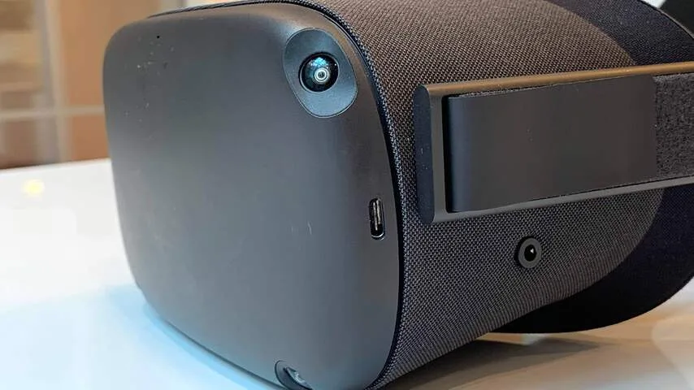
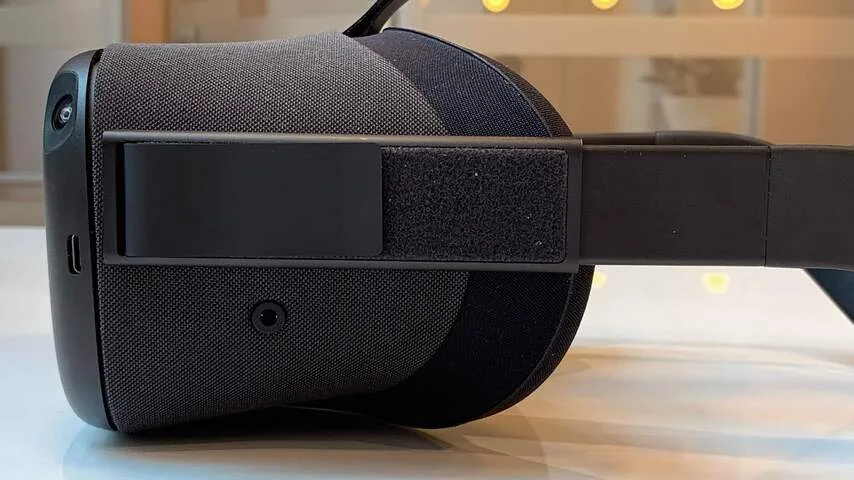
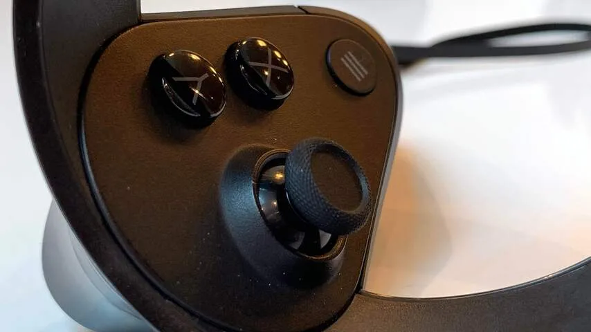
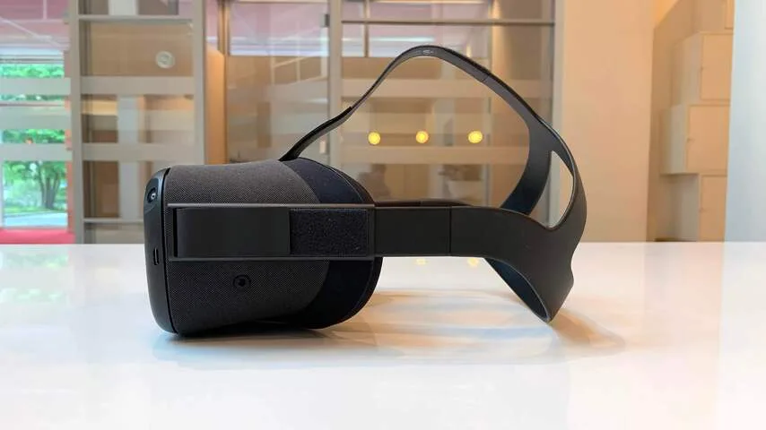
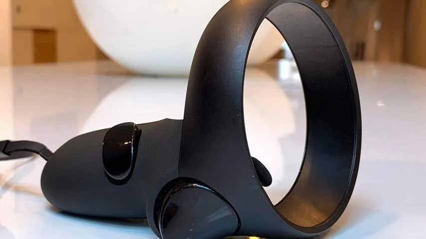

Hoewel virtual reality (VR) inmiddels al een paar jaar bestaat, richt de technologie zich vooral op een fanatieke, harde kern aan gebruikers. Een Oculus Rift, HTC Vive of PlayStation VR vereist een dure pc of een spelcomputer.

> [!NOTE]
> Deze recensie verscheen eerder op [NU.nl](https://www.nu.nl/reviews/5868378/review-oculus-quest-is-de-eerste-virtualrealitybril-voor-niet-nerds.html).

Zelfstandige headsets bestaan al langer, maar zien alleen algemene hoofdbewegingen. Hierdoor werken ze alleen voor simpele ervaringen en video's. De Oculus Quest gaat een stap verder en kan voor complexe games worden gebruikt.

De 450 euro kostende Quest wordt geleverd met twee gamepads die je handen in de echte wereld volgen, met knoppen om je vingerbewegingen vast te leggen. Hierdoor lijkt het in virtual reality alsof je je eigen handen kunt gebruiken. Je drukt bijvoorbeeld een trekker met je middelvinger in om een pistool te pakken, waarna je met een wijsvinger kunt schieten.

Voor op de virtualrealitybril zitten vier camera's, die de positie van de gamecontrollers en de bril ten opzichte van de echte wereld bijhouden. Zet je een stap naar voren of opzij, dan zien de camera's dit en beweeg je ook in virtual reality.

Voordat je de Quest kunt gebruiken, moet je laten zien waar het veilig is om in virtual reality te bewegen. De camera's laten de echte wereld zien, waarna je met de gamepads een lijn op de grond kunt tekenen. Op deze manier omhein je een leeg stuk grond waar geen meubels of andere obstakels in staan.

Tijdens het spelen krijg je een blauwe, doorzichtige muur te zien als je jouw getekende muur benadert, zodat je hier niet per ongeluk doorheen stapt of slaat en iets kapotmaakt. Steek je onverhoopt toch je hoofd door de virtuele barrière, dan activeren de camera's zodat je de echte wereld te zien krijgt om te heroriënteren.

[Bekijk ingesloten media](https://content.jwplatform.com/players/BXKCVcXD-whqXCOFb.html)

## Verreweg het makkelijkst in gebruik

Van alle VR-headsets die we de afgelopen jaren hebben getest, is de Quest verreweg het makkelijkst in gebruik. Je haalt hem uit de doos, stopt de batterijen in de controllers en koppelt hem draadloos aan je smartphone. Vervolgens hoef je de headset alleen nog maar op te zetten om games te downloaden of af te spelen.

Daarmee voelt de Quest als de eerste echt consumentvriendelijke virtualrealitybril. Eerdere headsets waren vaak een hobbyproject om te installeren. Je moest externe sensoren ophangen, bijbehorende software installeren en USB-verlengkabels aanleggen om je speelgebied te bereiken.

## Minder mooie games door zwakkere chip

Dat is grotendeels te danken aan de gebruikte hardware. De sensoren zitten in de Quest zelf, met daarbij ook een smartphonechip om al het rekenwerk te doen. Hierdoor is een losse computer niet meer nodig. Die chip is wel een stuk zwakker dan een gameconsole of een pc, waardoor spellen er minder mooi uitzien.

Bij veel games is daar weinig van te merken. _Beat Saber_, waarin je blokken snijdt met lichtzwaarden op maat van de muziek, lijkt identiek aan de versie voor bestaande virtualrealitybrillen. Spellen zoals _Superhot_, _Dead and Buried II_ en _Angry Birds VR_ gebruiken allemaal een cartoony stijltje, zodat ze er mooi uitzien zonder veel rekenkracht te vereisen.

Realistischer spellen lijden wel onder de hardware van de Quest. Tijdens een recent evenement in Londen konden we het robotschietspel _Robo Recall_ spelen, waarin veel kartelrandjes om personages te zien zijn. De game speelde op drukke momenten bovendien vertraagd af en had buitengewoon lange laadtijden.

_Robo Recall_ was echter de enige game tussen de pakweg twintig gespeelde titels die zichtbaar leek te lijden onder de mindere prestaties van de bril. Het lijkt erop dat vooral spellen die weinig hardwarekracht vereisen, worden uitgebracht op de Quest - en veel van deze spellen zien er alsnog prima uit.

_Oculus Quest — Beeld: NU.nl/Bastiaan Vroegop_

_Oculus Quest — Beeld: NU.nl/Bastiaan Vroegop_

_Oculus Quest — Beeld: NU.nl/Bastiaan Vroegop_

_Oculus Quest — Beeld: NU.nl/Bastiaan Vroegop_

_Oculus Quest — Beeld: NU.nl/Bastiaan Vroegop_

## Verrassend hoge resolutie

Daar staat wel een verrassend hoge resolutie tegenover. De Quest toont per oog 1.440 bij 1.600 pixels, waardoor het scherm scherper is dan bij de meeste hoogwaardige virtualrealitybrillen. Het zorgt ervoor dat de vaak wat gestileerde spelletjes en apps er alsnog bijzonder mooi uit zien.

De meest fanatieke gamers zullen alsnog een Oculus Rift of HTC Vive kopen, omdat ze hier in combinatie met een pc de maximale kracht uit kunnen trekken. De Quest is ook niet voor hen bedoeld. Deze headset richt zich vooral op de gigantische groep mensen die wel geïnteresseerd is in virtual reality, maar niet de technische kennis, het geld of geduld te besteden heeft aan de meest hoogwaardige brillen.

De ingebouwde accu houdt het pakweg twee uur vol. Dat is in de meeste gevallen genoeg voor meerdere speelsessies. Raakt de batterij leeg terwijl je hem gebruikt, dan kun je een bijgeleverde USB-kabel van 3 meter gebruiken om te laden terwijl je speelt. Die kabel is lang genoeg voor tijdens spellen waarbij je stil op één plek blijft staan.

Hoewel de batterijduur op papier kort lijkt, viel dat in de praktijk mee. De meeste virtualrealitygames zijn niet gemaakt om urenlang achter elkaar te spelen. Bovendien zullen beginnende VR-gamers eerst moeten wennen voor ze het lang volhouden in de digitale wereld.

## Conclusie

De Quest is iets bijzonders. Het is de eerste virtualrealitybril die echt hoogwaardige game-ervaringen kan bieden zonder het gedoe van veel bestaande headsets. Het kan de eerste bril zijn die virtual reality echt mainstream maakt en een gigantische groep mensen bereikt. Een must voor de technologie, die op het moment vooral wordt gebruikt door een kleine fanatieke club gamers.

Daar komt bij dat de Quest buitengewoon goed presteert. De bril houdt vlekkeloos bij waar je in de kamer bent, ziet hoe je handen bewegen en toont games op een buitengewoon mooie resolutie. Deze bril kan weleens heel veel mensen gaan overtuigen van hoe gaaf virtual reality kan zijn.

_Review score 4,5 ster — Beeld: NU.nl_

_De Oculus Quest is vanaf 21 mei in Nederland verkrijgbaar voor 449 euro._
