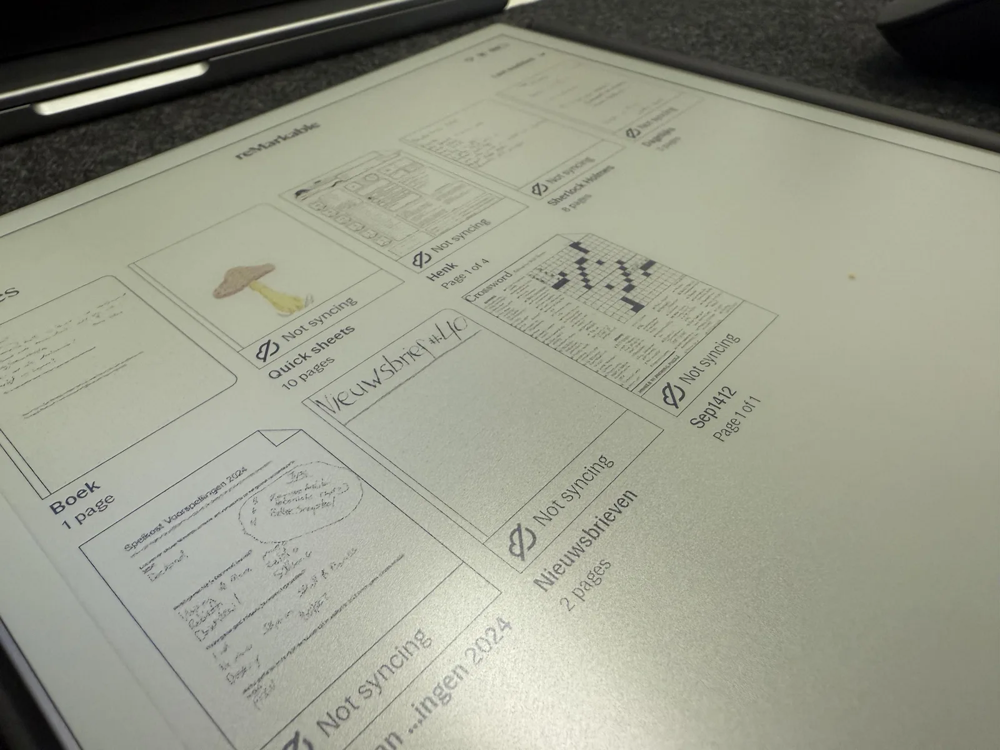
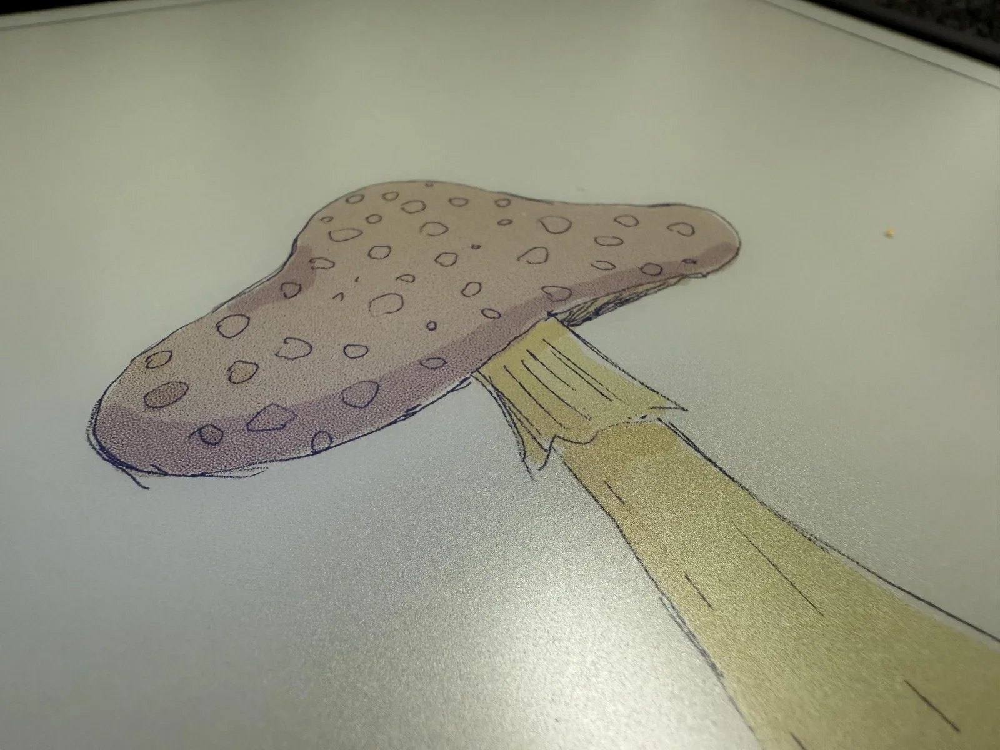
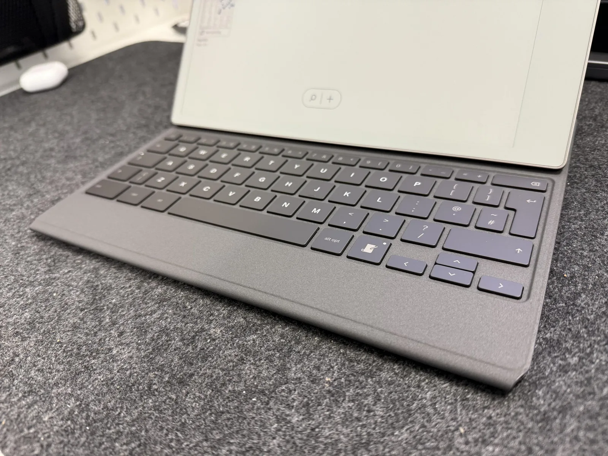

De Remarkable en Remarkable 2 waren apparaten die jouw leven zo afleidingloos mogelijk moesten maken. Onder de streep zijn het tablets met als grootste verschil de gebruikte schermtechnologie. Hier vind je geen contrastrijk kleurenscherm als op een iPad, maar een beeld zoals je het van je e-reader kent. De reden hiervoor is voor de hand liggend: e-ink is rustiger aan je ogen. Bovendien is zo'n scherm veel zuiniger, waardoor je een Remarkable wekenlang kan gebruiken zonder op te hoeven laden.

> [!NOTE]
> Deze recensie verscheen eerder op [Bright](https://www.bright.nl/nieuws/1231170/review-remarkable-paper-pro-is-een-perfect-apparaat-zonder-de-perfecte-flow.html).

Een bijbehorende stylus laat je vervolgens op het scherm schrijven. Het maakt een Remarkable eigenlijk een digitaal notitieboekje: je krabbelt er in zoals je ook op papier zou doen, maar dan met een paar voordelen van een digitaal apparaat. Je hebt bijvoorbeeld een nagenoeg onbeperkte hoeveelheid papier en kunt geselecteerde krabbels makkelijk naar elders op de pagina verplaatsen. En de kans dat je notities kwijtraakt is nihil, omdat alles netjes naar de clouddienst van Remarkable wordt gestuurd.

## Nu in kleur

De nieuwe Remarkable Paper Pro is in grote lijnen gelijk aan zijn twee voorgangers, met een concrete verandering: het scherm werkt nu ook in kleur. De vorige edities ondersteunden enkel zwartwit. Steeds meer e-ink-apparaten ondersteunen de laatste tijd kleur, waarbij filters bovenop het scherm worden geprojecteerd om delen kleur te geven. Het beeld van de Paper Pro werkt anders, met daadwerkelijk gekleurde digitale inkt die zich door het scherm verplaatst. Het maakt het beeld contrastrijker dan we van bijvoorbeeld [Kobo](https://www.bright.nl/organisaties/kobo)'s recente kleuren-e-reader gewend zijn.

Maar let wel op: die kleuren zijn echt vooral voor gebruik bij notities. De geïnstalleerde software laat je tussen een paar basistonen wisselen en meer niet. Genoeg om delen van je notulen te markeren of een snelle schets in een hoek van het scherm te maken, maar dit is geen tablet voor illustratoren die complexe schilderingen willen maken. Daarvoor is de software te beperkt en de tablet ook wat te langzaam: als je in tientallen lagen complexe tekeningen maakt, gaat hij na een tijdje protesteren.

## Net papier, en een fijn toetsenbord

Voor die fervente notulisten is de Paper Pro hoe dan ook perfect: je hebt een groot, digitaal blad waar je vrij op kunt schrijven. Omdat je op een dun e-ink-scherm krabbelt met een speciale stylus, voelt het ook echt alsof je op papier aan het werk bent. Afgelopen weken heb ik meermaals gewisseld tussen een iPad Pro met Pencil en de Remarkable Paper Pro, en ik merkte dat mijn handschrift beter uit de verf kwam op de laatste van de twee.

De nieuwe, los verkrijgbare toetsenbordhoes bevalt ook een stuk meer dan de variant die bij de Remarkable 2 werd verkocht. Omdat de nieuwe tablet groter is, heeft ook het bijbehorende toetsenbord meer ruimte om zijn knoppen te spreiden. Het resultaat is een keyboard pakweg zo groot als op een MacBook, met zachtere, rubber-achtige toetsen die fijn indrukken. Het toetsenbord is met zijn 250 euro wel een wat prijzige toevoeging aan de al dure tablet, maar het verandert hem in een perfecte schrijfcomputer om afleidingloos op te werken.

## Lastig naast digitale notities

De vraag is dan: werkt dat ook? De praktische uitvoering van de Remarkable Paper Pro is perfect, het is een apparaat dat precies doet wat je er van verwacht. Maar het is ook een [gadget](https://www.bright.nl/onderwerpen/gadget) die je precies in jouw dagelijkse flow moet zien te integreren, die anno 2024 wellicht al aan allerlei andere diensten hangt. Dikke kans dat je op dit moment al notities bijhoudt in bijvoorbeeld de notities-app van je telefoon, of dat je zelfs een heel eigen ecosysteem hebt opgebouwd in Obsidian of Notion.

Je kunt je krabbels op de Remarkable op je telefoon of computer openen met de Remarkable-app, waarbinnen je dan bewerkbare PDF'jes te zien krijgt. Die kun je exporteren, of je kunt tekst selecteren en afzondelijk naar een andere app kopiëren. Het is dus mogelijk om je notities te verplaatsen naar je documenten in een andere app, maar het voegt ook een extra laag gedoe toe. Wie de Remarkable in zijn of haar dagelijks leven wil integreren, is na het maken van krabbels later nog eens bezig om die bestanden op de juiste plek te zetten.

## Problemen voor productiviteitsnerds

Een alternatief is om je hele digitale leven te verplaatsen naar je Remarkable, maar dan kom je weer in de knoop als je op een ander apparaat werkt. Je kunt op je Mac geen notities tikken in je Remarkable-app. Schrijf je dus op iets anders dan je tablet, dan moet je het elders bewaren. In notitie-app Obsidian heeft iemand een tooltje gemaakt om al je schrijfsels automatisch in je notitie-vault te laden, maar daar moet je dan weer 1,30 euro per maand voor betalen. Terwijl je wellicht ook al betaalt voor de extra functies van Remarkable's eigen clouddienst.

Toegegeven, het zijn wat margeproblemen. Maar de Paper Pro richt zich juist op de groep productiviteitsnerds die dat belangrijk vinden: mensen die het belangrijk vinden om een afleidingloos apparaat te hebben om te notuleren, en die hun gedachten netjes in de juiste mapjes op een computer parkeren. En die groep mensen zal bij Remarkable snel ontdekken dat dit een relatief gesloten ecosysteem is, dat wat extra werk van jouw hand vereist om alles op één plek te sorteren. Maar als dat het je waard is? Dan is een Remarkable de beste gadget in zijn klasse.

## De duurste ook de beste?

De vervolgvraag is dan of de nieuwe Paper Pro je beste optie is, want het is met 650 euro ook de meest prijzige. Haal je er de meest luxe stylus en toetsenbordhoes bij, dan kruipt de prijs omhoog richting de duizend euro. Dan kun je voor minder ook de nog steeds verkrijgbare Remarkable 2 halen die voor een lager bedrag nog steeds wordt verkocht. Dan lever je het kleurenscherm weer in, wat voor schrijvers niet het grootste offer hoeft te zijn, maar de verschillen zijn stiekem groter dan dat.

De Remarkable 2 heeft bijvoorbeeld een krappere toetsenbordhoes. En misschien nog wel belangrijker: alleen de Paper Pro heeft een lampje ingebouwd, waardoor je hem 's nachts ook in bed kunt gebruiken om bijvoorbeeld stiekem wat stripboeken te lezen. Dan is de meerprijs ineens snel rechtgepraat.

**[Meer Bright reviews](https://www.bright.nl/onderwerpen/review) en mis niets met onze [Bright-app](https://www.bright.nl/pagina/app).**
