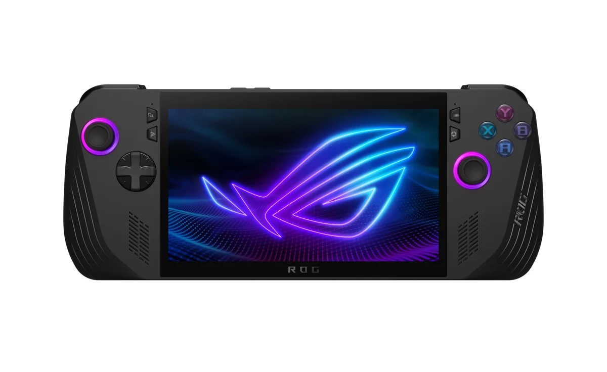
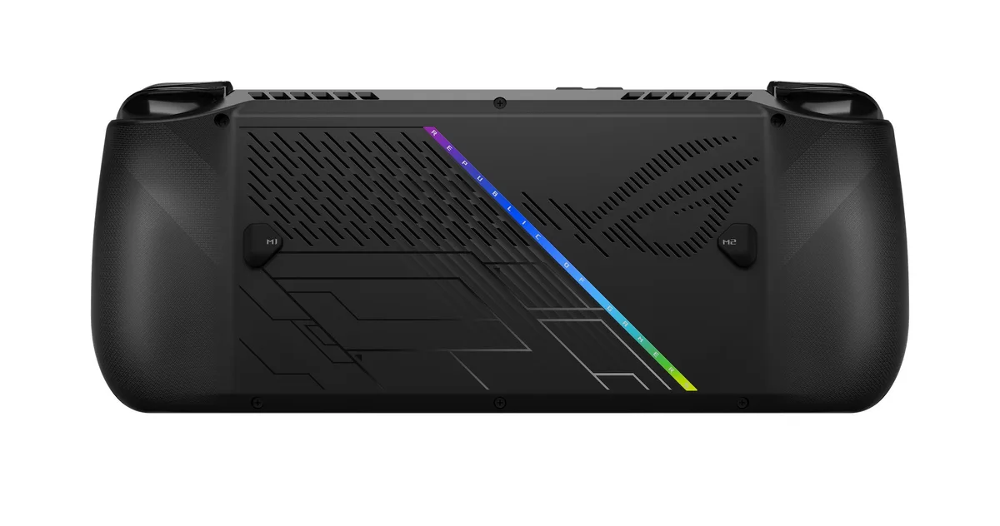

De Steam Deck veranderde enkele jaren geleden de gamingmarkt volledig. Door een gaming-pc in een Switch-achtige handheld te stoppen, maakte Valve een gamemachine die krachtig genoeg is voor moderne [games](https://www.bright.nl/onderwerpen/games) en veelzijdig genoeg om er bijvoorbeeld ook oude retro-spellen op te emuleren.

> [!NOTE]
> Deze recensie verscheen eerder op [Bright](https://www.bright.nl/nieuws/1214239/review-rog-ally-x-steam-deck-killer-heeft-grotere-accu-maar-alsnog-problemen.html).

Afgelopen jaar wilde de ROG Ally daar op een simpele manier een schepje bovenop doen: het was een Steam Deck, maar dan met dikkere specificaties. De chip was een stuk krachtiger waardoor games er mooier uit konden zien - wat ideaal was op het betere scherm. Die had een 1080p-resolutie met een ververssnelheid van 120 beelden per seconde, vergeleken met de 800p van de Steam Deck op 60 frames (of 90 op het recentere oled-model.)

Die spec-bump bracht echter een probleem mee. Ja, de chip was krachtiger, maar vrat ook flink meer stroom dan die in de Steam Deck. Toen ik hem vorig jaar recenseerde, was de batterij al na een half uurtje leeg bij het spelen van The Witcher op Ultra-instellingen. Dan kun je met een kabeltje bij het stopcontact gaan zitten, maar dan kun je bijna net zo goed gamen op een vaste console of een pc.

## Grootste probleem nu opgelost

De Ally X heeft een forsere accu gekregen die dit probleem opvangt. Nu haal je bij The Witcher 3 een uur aan gameplay op Ultra-instellingen voor de batterij leeg is. Nog steeds niet genoeg om een lange vakantiereis mee te dekken, maar het is vergelijkbaar met de Steam Deck op diens hoogste instellingen.

Daarmee heb je een handheld die games mooier in beeld brengt dan de Deck zonder een merkbaar verschil in gebruikstijd. Daarbij moet wel gezegd worden dat het geen verschil van dag op nacht is: dit is dezelfde chip die in de eerdere ROG Ally zit, die zo’n 25 procent hogere framerates biedt op vergelijkbare instellingen. Wel zorgt het scherm met hogere resolutie ervoor dat kleine tekst beter leesbaar is, een merkbaar voordeel bij games die gemaakt zijn voor op normaliter grote tv’s en beeldschermen.

## Kiezen: hoge resolutie of toch oled?

Maakt dat de ROG Ally X de meest voor de hand liggende handheld om te kopen? Niet per se. Ten eerste is er een prijsverschil om rekening mee te houden. Je koopt de Ally X voor 900 euro, terwijl een Steam Deck minder dan de helft kost. Koop je een Deck met dezelfde terabyte aan opslag, dan betaal je alsnog 220 euro minder en krijg je er een oled-scherm bij. Dat scherm heeft een lagere resolutie en framerate, maar heeft véél mooiere kleuren. Een voor mij merkbaarder verschil, maar dat is voor ieder persoonlijk.

Daarnaast is er de Windows-kwestie. De ROG Ally X draait op Windows 11, terwijl de Steam Deck een door Valve aangepaste versie van Linux draait die Windows-games met speciale software draait. Valve’s truc werkt 99 procent van de tijd, maar bepaalde games met anti-cheat-software zoals Destiny 2 werken niet op de Deck. Hetzelfde geldt voor Game Pass-games, die via een speciaal systeem van Microsoft draaien. De ROG Ally X kan al die games wel afspelen door zijn versie van Windows 11. Dat maakt het de handheld met het meest uitgebreide games-aanbod.

## Windows 11 nog wat onhandig

Windows is echter duidelijk niet gemaakt om op een gaminghandheld te draaien. De Ally X heeft een aanraakscherm zodat je jouw vinger als [muis](https://www.bright.nl/onderwerpen/muis) kunt gebruiken, maar een verkeerde tap is op het kleine schermpje snel gemaakt. Tijdens het gamen had ik bovendien vaak kleine Windows-probleempjes, bijvoorbeeld als er een andere app ineens bovenop het gamescherm opende. Issues waar je op de Steam Deck nooit tegenaan loopt, omdat Valve een volledig controller-gericht besturingssysteem heeft gebouwd.

Het is prijzenswaardig hoe ASUS heeft geprobeerd de problemen met Windows 11 af te vangen. Aan weerszijden van het scherm zitten bijvoorbeeld knoppen om een speciale overlay mee te openen, waarmee je opties zoals je resolutie en wifi kunt aanpassen met je controller. Ook heeft de handheld een speciale app waarmee je games uit de launchers van Steam, Epic en andere grote bedrijven kunt openen.

## Buggy

Die speciale software is echter niet zonder problemen. Het komt vrij vaak voor dat de controller ineens niet meer wordt herkend, waardoor je alleen met schermaanrakingen de instellingen kunt wijzigen. Geen halszaken en het is een stuk stabieler dan bij de ROG Ally van vorig jaar, maar alles is nog merkbaar buggy.

Inmiddels zijn er fanprojecten die SteamOS namaken voor op de ROG Ally. Een ander besturingssysteem kan immers gewoon, onder de motorkap is dit gewoon een pc. Op die manier krijg je de robuuste interface van een Steam Deck, samen met de betere prestaties van een Ally X. Maar dan verlies je weer die ondersteuning voor Game Pass-games en titels als Destiny 2. Het is een afweging om te maken.

Onder de streep voelt de Ally X een beetje alsof hij zijn tijd vooruit is. Er zijn al een tijdje geluiden dat Microsoft werkt aan een versie van Windows 11 speciaal voor dit soort gaminghandhelds - iets waarmee deze machine zijn voornaamste nadelen zou verliezen. Dat is echter toekomstmuziek, we zitten voor nu nog vast aan de gewone versie van Windows 11.

## Conclusie

De ROG Ally X is een krachtigere gaminghandheld dan de Steam Deck, die nu eindelijk ook een respectabele accuduur heeft. De ideale gaminghandheld voor wie liever hogere resoluties en framerates heeft, dan contrastrijke oled-kleuren.

Windows 11 maakt het gebruik van de Ally X nog wel wat ongemakkelijk, een probleem dat hopelijk ooit met een speciale gamingversie van het OS wordt opgelost. Maar tot dan maakt ASUS er het beste van dat ze kunnen.

Meer [reviews](https://www.bright.nl/onderwerpen/review) en mis niets met onze [Bright-app](https://www.bright.nl/pagina/app).
