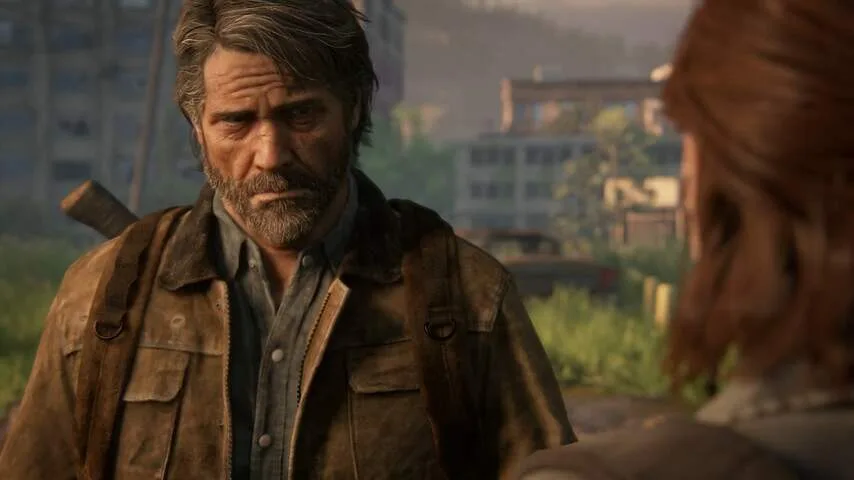
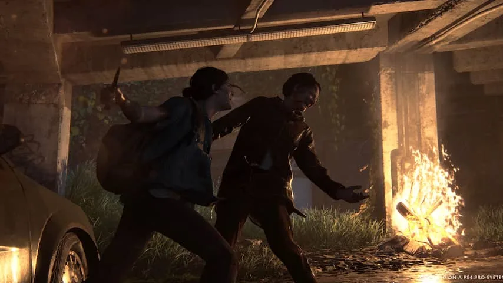
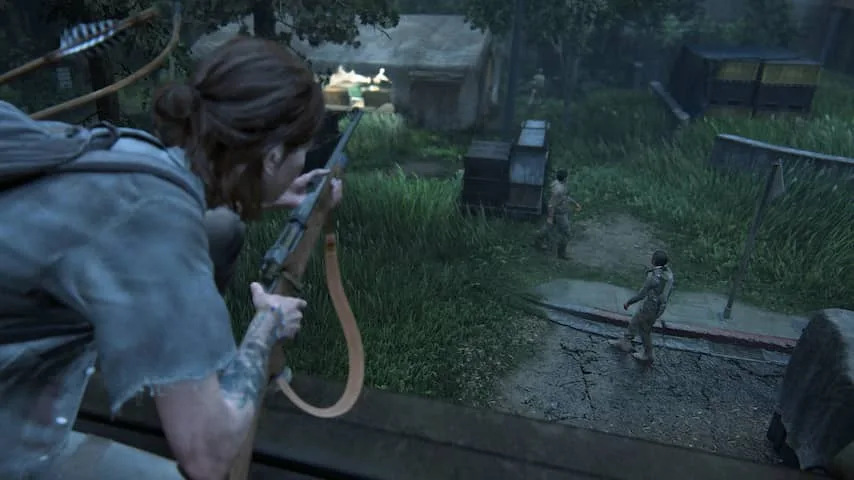

_Let op: deze review bevat spoilers over het einde van het eerste deel van The Last of Us._

> [!NOTE]
> Deze recensie verscheen eerder op [NU.nl](https://www.nu.nl/reviews/6057411/review-the-last-of-us-part-ii-is-grimmig-deprimerend-en-fantastisch.html).

Het eerste deel van _The Last of Us_ was een buitengewoon grimmig spel, dat een postapocalyptische wereld overspoeld door plantaardige zombies schetste. Smokkelaar en hoofdrolspeler Joel moest het tienermeisje Ellie door die wereld vervoeren, nadat bleek dat zij als enige niet door het zombievirus geïnfecteerd kon worden.

Als Ellie aan het einde van de game door doktoren gedood dreigt te worden om een vaccin te maken, besluit Joel het ziekenhuis uit te moorden. Hij redt zijn surrogaatdochter, maar ontzegt de mensheid zijn redding van het virus.

Het tweede deel gaat over de gevolgen van het einde van _The Last of Us_, die zowel de band tussen beide personages als de gehele wereld hebben beïnvloed. Spelers krijgen ditmaal de controle over de inmiddels negentienjarige Ellie, die wraak wil nemen op een groep mysterieuze aanvallers.

_Games juni, Last of Us Part II_

_Het eerste deel draaide om de relatie tussen Ellie en Joel. Bron: Naughty Dog._

## Sluipen en schieten wisselen elkaar af

Gevechten in _The Last of Us_ zijn een mengelmoes van sluipen en schieten, waarbij nooit één juiste manier is om te spelen. Je kunt ervoor kiezen om de hele game nagenoeg ongezien te blijven, of om als een roofdier door je tegenstanders te snijden en schieten.

Waar sommige games het doden van vijanden verheerlijken, doet _The Last of Us Part II_ zijn best om het er zo afgrijselijk mogelijk uit te laten zien. Het voelt ongemakkelijk om naar te kijken, maar dat lijkt juist de bedoeling: de game wil illustreren hoe ver de mensheid door de zombies is afgegleden.

Je zult geregeld voor één strategie kiezen, waarna je door een fout ineens moet improviseren en het heel anders uitpakt. Zo word je bijvoorbeeld betrapt, moet je een vijand doden en vlucht je daarna een oud huis in om te schuilen. In de meeste games kan zo'n aaneenschakeling statisch en houterig aanvoelen, maar in _The Last of Us Part II_ lijkt alles onderdeel te zijn van een organisch geheel.

_The Last of Us Part II — Beeld: Naughty Dog_

_Sluipen en actie wisselen elkaar af. Bron: Naughty Dog._

## Elke kogel is kostbaar

De spelwereld is sinds de apocalyps nagenoeg leeggeplukt, waardoor er voor Ellie maar weinig wapens en kogels te vinden zijn. Dat zorgt voor een buitengewoon hoge spanningsboog, omdat elke gemiste kogel kostbaar is. Wisselen tussen wapens is hierdoor een must: je wil waardevolle shotgunschoten pas gebruiken als het écht nodig is, dus gebruik je in de tussentijd liever je andere arsenaal.

_The Last of Us Part II_ heeft een grotendeels lineaire spelwereld, waarin je altijd van plek A naar plek B moet gaan. Toch kom je vaak genoeg leegstaande huisjes, tankstations of andere locaties langs de route tegen om naar af te buigen.

Daar vind je extra uitrusting, maar ook korte verhaaltjes die meer over de spelwereld vertellen. In een verlaten bank tref je bijvoorbeeld de lijken van een groep bankrovers, die een handlanger in de kluis hadden opgesloten.

_The Last of Us Part II — Beeld: Naughty Dog_

_Munitie is schaars in The Last of Us Part II. Bron: Naughty Dog._

## Mensen zijn de grootste monsters

Hoewel Ellie de nodige geïnfecteerden tegenkomt op haar tocht, zijn onbesmette mensen de grootste monsters op haar pad. Bendes zijn na de apocalyps langzamerhand uitgegroeid tot extremistische bewegingen en cults die jagen op medeoverlevenden. Eén groep maakt er bijvoorbeeld werk van om al hun slachtoffers op rituele wijze aan bomen op te hangen.

Tegelijkertijd is Ellie zelf ook geen lieverdje. Tijdens haar wraakmissie laat ze haar waarden vaker vallen en wordt ze een steeds brutere moordenaar. Voor de speler lijkt haar missie in eerste instantie gerechtvaardigd, gezien haar vijanden iets afgrijselijks hebben gedaan. Maar het wordt gaandeweg steeds lastiger om haar als held toe te juichen.

Dat laatste lijkt bewust: _The Last of Us Part II_ verandert Ellie in een van de schurken waar ze de hele game tegen vecht, waarmee wordt geïnsinueerd dat al haar slachtoffers een vergelijkbare goede reden hadden om haar aan te vallen. Tegelijkertijd maakt de game haar met een reeks flashbacks steeds menselijker, wat het nog moeilijker maakt om een mening over haar te vormen.

[Bekijk ingesloten media](https://content.jwplatform.com/players/vDB2VAjI-whqXCOFb.html)

## Conclusie

_The Last of Us Part II_ schetst een deprimerende wereld die gevuld is met menselijke momentjes. Het constant wisselen tussen verkennen, schieten en sluipen voelt vloeiender dan we ooit eerder in een game zagen en er zijn weinig gameverhalen die zo'n grote impact maken. Dat maakt van _The Last of Us Part II_ de beste PlayStation 4-game tot nu toe.

_Beoordeling: 5/5_
