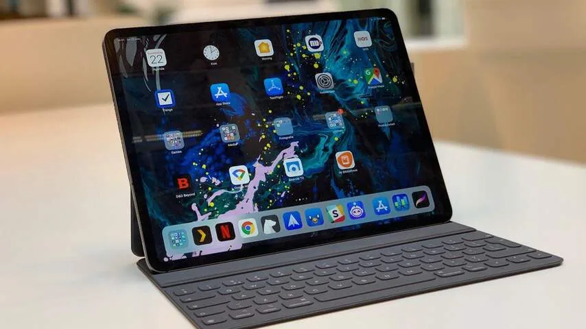
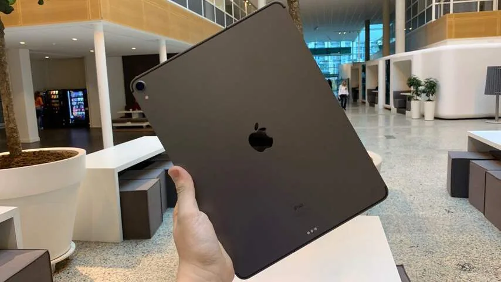
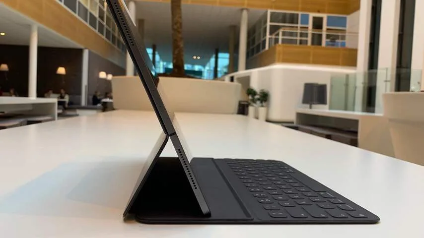
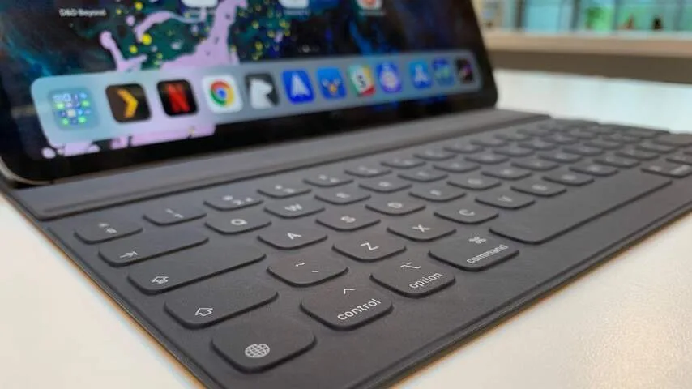
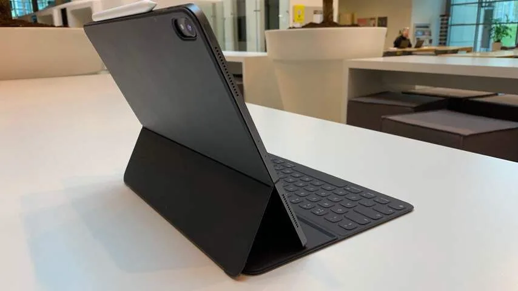
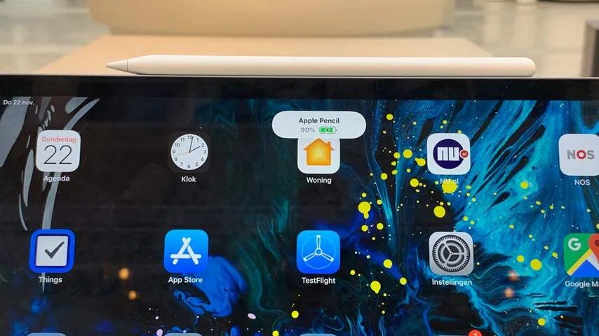
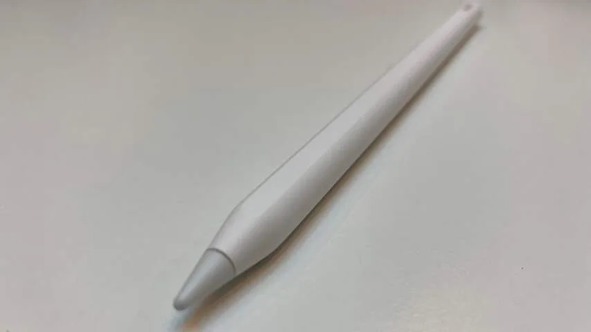
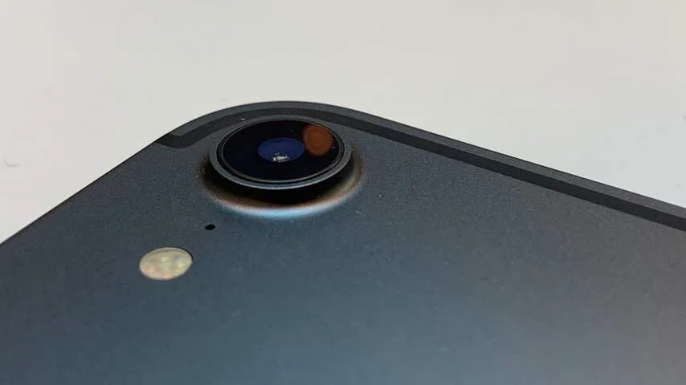

De iPad Pro is al jarenlang een wat vreemd product. Kijk je naar de specificaties, dan is het simpel gezegd een iets luxere iPad. Hij heeft een iets beter scherm dan zijn goedkopere broertje, met daarnaast wat functies die je niet in andere iPads ziet.

> [!NOTE]
> Deze recensie verscheen eerder op [NU.nl](https://www.nu.nl/reviews/5588504/review-voor-wie-is-de-ipad-pro-nou-bedoeld.html).

De naam doet vermoeden dat hij speciaal bedoeld is voor werk als beeldbewerking, maar tegelijkertijd klagen professionals over hoe gesloten de iPad eigenlijk is. De tablet gebruikt hetzelfde mobiele besturingssysteem als bijvoorbeeld de iPhone, waardoor hij niet altijd zo veelzijdig is als een laptop.

De nieuwe versie van de iPad Pro is vooral op het gebied van hardware verbeterd. De schermranden zijn bijvoorbeeld veel dunner geworden. Het is geen randloos ontwerp, zoals Apple beweert, maar hierdoor oogt de gehele tablet wel een stuk slanker. Dat valt vooral op bij de 12,9-inchversie van de iPad Pro, die ook nog eens verrassend licht is geworden. Dat komt doordat de algehele grootte is verminderd door de dunnere randen. De 11-inchvariant heeft de omvang van de oude 10,5-inch-iPad Pro, waarbij de oude randen met meer schermruimte zijn gevuld.

De thuisknop onderaan het scherm is verdwenen. In plaats daarvan open je de tablet voortaan door met je vinger aan de onderkant omhoog te vegen, net als bij de recentste iPhones. Je ontwaakt de iPad simpelweg door ergens op het scherm te tikken. De eerste paar dagen is dat even wennen, maar uiteindelijk voelt de besturing net zo natuurlijk als op oude iPads.

## Geen oled, maar wel uitstekend scherm

De schermen van beide iPads zijn nog even scherp als bij voorgaande iPad Pro's. Ook wordt het scherm nog steeds met een frequentie van 120Hz ververst. Dat betekent dat in één seconde 120 beeldjes achter elkaar getoond kunnen worden.

De iPad Pro heeft geen oledscherm, zoals we wel van de duurste iPhones gewend zijn. Dat lijkt in eerste instantie wellicht gek - bij een duur Pro-model reken je al snel op de hoogwaardigste onderdelen die Apple in huis heeft. Het zou op het moment echter lastig zijn om het scherm op alle plekken even helder te krijgen, waardoor oled zich niet goed voor een grote tablet leent.

Hoewel de nieuwe iPad Pro's een traditioneel scherm gebruiken, zijn de kleurwaarden en scherpte wel uitstekend. Foto's, video's en games zien er allemaal prima uit op het apparaat.

_iPad Pro — Beeld: NU.nl/Bastiaan Vroegop_

_iPad Pro — Beeld: NU.nl/Bastiaan Vroegop_

_iPad Pro — Beeld: NU.nl/Bastiaan Vroegop_

_iPad Pro — Beeld: NU.nl/Bastiaan Vroegop_

_iPad Pro — Beeld: NU.nl/Bastiaan Vroegop_

_iPad Pro — Beeld: NU.nl/Bastiaan Vroegop_

_iPad Pro — Beeld: NU.nl/Bastiaan Vroegop_

_iPad Pro — Beeld: NU.nl/Bastiaan Vroegop_

## Gezichtsherkenning in plaats van vingerafdrukscanner

Door het verdwijnen van de thuisknop heeft de iPad Pro niet langer een vingerafdrukscanner. Bovenaan het scherm zitten nu echter wel meerdere camera's en sensoren die worden gebruikt voor gezichtsherkenning. Door simpelweg naar de iPad te kijken, wordt hij al ontgrendeld.

Deze vorm van gezichtsherkenning zagen we eerder al op de nieuwste iPhones, maar lijkt op de iPad Pro net wat beter te werken. Zo werkt de detectie in alle schermoriëntaties, waardoor het niet uitmaakt hoe je de iPad vasthoudt tijdens het ontgrendelen. Daarnaast lijkt de kijkhoek bijzonder groot. We hoeven maar naar een iPad die plat op een tafel ligt te kijken om hem open te maken.

Hardwaretechnisch is er eigenlijk niet veel aan te merken. Bij benchmarktests, waarbij we keken hoe snel de processoren nou eigenlijk zijn, doet de tablet het uitzonderlijk goed. We hebben hem ook geen enkele keer op een hapering of traag momentje kunnen betrappen.

Achter die verbeterde hardware schuilt echter een subtieler probleem: waar moet je de iPad Pro nou eigenlijk voor gebruiken? Dit was het voornaamste kritiekpunt bij de eerdere iPad Pro's - waar eigenlijk niet superveel aan veranderd is.

## Videobewerking lastig door gesloten software

We hadden voorgenomen om op de NU.nl-redactie een dag video's te bewerken met de iPad Pro. Hij heeft immers meer dan genoeg rekenkracht om in opnames te snijden en de beelden achteraf te exporteren. We hoefden alleen een kaartlezer op de nieuwe USB-C-poort aan te sluiten om de beelden in te laden. De iPad weigerde die beelden echter goed te importeren.

In veel situaties moet je daarom creatieve oplossingen bedenken om je te bewerken materiaal op de iPad te zetten. Onhandig - en iets waar je op een laptop nooit last van hebt.

Door de stap naar USB-C kun je meer gangbare kabels en accessoires met de iPad verbinden. Wij konden een goedkoop HDMI-verloopje gebruiken om de iPad op een scherm aan te sluiten, of een ouderwets toetsenbord aansluiten met een USB-verloop. Externe harde schijven werken echter nooit. Apple kijkt duidelijk nog kritisch naar wat je wel of niet mag aansluiten, waardoor de iPad een vrij gesloten apparaat is.

Wil je de iPad Pro gebruiken voor videobewerking, dan moet je bereid zijn om een compleet andere werkwijze aan te leren. Je moet op zoek naar een camera waarvan de geheugenkaart op precies de correcte wijze geformatteerd is. Daarnaast zul je moeten kijken welke bewerkingsapps eigenlijk het best aansluiten op je behoeften, want de meeste professionele software heeft nog geen iPad-equivalent.

## Prima schetsboek voor Donald Duck

Onze veldtest met de iPad Pro-stylus verliep wel een stuk soepeler. We hebben onze iPad Pro een dag uitgeleend aan _Donald Duck_\-tekenaar Maarten Gerritsen, die in zijn dagelijks werk al langer de iPad Pro gebruikt. "Meestal maak ik schetsen op de iPad, waarna ik ze op een Mac verder uitwerk." Hij concludeerde al snel dat de iPad Pro voor tekenaars op een aantal fronten verbeterd is.

De penpunt van de Apple Pencil blijft bijvoorbeeld net wat beter zitten dan bij het vorige model. Dat was een pijnpunt bij de oude stylus, waarbij de punt er bij lange tekensessies weleens af vliegt.

Je kunt nu ook twee keer op de zijkant van de stylus tikken om snel te wisselen tussen het potlood en de gum. "Dat is echt heel handig", vertelt Gerritsen. "Want normaal zit je continu op knoppen van het scherm te tikken om dat te doen."

En misschien wel het belangrijkst: de iPad-stylus laadt nu eindelijk draadloos op. Je klikt hem met magneten aan de zijkant van de iPad, waarmee je hem meteen ook opbergt. Een gigantische verbetering ten opzichte van de oude stylus van de iPad Pro, die je op vrij onnozele wijze aan de Lightning-poort van de iPad moest aansluiten.

[Bekijk ingesloten media](https://content.jwplatform.com/players/TX6rr4qZ-whqXCOFb.html)

## Een dure machine voor notulenwerk

Voor gewoon redactiewerk bleek de iPad Pro geen vervanger van een ouderwetse laptop te zijn. Je kan multitasken om meerdere apps tegelijk te bekijken, maar dan ben je beperkt tot maximaal twee applicaties tegelijk. Wil je drie of vier schermen naast elkaar openzetten, dan heb je een probleem.

De iPad Pro was wel een geinige gadget om notities mee te maken tijdens vergaderingen. De los verkrijgbare toetsenbordhoes kan nu in twee posities worden geplaatst, waardoor je het scherm ook iets naar achter kan buigen. Maar we zouden hem niet voor zulke simpele activiteiten aanraden. Er zijn er immers veel goedkopere apparaten waarmee hetzelfde kan.

## Conclusie

We kunnen ons eigenlijk moeilijk voorstellen dat iemand de iPad Pro daadwerkelijk professioneel zou gebruiken, afgezien van tekenaars. Dat betekent niet dat de tablet geen meerwaarde heeft; het is namelijk alsnog een ontzettend hoogwaardige tablet waar de meeste concurrentie niet aan kan tippen.

De iPad Pro heeft voor algemeen thuisgebruik echter een flinke prijskaart. De 11-inchversie van de tablet wordt in Nederland vanaf 899 euro verkocht. Het duurste 12,9-inchmodel kost maar liefst 2.119 euro. Voor dat geld heb je dan wel een terabyte aan opslag.

Het loopt al geen storm op de tabletmarkt, dus je kunt je afvragen hoe goed een tablet van minstens 899 euro het überhaupt zal doen. Maar als je in de specifieke doelgroep voor dit apparaat valt, dan haal je wel iets krachtigs in huis.

_4 sterren — Beeld: NU.nl_
