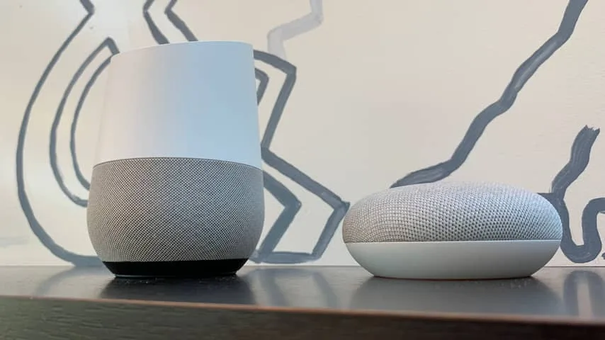
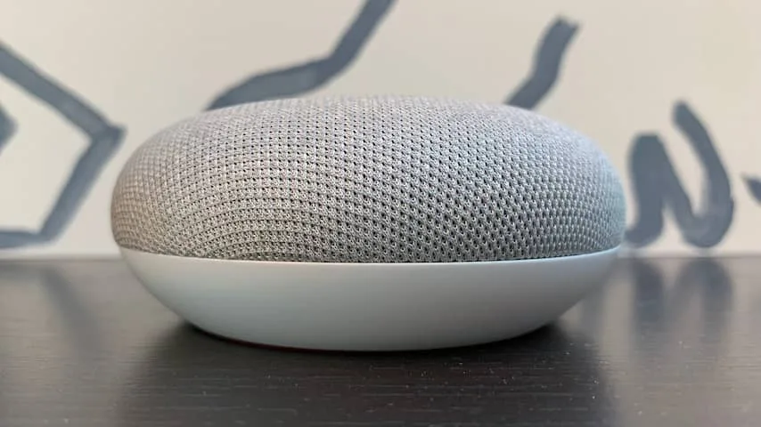
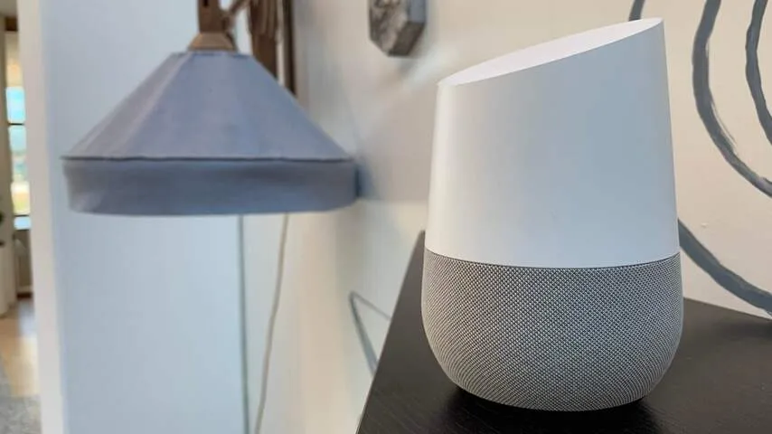
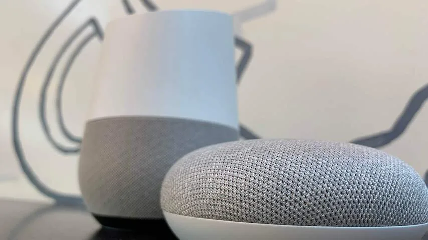
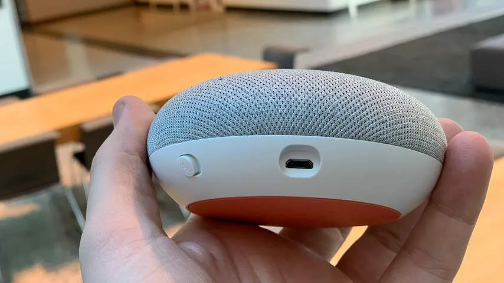
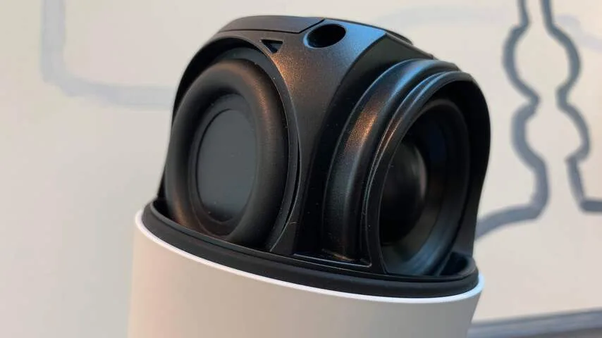

Hoewel de slimme speakers in landen zoals de Verenigde Staten al lange tijd worden verkocht, waren de gadgets tot op heden niet officieel in Nederland te koop. Techgiganten zoals Amazon verkopen hun luidsprekers hier niet, omdat de bijbehorende stemassistent nog geen Nederlands spreekt.

> [!NOTE]
> Deze recensie verscheen eerder op [NU.nl](https://www.nu.nl/reviews/5544572/review-wat-heb-je-nou-echt-aan-een-google-home-speaker.html).

De Google Assistent spreekt sinds afgelopen zomer wel Nederlands. En nu ook de commando's voor de Google Home-speakers zijn vertaald, worden de speakers ook in Nederland verkocht. De 'gewone' Google Home kost 149 euro, terwijl de kleinere Mini-luidsprekers voor 59 euro per stuk worden verkocht.

Met de woorden "oké Google" of "hé Google" wordt de speaker geactiveerd, waarna je met simpele stemcommando's om informatie kunt vragen. Na de vraag wat voor weer het is, hoor je bijvoorbeeld snel hoe warm het wordt en of het gaat regenen.

De Google Assistent weet ook het antwoord op specifieke vragen, zoals wie de premier van Nederland is. Die kennis is echter begrensd. Vraag je bijvoorbeeld naar de premier van Nederland in 1976, dan weet de stemassistent je niet verder te helpen.

_Google Home — Beeld: NU.nl/Bastiaan Vroegop_

_Google Home — Beeld: NU.nl/Bastiaan Vroegop_

_Google Home — Beeld: NU.nl/Bastiaan Vroegop_

_Google Home — Beeld: NU.nl/Bastiaan Vroegop_

_Google Home — Beeld: NU.nl/Bastiaan Vroegop_

_Google Home — Beeld: NU.nl/Bastiaan Vroegop_

_Google Home — Beeld: NU.nl/Bastiaan Vroegop_

We merkten in de afgelopen week dat Google Home best vaak per ongeluk wordt geactiveerd. Zodra iemand op tv of op de radio iets zegt dat lijkt op de activatiecommando's, dan luistert de assistent al mee. De Engelse versie van Google Home deed dat soms ook, maar het komt eerder bij de Nederlandstalige versie voor.

Het is eerst leuk om Google van alles te vragen, maar na verloop van tijd gebruikten wij de Google Home eigenlijk vooral voor vier zaken: nieuws beluisteren, muziek afspelen, wekkers en timers instellen en het bedienen van smarthomeapparatuur. Dit kan vaak net iets makkelijker met een stemcommando dan met een smartphone uitgevoerd worden.

Veel van de leuke gimmicks uit de internationale versie van Google Home lijken in Nederland nog te ontbreken. Amerikanen kunnen bijvoorbeeld een quiz spelen op de speaker, of het apparaat een verhaal laten voorlezen. Veel van deze extra's werken nog niet in Nederland.

## Handige samenvatting van de dag

Met het commando "goedemorgen" geeft Google een handige samenvatting van wat je van de dag kunt verwachten. Daarbij hoor je het weerbericht, je eerstvolgende afspraak in de agenda, de drukte op de weg richting je werk en een recente nieuwsuitzending.

Dit alles is naar je eigen voorkeuren aan te passen. Je kunt bijvoorbeeld kiezen tussen een nieuwsupdate van NU.nl, het _ANP_ of de _NOS_. Ook kun je kiezen tussen een reisadvies voor de auto of het openbaar vervoer.

Het commando "goedemorgen" is onderdeel van een routine, waarbij één stemcommando meerdere opdrachten tegelijk kan activeren. Bij de Engelstalige Google Assistent is het al langer mogelijk om zelf zo'n routine in te stellen, zodat je bijvoorbeeld met één woord alle lichten kunt dimmen en de muziek aanzet. In de Nederlandse app is deze functie echter nergens te bekennen. Op iPhones en Android-telefoons konden we de optie voor het instellen van een routine niet terugvinden.

## Google Home weet wie er praat

Door Voice Match te activeren, kan Google Home onderscheid maken tussen de stemmen van meerdere gebruikers. Hierdoor krijgt iedereen die goedemorgen zegt een ander overzicht te horen, afgestemd op zijn of haar werkadres en andere voorkeuren.

Die stemherkenning komt op nog meer manieren van pas. Start je muziek met de Google Home, dan wordt daarvoor jouw specifieke account op Spotify, YouTube Music of of Google Play Music gebruikt. Hierdoor krijg je met het commando "speel mijn favorieten op Spotify" jouw eigen muziek, terwijl bijvoorbeeld je partner weer heel iets anders hoort.

Je kunt met stemcommando's ook videodiensten bedienen, mits je een Chromecast in je televisie hebt zitten. Met het commando "speel _Mindhunters_" wordt automatisch de volgende aflevering op Netflix naar je Chromecast gestuurd. Ook daarbij kan iedere gebruiker zijn of haar profiel op Netflix aanpassen, zodat je niet elkaars kijklijsten verpest.

Het afspelen van Netflix-video's werkt gek genoeg nog niet op een televisie of settopbox met Android TV. Wel is het mogelijk om op deze televisies YouTube-filmpjes te starten met je stem.

[Bekijk ingesloten media](https://content.jwplatform.com/players/0pb0xIa5-whqXCOFb.html)

## Een huis dat tegen je praat

Google Home kan praten met meerdere slimme apparaten in huis, zoals de verlichting, thermostaten en beveiligingscamera's. Door een slimme stekker aan te sluiten op een apparaat, kun je die ook met je stem activeren. Daardoor kun je bijvoorbeeld vanuit bed alvast het koffiezetapparaat laten opwarmen.

De smarthomefunctionaliteit voelt als de grootste meerwaarde. Omdat je alleen je stem hoeft te gebruiken, ben je niet langer gebonden aan bijvoorbeeld de lichtknoppen en je smartphone om een lamp aan te zetten. Je kunt met twee glazen cola richting de bank lopen en met volle handen het licht alvast in 'bioscoopmodus' zetten.

In de eerste dagen was de smarthomekoppeling van Google Home nog wel wat instabiel. Lampen werden soms niet herkend. De stemassistent zette soms ook Spotify-lijsten met de naam "lampen" aan. Inmiddels lijken al deze problemen echter grotendeels te zijn opgelost en werkt de bediening bij ons vlekkeloos.

## Conclusie

Google Home klinkt in de eerste plaats wellicht als een oplossing voor een luxeprobleem. Je kunt er dingen mee die je smartphone eigenlijk ook al kan, maar dan in sommige gevallen iets sneller en ongeacht of je een telefoon in je hand hebt. Daarbij gaat het om dingen zoals het instellen van wekkers, het opzetten van muziek en het bedienen van smarthomegadgets. Een echte vervanger voor je telefoon is het niet.

Maar voor die paar kleine dingen voelt het desalniettemin als een aanwinst. In de afgelopen maanden zijn we al verknocht geraakt aan een geïmporteerde Google Home Mini, en in de laatste week zijn we de stemdienst alleen maar meer gaan gebruiken. Google gaat hiermee wellicht niet je leven veranderen, maar zal je leven wel een leuke, kleine upgrade geven.

_4 sterren — Beeld: NU.nl_
