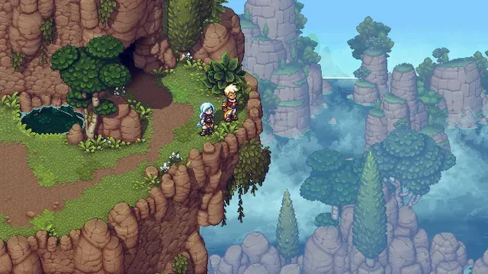

**De beste jrpg's komen afgelopen jaren van niet-Japanse indiestudio's. Na Crosscode en Chained Echoes is ook Sea of Stars een geweldige hommage aan oude klassiekers, al bereikt hij nooit het niveau van zijn inspiratiebronnen.**

> [!NOTE]
>
> Deze recensie verscheen eerder op [Gamer.nl](https://gamer.nl/reviews/games/playstation/sea-of-stars-is-een-geweldige-hommage/?ref=gamepraat.nl).

Het crowdfundingproject voor Sea of Stars had slechts 133.000 Canadese dollar (133.000 euro) nodig, maar wist uiteindelijk dik het tienvoudige daarvan in te zamelen. Geen wonder, want de eerste beelden leken haast handgemaakt om een specifieke groep mensen (waaronder ondergetekende) helemaal gek te maken. Het moest een jrpg worden geïnspireerd door oude klassiekers als Chrono Trigger, met fenomenale pixelart en muziek van Chrono Trigger-componist Yasunori Mitsuda.

Drie jaar na de Kickstarter-campagne weten we inmiddels dat Sea of Stars de toen gemaakte beloftes grotendeels inlost. De game die we afgelopen week hebben gespeeld voelt als een eerbetoon aan oude klassiekers.

## **Chrono Trigger en Paper Mario**

De inspiratie door Chrono Trigger is het meest vanzelfsprekend: net als in die game bestuur je een team van drie personages, die naast individuele aanvallen ook samen speciale vaardigheden kunnen gebruiken. Monsters lopen door de spelwereld heen en je vecht zonder transitie naar een speciaal vechtscherm, waardoor omgevingen dynamisch en levend aanvoelen.

Tijdens die gevechten blijkt al snel dat de Paper Mario-franchise ook een inspiratiebron is. Net als in die games is timing van belang: druk op het juiste moment tijdens een aanval op A en je doet meer schade, time je A-druk als een monster je raakt en je verdedigt om de pijn te verminderen. Sommige aanvallen vereisen speciale inputs, zoals een magische bal die je heen en weer moet tennissen alsof je in een Zelda-game tegen Ganon vecht.

Het resultaat is een fenomenaal vechtsysteem dat al snel de diepte ingaat. Argeloos _button bashen_ om langs monsters te komen zit er niet in, omdat je snel harde klappen krijgt. Vijanden die magische spreuken voorbereiden zijn tegen te houden door het juiste type aanvallen tegen ze te gebruiken, waardoor je tactisch te werk moet gaan. Welke aanvallen gebruik je wanneer, en wanneer kun je beter verdedigen? Het is een rpg die de nadruk legt op strategie.

## Tweedimensionale diepte

De wereld die Sabotage Studios neerzet voelt als een mengelmoes van allerlei games. Omgevingen zijn exotisch en kleurrijk als in Chrono Cross, en er is een nadruk op de macht van de natuur als in de Quintet-games.

De vele gebieden die je doorkruist zijn fantastisch in hun ontwerp. De wereld van Sea of Stars is tweedimensionaal, maar Sabotage heeft er juist voor gekozen om deze zo 3D mogelijk aan te laten voelen. Je beklimt ladders, klautert op richels en springt van daken om de juiste plekken te bereiken. Het voelt nooit alsof je gedachteloos een gamewereld aan het doorkruizen bent.

Puzzels houden kerkers extra uitdagend. Die zijn in eerste instantie simpel: je trekt aan de juiste schakelaars om een deur te openen en vindt geheime doorgangen. Later vind je onder andere een windpistool waarmee je blokken kunt verschuiven en een hookshot om mee door levels te zwiepen, wat de puzzels nog wat creatiever en complexer maakt. Het doet haast denken aan Zelda, al ligt de inspiratie in dit geval geheid meer bij games als Lufia en Wild Arms die vergelijkbare puzzelkerkers hadden.

## Greatest hits

Sea of Stars voelt eigenlijk als een soort greatest hit-collectie van oude jrpg's. Steeds weer stuit je op dingen die in een oude game zitten die je kent - maar ditmaal zijn ze gecombineerd tot één grote titel. Op papier zou het dan ook de beste in zijn genre zijn - het is immers een hoogtepunt van alle slimmigheden die ervoor kwamen. Het wat kneuterige verhaal van de game staat dat alleen in de weg.

Sea of Stars is namelijk niet heel erg goed geschreven. Hoofdrolspelers Zale en Valere zijn twee uitverkoren kinderen die zijn gezegend door de zon en maan. Ze worden getraind om Solstice Warriors te worden, krijgers die een eeuwenoud kwaad kunnen verslaan. Dat lot accepteren ze vrij snel en er volgen ook de nodige twists, maar verhaaltechnisch gebeurt er eigenlijk weinig verrassend. Waar Sea of Stars gameplaytechnisch voelt als een evolutie van eerdere jrpg's, lijkt het verhaal wat op fanfictie gebaseerd op diezelfde games. Grammaticaal is het script ook niet helemaal in orde, al kunnen we de game dat wel vergeven. Soms leest het een beetje als gehaaste vertalingen van oude rpg's op de SNES, wat onbedoeld meedraagt aan de sfeer.

## Kleine smet op prachtige game

Het verhaal is een kritiekpunt waar je je verder niet ál te diep op moet blindstaren, want verder is Sea of Stars een fenomenaal spel. Gevechten zijn spannend en kerkers zijn gevarieerd - en dan hebben we het nog niet eens over het audiovisuele aspect gehad. Je vindt hier misschien wel de beste pixelart die dit jaar is verschenen, met prachtige werelden en soepel bewegende personages. Daarnaast heeft de game een soundtrack vol met nummers die dagenlang in je hoofd blijven hangen. De inbreng van Mitsuda is heel duidelijk merkbaar.

Hoewel Sea of Stars eeuwige klassiekers als Chrono Trigger niet van de troon weet te stoten, is het een must voor iedereen die oude jrpg's een warm hart toedraagt. Eentje die je er geheid toe zal zetten om na het uitspelen weer in al die oude klassiekers te duiken.

> [!INFO] Details
>
> **Sea of Stars**
>
> Beoordeling: ★★★★☆
>
> **Pluspunten:** Audiovisueel prachtig, prikkelende kerkers vol puzzels, tactische gevechten
>
> **Minpunten:** Kneuterig verhaal
