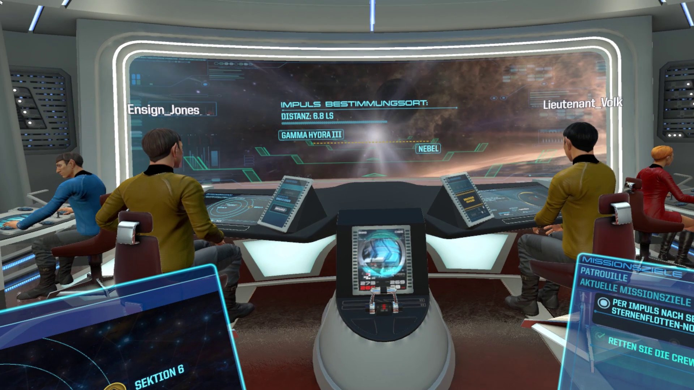
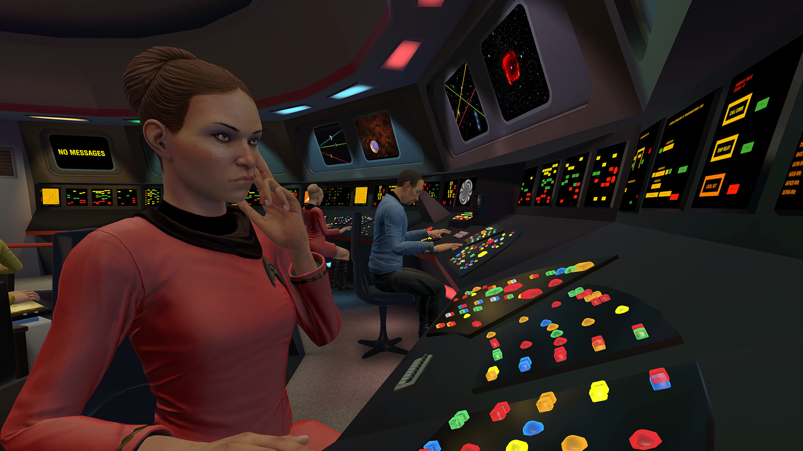
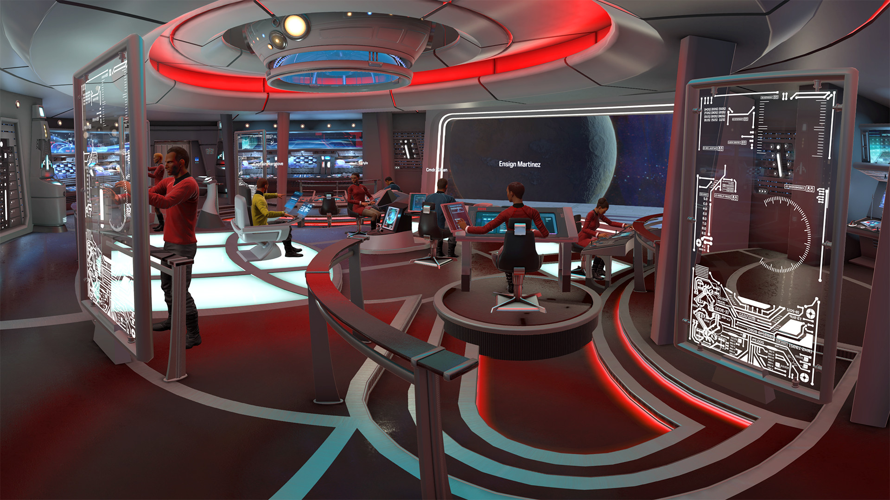
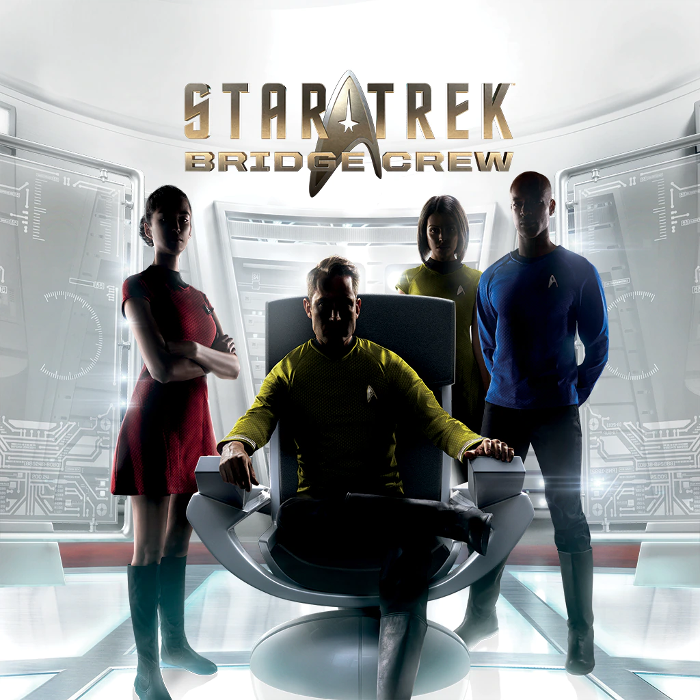
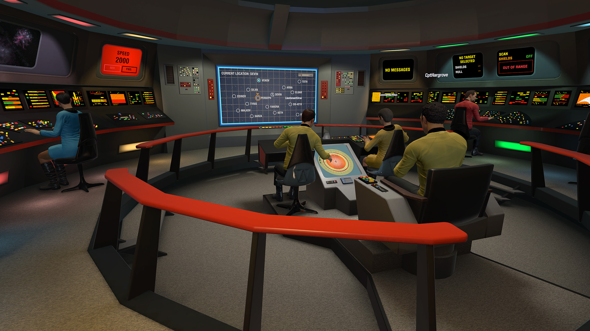

Als één ding in Star Trek tot de verbeelding spreekt, dan is het wel de holodeck. In deze virtuele ruimte konden de bemanningsleden van de televisieserie ieder denkbaar avontuur beleven, waarbij de computer omgevingen, personen en zelfs monsters tevoorschijn toverde.

> [!NOTE]
>
> Deze review verscheen eerder op [Insidegamer](https://inside.gamer.nl/128036-star-trek-bridge-crew-review-de-holodeck-bestaat-echt/).

Het televisieprogramma leek daarmee de toekomst van videogames te voorspellen, want we zitten inmiddels akelig dichtbij zo’n holodeck. Zet een vr-bril op en je waant jezelf immers ook in een digitale wereld. Dat maakt het juist zo toepasselijk dat uitgerekend Star Trek: Bridge Crew misschien wel de meest innovatieve vr-game van deze tijd is. Dit is misschien wel de meest sociale virtualrealitytitel, die je ook nog eens urenlang kan spelen zonder al te snel misselijk te worden.

Je vervult in Bridge Crew een rol op de brug van een sterrenschip. Daarbij kun je aan de slag als kapitein om orders uit te delen aan je medespelers, of bijvoorbeeld achter het stuur gaan zitten om het schip los te vliegen. Vind je de technische kant van een ruimteschip gaver? Dan kun je ook het energiegrid bedienen en beschadigde onderdelen repareren. Of je kunt achter de wapens kruipen om je tegenstanders te beschieten.

## Samen sta je sterk

Jij en je drie medespelers kunnen individueel maar een beperkt aantal taken uitvoeren, waardoor je sterk van elkaar afhankelijk bent. Zo moet de stuurman bijvoorbeeld een vijand binnen de vuurlinie houden, zodat de wapenmeester hem met lasers en torpedo’s er van langs kan geven. En alleen de kapitein ziet basisinformatie over alle andere spelers, waardoor hij het beste de groep kan coördineren.

Ruimtegames zoals het mobiele Spaceteam lieten ons al eens een ruimteschip bedienen met andere gamers, maar nog nooit deden we dit in virtual reality. Dat terwijl het medium bij Bridge Crew ontzettend veel weet toe te voegen. Je zit werkelijk op het schip, samen met vrienden die de game meespelen. Zit de kapitein links van je? Dan kun je die kant opkijken om een gesprek aan te gaan, of hoor je hem in je linkeroor. Het zorgt ervoor dat je jezelf werkelijk op een sterrenschip waant, met andere echte mensen die tegen je terugpraten. En omdat Bridge Crew cross-platform is, kun je met gamers op Oculus Rift, HTC Vive en PlayStation VR spelen.

In het begin is dat trouwens vooral lollig: het duurt niet lang totdat je de bewegingscontrollers gebruikt om bijvoorbeeld een dab te doen, of om met een vuist te schudden naar vrienden terwijl je ‘KHAAAAAAAN!!!’ roept. Zit je eenmaal wat dieper in de game, dan heb je wel het idee dat je samen op een echte plek bent. Je kijkt naar de kapitein tijdens discussies, wijst naar het raam als er een meteoriet nadert en schrikt op als er rechts een paneel van je explodeert.

Je bedient jouw deel van het schip met een holografisch touchscreen. Deze kan met een gamepad worden bediend, maar komt pas echt tot zijn recht met aanraakcontrollers. Er gaat niets boven het overhalen van de warpschakelaar met een flinke zwiep van je arm, om te ontsnappen van een agressieve vloot Klingon-schepen. Of het herleiden van al je extra energie naar de schilden, zodat die ene oorlogskruiser je niet kapotschiet met zijn salvo torpedo’s.

Tijdens onze reviewperiode hebben we meermaals uren achter elkaar gespeeld, zonder echt misselijk te worden. Dat heeft vermoedelijk alles te maken met hoe de game in elkaar steekt. Hoewel je ruimteschip beweegt, zit je personale namelijk comfortabel stil op de brug.

## Een beetje weinig

Het moge duidelijk zijn: het spelen van Star Trek: Bridge Crew voelt als een droom. Je hebt echt het idee op een ruimteschip te zitten, zoals vele trekkies tientallen jaren geleden alleen maar van konden dromen. Het nadeel is alleen wel: héél veel is er op dat schip niet te doen. De game heeft een verhaalmodus, maar deze bestaat uit een beperkt aantal hoofdstukken die aardig los van elkaar lijken te staan. Na een uur of vijf spelen ben je er eigenlijk wel doorheen. Daarna kun je nog willekeurig gegenereerde levels spelen, maar een flink aantal hiervan zijn best snel uitgespeeld. Daarnaast bestaan deze missies uit een beperkt aantal hoofdtaken, zoals het verkennen van gebieden, redden van gestrande ruimtevaarders en het vermijden of beschieten van vijandelijke schepen. Na een tijdje beginnen de basiselementen achter de game zich te herhalen.

Dat gebrek aan content klinkt als een nadeel, maar ondanks dit, vervelen we ons zelfs na een fors aantal speluren nog niet met de game. Dat heeft vermoedelijk te maken met de nieuwigheid achter Bridge Crew. Zelfs nadat we de game hadden uitgespeeld en ons flink in de willekeurige opdrachten hadden verdiept, voelde het nog bijzonder om op de brug van een sterrenschip te zitten. Logisch ook, want er zijn weinig games die je zo goed het gevoel kunnen geven dat je ergens bent, terwijl je samen met vrienden iets doet dat je nog nooit eerder in deze vorm hebt meegemaakt. Bij zo’n nieuw soort vr-titel willen we het gebrek aan content daarom voor nu nog wel even vergeven – mits we op termijn een vervolg of downloadbare content met meer materiaal krijgen.

## Kapitein Solo

Wij speelden Bridge Crew voornamelijk met vrienden en willekeurige andere journalisten en ontwikkelaars. Het is ook mogelijk om het spel alleen te spelen, maar heel bijzonder is dat niet. Je bent dan toegewezen tot de kapiteinsstoel, vanuit waar je commando’s geeft aan computergestuurde bemanningsleden. Grappig, maar het sociale element is juist wat deze Star Trek-game extra bijzonder maakt.

Overigens zit er ook nog een leuke kleine easter egg in de game. Bij willekeurige missies kun je er voor kiezen om in de allereerste Enterprise te vliegen, inclusief de ouderwetse knoppenbediening. Je moet dan ineens uitvogelen welke gekleurde toetsen op een gigantisch gekleurd schip het schip bijvoorbeeld naar voren laten bewegen, of de warp activeren. Door de tutorial-overlay aan te zetten zie je wat iedere knop doet, maar een echte fan leert natuurlijk om zonder die helpende hand het schip te bedienen.
