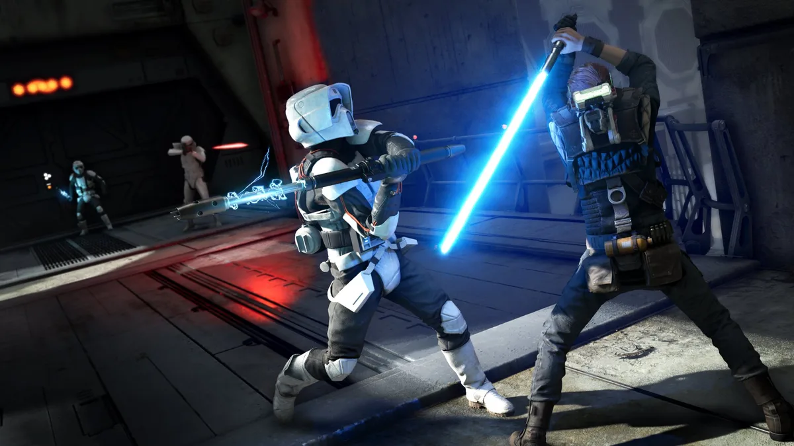
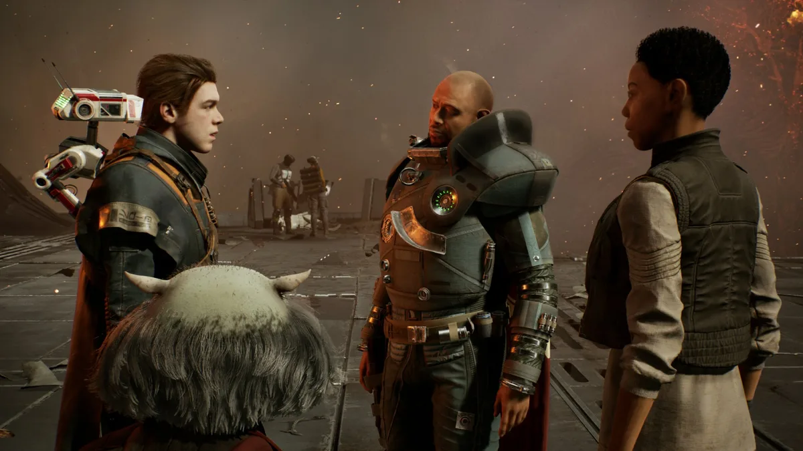
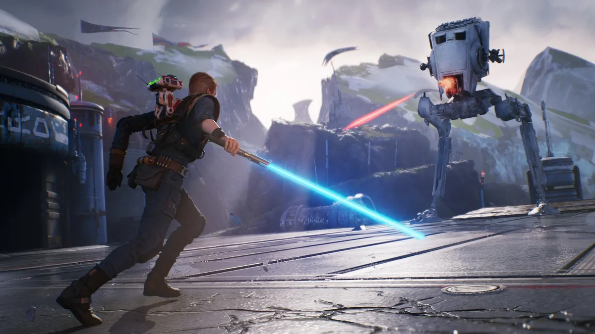

Star Wars Jedi: Fallen Order is niet wat we hadden verwacht. In de game speel je de jonge Jedi Cal in de meest duistere periode in het [Star Wars](https://www.bright.nl/tips/artikel/3915836/star-wars-verwacht-films-series-rise-skywalker-mandalorian-marvel-obi-wan)\-universum. Darth Sidious heeft het universum in een ijzeren greep en heeft enkele jaren geleden de gehele Jedi-orde uitgeroeid.

> [!NOTE]
> Deze recensie verscheen eerder op [Bright](https://www.bright.nl/nieuws/1124317/star-wars-jedi-fallen-order-game-review-ea-kopen.html).

De rebellen die in de films het universum weten te bevrijden, zijn in Fallen Order nog nergens te bekennen. Geen wonder ook: Luke Skywalker is tijdens de gebeurtenissen in de game nog maar vier jaar oud. Het zijn daarom gevaarlijke tijden voor een Jedi als Cal, en dat is rechtstreeks in de gameplay terug te zien.

## Overal toestemming voor vragen

We konden Fallen Order een uurtje spelen in Parijs, onder begeleiding van narrative director Aaron Contreras, die verantwoordelijk is voor het verhaal en hoe deze in de game wordt verteld. Een pittige taak bij een game als [Star Wars](https://www.bright.nl/tags/onderwerpen/kunst-cultuur/film/star-wars): "Voor bijna alles moet er toestemming aan Disney worden gevraagd, en bestaande personages mogen we alleen gebruiken als we daar een heel goede reden voor hebben."

De demo die we speelden zat een paar uur na de introductie, als Cal net heeft geleerd wat hij zoal kan. Met zijn ruimteschip konden we afreizen naar twee verschillende planeten, waarvan we er eentje volledig hebben uitgespeeld.

## Geen laadtijden

Het afreizen naar die planeten zit technisch slim in elkaar: terwijl je door hyperspace racet wordt het spel stiekem in de achtergrond geladen, terwijl je in het schip rondloopt en met Cal’s vrienden praat. Hierdoor word je nooit met laadschermen geconfronteerd en lijkt de gamewereld één vloeiend geheel.

De planeet Dathomir laat zien hoe serieus het bestaande Star Wars-verhaal wordt genomen. Dit is de planeet waar Sith-schurk Maul is geboren, en een plek die geregeld in de latere cartoons voorbijkwam. Clans van de Nightsisters, die bestaan uit hetzelfde ras als Maul, hebben het hier op je gemunt.

## Je bent Luke niet

Fallen Order vertelt een wat gek geplaatst verhaal: je weet als speler immers al dat Cal de Sith niet gaat verslaan. Dat doet immers Luke, jaren na de evenementen in de game. "Toch denk ik dat het einde van Fallen Order mensen zal verrassen", zegt Contreras.

Wij liepen over een stukje van de planeet Dathomir, die vrij te verkennen was. Je kan meerdere kanten op en wordt aangemoedigd om te verkennen, zodat je langzamerhand de juiste route naar je doel kunt vinden. Cal springt en klautert, terwijl hij gaandeweg tegen wilde monsters vecht. Soms staan er schatkisten door de spelwereld verspreid die met een acrobatische handigheid te bemachtigen zijn.

## Teruggaan

Je kunt niet meteen voorbij ieder obstakel dat je tegenkomt. Soms heb je krachten nodig die je pas later in de game krijgt. Op die manier hoopt EA je aan te sporen om oude gebieden opnieuw te bezoeken om daar verborgen schatten te vinden. Wij vonden bij onze speelsessie bijvoorbeeld alternatieve kleuren voor Cals outfit en ruimteschip.

Toen we bij een kamp van de Nightsisters kwamen, veranderde de game ineens significant. Na een korte poging met ze te onderhandelen, wilde de clan wilde aliens ons uitschakelen. Gevechten zijn hier geen kwestie van rondhakken: je moet goed zoeken naar openingen om te misbruiken om hier levend uit te komen.

## Geen handen afhakken

Cal heeft een lichtzwaard, maar dit is niet het handenafhakkende wapen dat je kent uit de films. Vijanden hebben meerdere klappen nodig om te worden uitgeschakeld, net als bij gewone zwaarden in games.

Wel heeft Cal een paar handige trucs om tegenstanders te slim af te zijn. Door met goede timing op de blokkeerknop te drukken, kun je bijvoorbeeld aanvallen van vijanden pareren en meteen de tegenaanval openen. Doe dit bij binnenkomende laserstralen en je slaat ze terug naar de schutter.

Daarnaast kan de Jedi gebruikmaken van de Force. Wij hadden in de demo de mogelijkheid om tegenstanders te vertragen, waardoor ze weerloos waren tegen een zwaardslag.

## Moeilijk

Onderschat de moeilijkheidsgraad van deze game niet: we gingen bij onze demo meermaals onderuit, waarna we een flink stuk terug moesten lopen. Vijanden verstoppen zich om je op een onbewaakt moment te belagen, waarna een enkele klap flink wat schade kan doen. Je moet bij iedere bocht goed om je heen kijken en altijd waakzaam blijven.

Eigenlijk lijkt de game verdacht veel op de Dark Souls-reeks, waarin een enkele vijand je op een onbewaakt moment ook kan uitschakelen. Net als in die games kun je tussendoor uitrusten, maar komen alle eerder verslagen vijanden dan terug. Je moet soms stukjes meermaals herhalen tot je precies weet wat de bedoeling is, waarna de voldoening des te groter is zodra je het haalt.

## Voorlopige conclusie

Fallen Order is eigenlijk helemaal niet wat we hadden verwacht. Bij een verhalende game over zo’n grote franchise denk je vaak aan makkelijke, lineaire spellen die vooral cinematisch moeten aanvoelen. Fallen Order is het tegendeel van al die dingen: dit spel is uitdagend, heeft een open wereld en legt de nadruk juist op de spelsystemen.

Hoewel we dat niet hadden verwacht, is het wel precies wat we in een Star Wars-game willen. We hadden in ons uur speeltijd kneiterlastige gevechten waarbij we op het nippertje wisten te winnen - en dat alleen al geeft je het gevoel een Jedi te zijn. Hopelijk wordt de volledige game net zo indrukwekkend.

## Kijk ook: Nintendo-gadget maakt fitness weer leuk

[Bekijk ingesloten media](https://www.youtube.com/embed/-snQ5Fi0LOc?autoplay=1&modestbranding=1)

**[Volg Bright op YouTube](https://bit.ly/brighttv) voor meer tech-video's**
