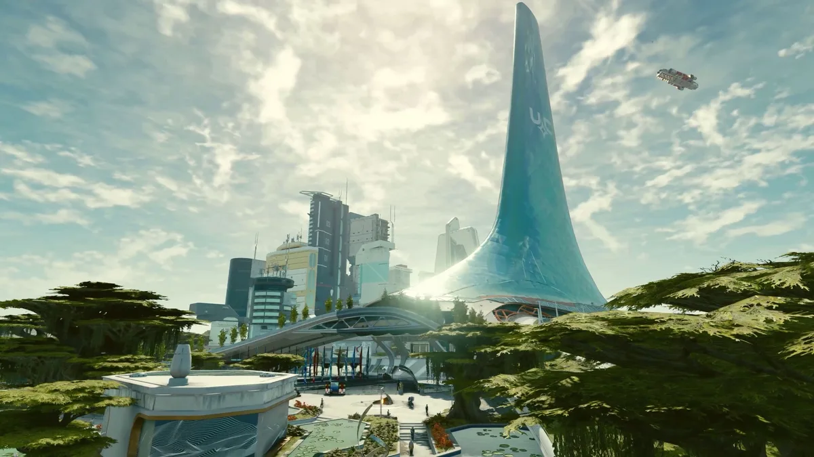
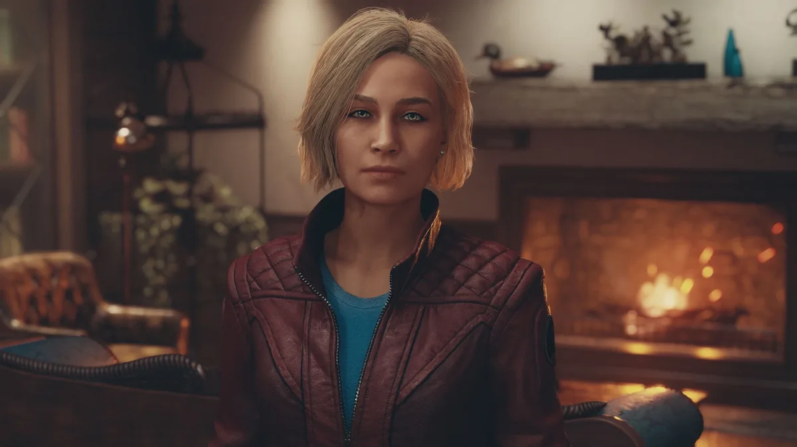
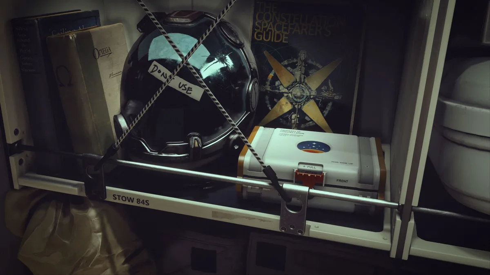
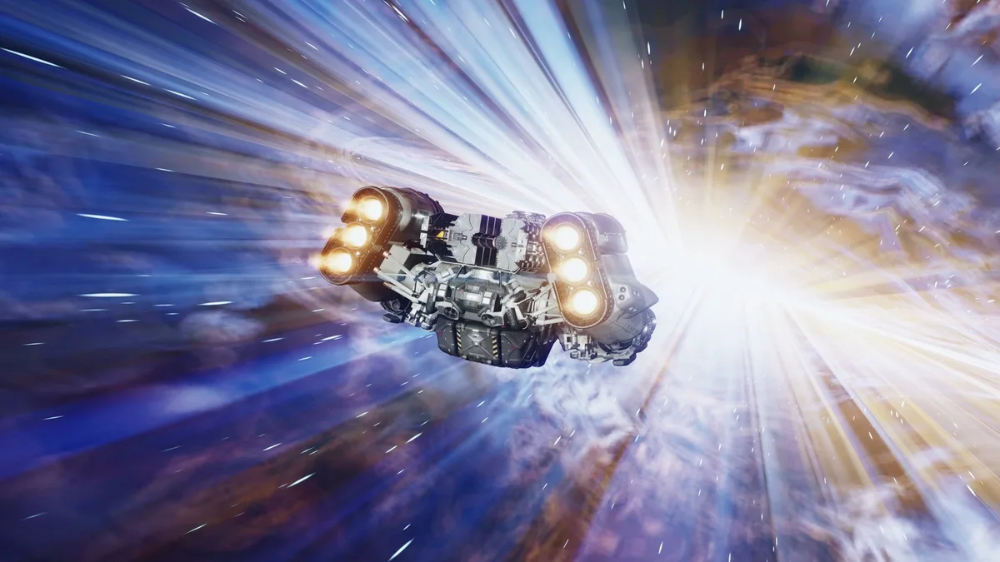

De trailers van Starfield beloofden de afgelopen maanden iets groots. Een spel met meer dan duizend planeten om te verkennen en talloze systemen die boven op elkaar zijn gebouwd. Hoewel het onduidelijk was hoe al die ideeën moesten samenkomen om een samenhangend geheel te vormen.

> [!NOTE]
> Deze recensie verscheen eerder op [Bright](https://www.bright.nl/nieuws/1150259/starfield-review-xbox-pc-gamepass-bethesda.html).

Het blijkt vrij eenvoudig te zijn, want in de kern werkt Starfield op dezelfde manier als de vorige games van Bethesda. Het schietspel en het bouwen van bases lijken het meest op Fallout 4, hoewel de manier waarop je voortdurend coole nieuwe stukjes van het universum ontdekt meer lijkt op Skyrim. Er is een hoofdverhaal om in te duiken, maar je zult snel worden afgeleid door zijmissies. Je vecht tegen piraten en ontdekt verlaten stations vol met buit.

## Onsamenhangend

Je reist tussen planeten met je ruimteschip dat je zelf koopt, steelt of bouwt. Je vliegt rond zoals je zou doen in Elite: Dangerous, waarbij je je snelheid tijdens gevechten beperkt voor wendbaarheid, terwijl je je energie-uitvoer in evenwicht houdt om ervoor te zorgen dat je wapens, schilden en motor goed presteren wanneer dat nodig is. Het is leuk genoeg, maar ruimtereizen worden uiteindelijk routine. Er ontbreekt bij het vliegen nuance en diepgang, wat je wel hebt bij andere delen van de game.

Het kan ook soms een beetje onsamenhangend aanvoelen. Het vliegen tussen systemen en landen op planeten gebeurt met een druk op de knop, meestal gevolgd door een laadscherm. Het reizen tussen al bezochte systemen komt al snel neer op het navigeren door menu's en wachten tot het spel is geladen. Je krijgt het gevoel dat je een reeks levels speelt, in plaats van dat je door een groot, samenhangend universum vliegt.

## Gigantisch

De immense schaal is echter indrukwekkend. Hoewel een groot deel van de planeten onbewoonbaar is en lijkt te zijn gegenereerd door een algoritme, zit het spel vol met handgeschreven zijmissies die de vele stersystemen tot leven brengen.

Je verdwaalt makkelijk in de spelwereld, denkend dat je een planeet hebt bereikt die tijdens de ontwikkeling niet veel aandacht had gekregen. Om daarna te ontdekken dat je het fout had, omdat ook daar een cool verhaal verstopt zit.

Sommige van die missies zijn fantastisch. Ze sluiten vaak aan bij verhalen die je eerder hebt gespeeld, waardoor unieke dialoogopties krijgt die je normaal gesproken niet zou hebben. Je zult missies vinden die je kunt spelen zonder een schot te lossen. Het geeft het hele universum een groots en levendig gevoel en dat is geweldig.

## Game-y game

Die illusie wordt verbroken wanneer je af en toe stuit op een plek waar niks handgemaakt is. In het begin was ik geneigd om Starfield te spelen zoals ik Baldur's Gate 3 zou spelen, in de verwachting dat er achter elke hoek iets goed doordachts zou zijn. Ik zag een ruimteschip landen op de [maan](https://www.bright.nl/onderwerpen/maan) die ik aan het verkennen was en rende erheen in de hoop met de kapitein te praten. Die kapitein was echter gewoon een vijandige npc genaamd 'Spacer', omringd door andere spacers. Het enige dat ik kon doen was op ze schieten of vluchten. Banaal.

Dit soort vijanden maakt Starfield echt een game-y game. Er zijn veel vijandige, gedachteloze astronauten die rondlopen, puur om het spel op te vullen. Meestal omringd door dezelfde soort bases om te plunderen. Hetzelfde geldt ook voor Skyrim en Fallout, maar die spellen verstopten hun agressieve vijanden achter het feit dat het radioactieve monsters of zombies waren. In het meer beschaafde universum van Starfield valt het wat uit de toon.

Dat is waarschijnlijk te wijten aan de schaal van de game. Starfield is enorm, dus je zult onvermijdelijk content tegenkomen die niet zo goed doordacht is. Het is onmogelijk om al die planeten van een uniek verhaal te voorzien. Dat het bij zoveel wél is gelukt, is een wonder.

## Je doet er weinig toe

Die schaal zorgt ervoor dat je je ook wat nietig kunt voelen. Je bent een kleine stip in een enorm universum, dat jou niet echt nodig lijkt te hebben om voort te bestaan. Er zijn bovendien onwijs veel facties en nuances waardoor de game niet echt een simpel verhaal met een goede klap kan vertellen. Een identiteit ontbreekt in de game, behalve dat het 'dat grote ruimtespel' is.

Voor sommige mensen is dat prima. Het is een probleem dat onmogelijk te vermijden is met een spel op deze schaal, en het is precies het soort ervaring dat je zou verwachten van Bethesda. Dit is het grootste spel dat ze ooit gemaakt hebben, misschien wel hun beste titel die ik heb gespeeld. Maar in de kern is het ook gewoon een Bethesda-game. Ik ben benieuwd of dat genoeg is voor al die mensen die hopen op een gigasucces bij Microsoft.

_[Starfield](https://bethesda.net/en/game/starfield) is vanaf 6 september beschikbaar voor Windows en [Xbox](https://www.bright.nl/onderwerpen/xbox) Series X|S, en zit direct inbegrepen bij het Game Pass-abonnement._

[Bekijk ingesloten media](https://www.youtube.com/embed/kfYEiTdsyas)
