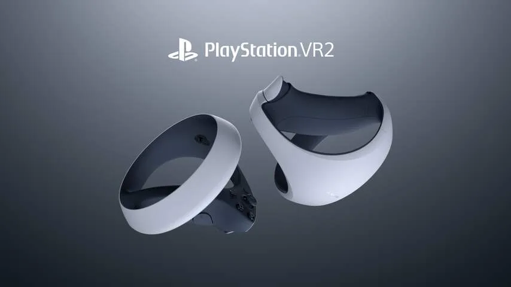

Een paar jaar geleden was virtual reality het paradepaardje van de techwereld. Door een scherm en een paar lenzen vlak voor je ogen te plaatsen, kun je rechtstreeks een virtuele wereld in kijken. Tegelijkertijd registreren bewegingssensoren welke kant je opkijkt. Hierdoor voelt het alsof je echt ergens anders bent.

> [!NOTE]
> Deze recensie verscheen eerder op [NU.nl](https://www.nu.nl/reviews/6252710/we-hebben-de-nieuwe-vr-bril-van-sony-getest-vijf-dingen-die-opvallen.html).

Sony had al zo'n VR-bril voor de PlayStation 4 en doet nu nog een gooi met de PS VR2. De prijs: 600 euro, plus de kosten van een PlayStation 5 om hem op aan te sluiten.

## 1. Makkelijker dan de PS VR1, hetzelfde als de concurrentie

De eerste PS VR was een soort hobbyproject, met camera's en gekleurde lampjes die je posities in de gaten moesten houden. Je moest ook allerlei apparaten en kabels verbinden om het te laten werken. Daardoor was het gebruik van de headset allesbehalve gebruiksvriendelijk.

De PS VR2 is op dat vlak fors verbeterd. Je sluit hem aan met een enkele USB-c-kabel en verbindt de bijbehorende controllers draadloos, waarna alles werkt zoals je verwacht. Dat is beter dan Sony's vorige poging, maar eigenlijk ook een beetje de norm. Concurrenten zoals de Valve Index en Meta Quest zijn minstens net zo makkelijk aan te sluiten.

## 2. De controllers zijn iets geavanceerder dan bij de concurrent

Bij de PS VR2 heb je twee controllers, die je elk in één hand vasthoudt. De camera's op de bril zien de posities van die apparaten, zodat je in de game ziet waar je handen zich 'echt' bevinden. Ook ziet de bril waar sommige vingers op de knoppen liggen, zodat je bijvoorbeeld kunt wijzen of een vuist kunt maken.

De apparaatjes zijn grotendeels identiek aan de controllers van de Quest, Valve Index en andere moderne VR-brillen. Met één groot verschil: de trekkers kunnen op verschillende manieren aanvoelen. Span een boog aan en je voelt extra druk onder je wijsvinger, bij een pistooltrekker voel je ineens een klikbeweging. Datzelfde systeem zit ook in de gewone PlayStation 5-gamepad.

Het zorgt ervoor dat games iets meeslepender aanvoelen, al moeten spellen het dan wel ondersteunen. Bij de PlayStation 5 is dat wisselend het geval, en bij de PS VR2 werkt ook niet iedere game met die speciale triggers.

_We hebben de nieuwe VR-bril van Sony getest: vijf dingen die opvallen — Beeld: Sony_

## 3. Oogtracking maakt games verbluffend mooi

De schermen van de PS VR2 hebben bij elkaar opgeteld de resolutie van een 4K-televisie. Voor VR is dat haarscherp. En ook een vereiste: omdat je ogen vlak op het scherm zitten, kun je bij lagere resoluties vaak de ruimte tussen de pixels zien. Daardoor hangt er een soort hor over de wereld. Dat is bij de PS VR2 niet het geval.

Strikt gezien zijn er VR-brillen met een hogere resolutie, maar in onze ervaring zijn games op de PS VR2 mooier. Dat komt door ingebouwde sensoren die je ogen in de gaten houden. De bril weet altijd waar je naar kijkt, zodat dit deel van de gamewereld iets mooier in beeld wordt gebracht. Games die exclusief voor de PS5 zijn gemaakt, zoals _Horizon Call of the Mountain_, zijn hierdoor verbluffend om te zien.

## 4. Er zijn bar weinig games, maar Horizon is bijzonder goed

Sony pocht met tientallen games voor de PS VR2, maar in de praktijk valt dat tegen. Veel van de 'nieuwe' spellen verschenen al eerder, bijvoorbeeld voor de PS VR1 of concurrerende brillen. Kijk je naar de lijst echt nieuwe games, dan gaat het om een paar.

Het Nederlandse _Horizon Call of the Mountain_ is een van de weinige echt nieuwe titels en maakt ook een zeer goede indruk. Je speelt een bergbeklimmer die op zoek is naar zijn broer, in de wereld van de eerdere _Horizon_\-games. Het is een van de mooiste VR-games die we ooit hebben gezien. De makers hebben elementen uit andere, kleinere VR-spellen gecombineerd om één grote, meeslepende ervaring te bouwen.

## 5. De prijs maakt het een nicheproduct

Met een prijs van 600 euro is de PS VR2 zelfs duurder dan de spelcomputer die je nodig hebt om de bril te kunnen gebruiken. Tel je die spelcomputer mee, dan betaal je ruim 1.000 euro om deze headset te kunnen gebruiken. En dan is de benodigde PlayStation 5 ook nog eens slecht verkrijgbaar.

Het maakt de PS VR2 een echt nicheproduct voor de fanatiekste gamers. Vooral vergeleken met concurrenten zoals de Meta Quest 2: die werkt zelfstandig zonder extra spelcomputer en kost je zo'n 400 tot 450 euro. Daar draaien de meeste PS VR2-games ook gewoon op, al zien ze er dan wel beduidend minder mooi uit.
