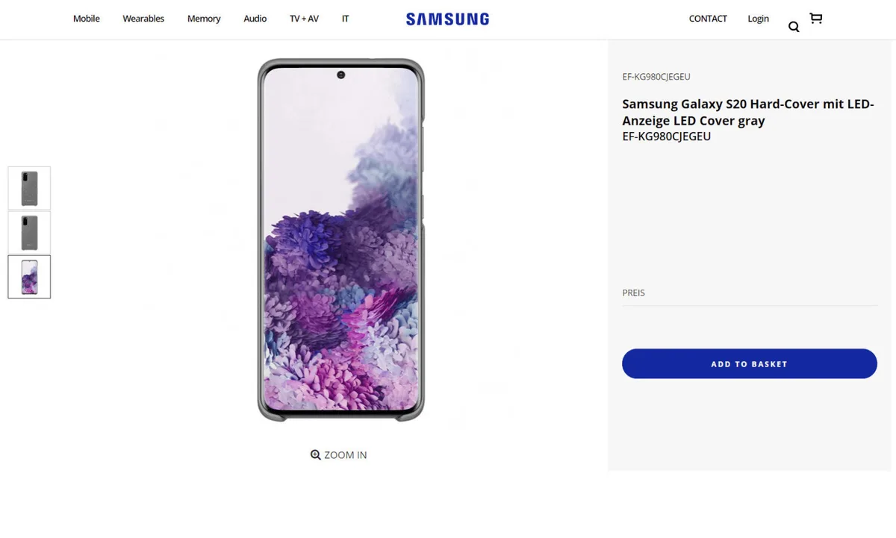

**Weer een lek**

> [!NOTE]
> Dit artikel verscheen eerder op [Bright](https://www.bright.nl/nieuws/1125245/samsung-bevestigt-naam-en-ontwerp-galaxy-s20-op-eigen-website.html).

De nieuwe smartphone stond voor korte tijd op de Duitse website van Samsung, bij een productpagina van een nieuw hoesje voor de Galaxy S20. De telefoonmaker haalde de pagina snel weer offline, maar niet voordat [WinFuture](https://winfuture.de/news,113892.html) er screenshots van had gemaakt.

De pagina lijkt eerdere geruchten grotendeels te bevestigen: de nieuwe Galaxy S-telefoon heet inderdaad de [Galaxy S20](https://www.youtube.com/watch?v=MIdcLvoFXjk) en heeft wederom een nagenoeg randloos scherm. Aan de bovenkant zit één klein gaatje voor de selfiecamera.

Op de achterzijde van de telefoon zitten drie cameralenzen. En daarnaast lijkt Samsung wederom een led-hoesje voor de nieuwe Galaxy uit te brengen, met achterop lichtgevende stipjes.

> 

## Vier lenzen, 108 megapixel sensor

Smartphonelekker Ice Universe, die eind vorig jaar als één van de eersten de naam van de S20 naar buiten bracht, heeft op zijn beurt een nieuwe foto van een luxe variant gedeeld. Deze Galaxy S20 Ultra heeft achterop vier lenzen zitten. Volgens eerdere geruchten schuilt daar een 108 megapixel-sensor achter.

## Samsung-event op 11 februari

Het duurt niet lang tot we meer over de Galaxy S20 horen. Op 11 februari presenteert het Zuid-Koreaanse bedrijf zijn smartphoneplannen, waarbij vermoedelijk ook opvouwtoestel [Galaxy Z Fold](https://www.youtube.com/watch?v=MIdcLvoFXjk) aan bod zal komen.

Een nieuwe Samsung-app verklapte eerder al de komst van nieuwe [draadloze oordoppen](https://www.bright.nl/nieuws/artikel/5010966/samsung-galaxy-buds-nieuwe-oordoppen-oordopjes-android-iphone-airpods) van het bedrijf, die ook met iOS zullen werken.

**Bright doet verslag van het Samsung-event volgende week. Volg ons op [YouTube](https://bit.ly/brighttv), [Facebook](https://www.facebook.com/brightnl) en [Instagram](https://www.instagram.com/bright_nl).**

## Dit weten we over de Galaxy S20 en Galaxy Z Fold

[Bekijk ingesloten media](https://www.youtube.com/embed/MIdcLvoFXjk?autoplay=1&modestbranding=1)

**[Volg Bright op YouTube](https://bit.ly/brighttv) voor meer tech-video's**
