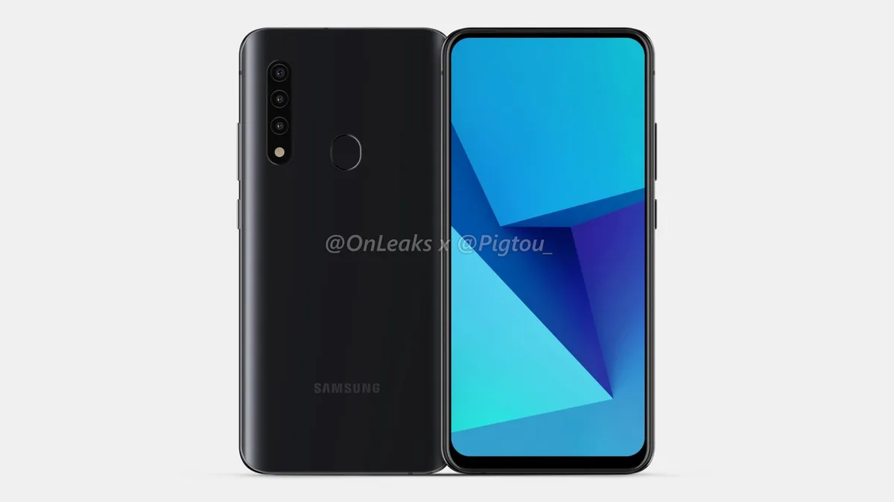

**Cameraloos beeldscherm**

> [!NOTE]
> Dit artikel verscheen eerder op [Bright](https://www.bright.nl/nieuws/1126234/samsung-werkt-aan-smartphone-met-uitschuifcamera-voor-selfies.html).

Door de selfiecamera met zo'n uitschuifsysteem te verbergen, hoeft Samsung hem niet langer in het scherm te verwerken. Hierdoor kan een toekomstige Galaxy-telefoon de voorkant bedekken met alleen maar een beeldscherm.

Het is nog niet bekend welke telefoon het camerasysteem zal gebruiken, maar vermoedelijk gaat het om een toestel ik de Galaxy A-reeks. De telefoon is te zien op gelekte afbeeldingen in handen van OnLeaks en [PigTou](https://pigtou.com/blogs/android/exclusive-samsung-galaxy-with-pop-up-camera?sscid=41k4_s2c86&).

## OnePlus

Meerdere andere Android-telefoonmakers gebruikten in het verleden al eens een vergelijkbaar systeem. OnePlus stapte er bij zijn nieuwe OnePlus 8-reeks weer van af, omdat het motorsysteem de telefoon een stuk zwaarder zou maken.

De OnePlus 8 gebruikt toevallig hetzelfde camera-ontwerp als in recente Samsung-telefoons: in het scherm zit een klein gaatje, waar de selfiecamera achter schuilt.

## Camera in scherm

Telefoonmakers zijn al jaren op zoek naar een manier om de selfiecamera te verbergen in het toestel. Het Chinese Oppo toonde vorig jaar technologie waarmee de camera in het scherm zelf geïntegreerd kan worden.

[Bekijk ingesloten media](https://www.youtube.com/embed/lnRabHU-5_4?autoplay=1&modestbranding=1)

## Eerste indruk: OnePlus 8 Pro

**[Volg Bright op YouTube](https://bit.ly/brighttv) voor meer tech-video's**
