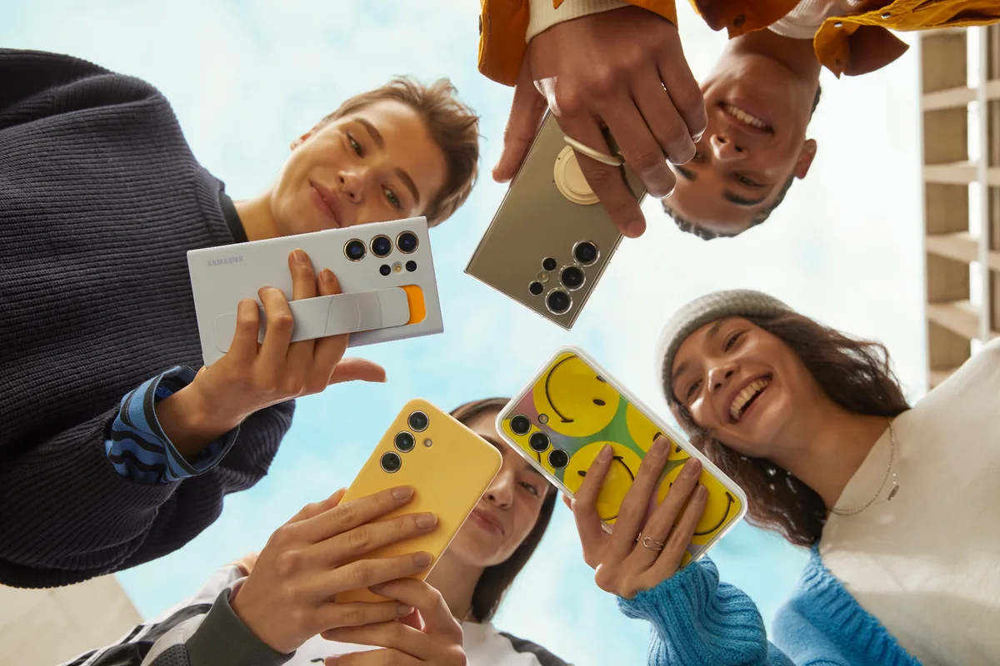
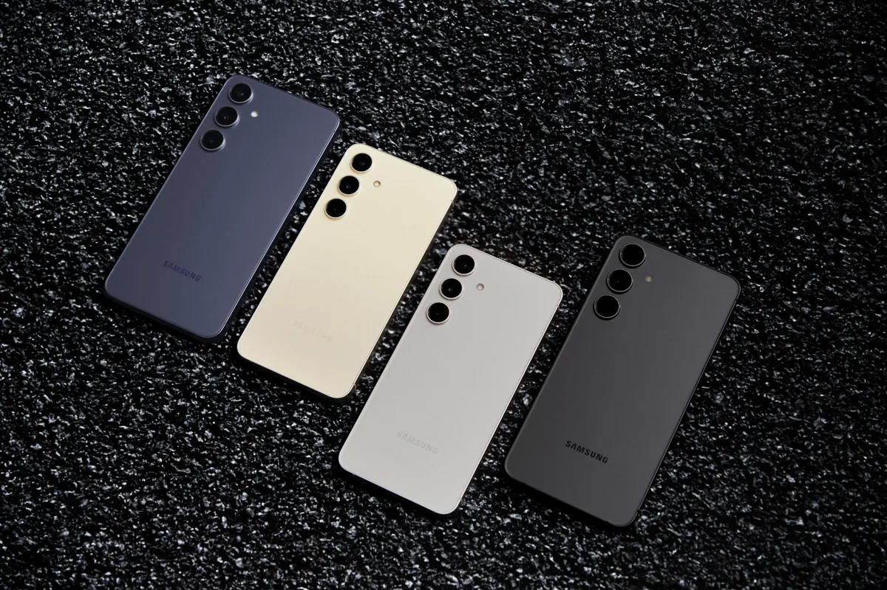

**Kijk ook onze [eerste indruk van de Galaxy S24](https://www.bright.nl/videos/1174350/verrassend-leuk-samsung-toont-galaxy-ai-bij-onthulling-van-galaxy-s24.html) en luister [onze podcast](https://www.bright.nl/nieuws/1174345/alles-over-de-ai-thuisbatterij-n-de-nieuwe-samsung-galaxy-s24.html).**

> [!NOTE]
> Dit artikel verscheen eerder op [Bright](https://www.bright.nl/nieuws/1173899/samsung-zet-met-nieuwe-galaxy-s24-telefoons-vol-in-op-ai.html).

Samsung heeft vanavond de nieuwe [Galaxy S24](https://www.bright.nl/videos/1174350/verrassend-leuk-samsung-toont-galaxy-ai-bij-onthulling-van-galaxy-s24.html)\-smartphones onthuld, wederom in drie varianten. Het ontwerp van de drie telefoons is vernieuwd, met de meest merkbare verschillen bij de S24 en S24+: die hebben een plattere band rond de zijkant en een afgevlakt scherm voorop, waardoor ze iets meer lijken op de recente iPhones. De schermen zijn respectievelijk 6,2 en 6,7 inch groot.

Het S24 Ultra-model van 6,8 inch voelt nog het meeste als de voorgangers, met aan zijkanten gebogen randen en onderin een pennetje om hem mee te bedienen. Dit duurste model heeft nu een titanium behuizing, wat hem steviger en lichter moet maken.

De Ultra draait op een Snapdragon Gen 3-chip die games significant mooier moet maken: met behulp van ray-tracing worden realistischere reflecties getoond.

## Alle ballen op [AI](https://www.bright.nl/onderwerpen/AI)

Hoewel er veel is vernieuw qua hardware, lag de nadruk bij Samsungs prestatie aan de softwarekant: dit zijn de eerste telefoons die gebruikmaken van de nieuwe [Galaxy AI](https://www.bright.nl/videos/1174350/verrassend-leuk-samsung-toont-galaxy-ai-bij-onthulling-van-galaxy-s24.html). Deze kunstmatige intelligentie helpt je op allerlei manieren om meer uit je dag te halen.

Bel je met iemand in een andere taal, dan kan de AI dat gesprek bijvoorbeeld live voor je vertalen. Het toetsenbord bevat eigen AI-software die je helpt je tekst te corrigeren of beter op te maken. Zo kan je telefoon een jolig bericht formeler verwoorden zodat je hem naar je baas kunt sturen.

## Nog niet alles Nederlands

Samsung vertelt ons dat sommige functies, zoals de live-vertalingen of het automatisch uitschrijven van interviews, nog niet in het Nederlands werken. Wel kun je ze bijvoorbeeld in het Engels gebruiken. Daarnaast zijn er meerdere AI-functies die niet taalafhankelijk zijn, zoals een fotobewerker waarmee je objecten in het beeld kunt verplaatsen of delen van de ruimte kunt invullen. Bij video’s kan de AI extra frames verzinnen, zodat je er een slow-motion-clip van kunt maken.

De nieuwe smartphones zijn grotendeels iets goedkoper geworden: de Galaxy S24 kost 899 euro, vijftig euro minder dan de S23 van vorig jaar. De S24+ is met 1149 euro ook vijftig euro in prijs gedaald. Het Ultra-model is met 1449 euro wel vijftig euro duurder geworden dan zijn voorganger, al zijn modellen met meer opslag een tientje goedkoper.

Alle nieuwe Galaxy S24-toestellen zijn vanaf 31 januari verkrijgbaar in Nederland.

_Kijk ook onze [eerste indruk van de Galaxy S24](https://www.bright.nl/videos/1174350/verrassend-leuk-samsung-toont-galaxy-ai-bij-onthulling-van-galaxy-s24.html) en luister [onze podcast](https://www.bright.nl/nieuws/1174345/alles-over-de-ai-thuisbatterij-n-de-nieuwe-samsung-galaxy-s24.html)._

[Volg meer nieuws over Samsung](https://www.bright.nl/%E2%80%9Chttps://www.bright.nl/onderwerpen/samsung%E2%80%9D).
