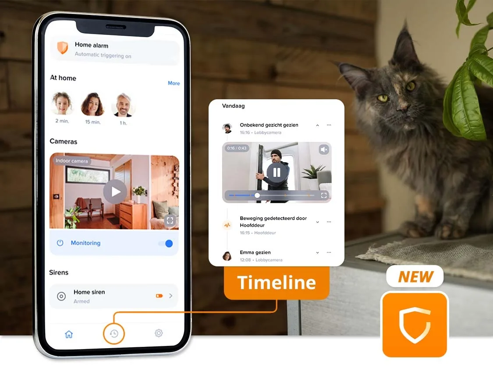

Netatmo’s app was ooit bedoeld om de camera’s van het bedrijf te bedienen, maar groeide uit de klauwen toen het bedrijf ook rookmelders, deuropeners en andere smarthome-apparatuur introduceerde. Het nieuwe ontwerp moet ervoor zorgen dat al dit makkelijker te bedienen is.

> [!NOTE]
> Dit artikel verscheen eerder op [Bright](https://www.bright.nl/nieuws/1179026/smarthome-app-netatmo-vernieuwd-voortaan-duidelijker-met-meer-gadgets.html).

Centraal in de nieuwe app is het dashboard, waarop je een snel overzicht krijgt van wat er in huis gebeurt en simpele acties kunt uitvoeren.

Op de nieuwsfeed-pagina kun je zien wat voor gebeurtenissen er hebben plaatsgevonden - zoals hoe laat een camera activiteit detecteerde. Het derde tabblad biedt toegang tot de instellingen.

## Uitrol gestart

De vernieuwde app is deze week beschikbaar gesteld, maar het kan volgens het bedrijf nog wekenlang duren tot alle gebruikers het nieuwe ontwerp ook echt zien.

Het nieuwe app-ontwerp komt net nu de Netatmo-app de hete adem voelt van smarthome-apps van grote bedrijven. Omdat steeds meer slimme huisapparatuur via de wereldwijde standaard [Matter](https://www.bright.nl/nieuws/1158187/matter-smart-home-apple-google-slimme-koelkast-stofzuiger-wasmachine-luchtreiniger.html) werkt, zijn ze ook te bedienen vanuit bijvoorbeeld [Apple](https://www.bright.nl/organisaties/apple)'s Woning-app of de [Google](https://www.bright.nl/organisaties/google) Home-app.

Lees meer over [smart home](https://www.bright.nl/onderwerpen/smart-home) en abonneer gratis op [onze nieuwsbrief](https://www.bright.nl/nieuws/1175658/abonneer-je-gratis-op-de-bright-nieuwsbrief.html).
