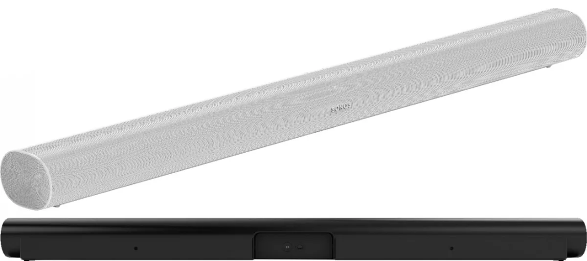

**Beelden gelekt**

> [!NOTE]
> Dit artikel verscheen eerder op [Bright](https://www.bright.nl/nieuws/1126302/sonos-presenteert-nieuwe-playbar-sub-en-play5-juni.html).

Dat vertelt een anonieme bron aan [9to5Mac](https://9to5mac.com/2020/04/29/sonos-dolby-atmos-playbar-more/). Het is voor het eerst in jaren sinds de drie producten een nieuwe versie krijgen.

Tedchjournalist [Dave Zatz](https://zatznotfunny.com/2020-05/new-sonos-playbar/) heeft al vroege beelden van de vernieuwde Sonos Playbar bemachtigd, waarop de soundbar er iets ronder uitziet dan het huidige model. Er worden twee kleuren getoond: zwart en wit. Volgens 9to5Mac zal de speaker bovendien [Dolby Atmos](https://www.bright.nl/tips/artikel/4250706/dolby-atmos-speakers-soundbars-werking-verticaal-geluid-surround-sound) ondersteunen, voor een betere surround-ervaring.

De poorten achterop de speaker zijn in deze plaatjes niet te zien, wat doet vermoeden dat ze in de zijkant zitten of simpelweg nog niet in dit beeld zijn verwerkt. Het is daarom onduidelijk of deze speaker net als de [Sonos Beam](https://www.youtube.com/watch?v=QASxpJZhUPw) gebruikmaakt van een HDMI-poort, of afhankelijk is van optische audio zoals bij de Playbar.

Details over de nieuwe Sub en Play:5 zijn nog niet naar buiten gelekt.

[Bekijk ingesloten media](https://www.youtube.com/embed/jKMB6xI1eE4?autoplay=1&modestbranding=1)

## Kijk ook: Denon-speakers verslaan Sonos?

## Grote software-update

De vermeende verschijningsdatum in juni lijkt wel plausibel, gezien het bedrijf in diezelfde periode een [grote software-update](https://www.bright.nl/nieuws/artikel/5059476/sonos-onthult-nieuw-besturingssysteem-voor-slimme-speakers) voor bijna al zijn luidsprekers uitbrengt. Daarmee wil Sonos zijn besturingssysteem voorbereiden op krachtigere hardware - zoals dit gelekte drietal.

[Bekijk ingesloten media](https://www.youtube.com/embed/oKmoq749Ejw?autoplay=1&modestbranding=1)

## Maak kans op de nieuwe iPhone SE:

**[Volg Bright op YouTube](https://bit.ly/brighttv) voor meer tech-video's.**
