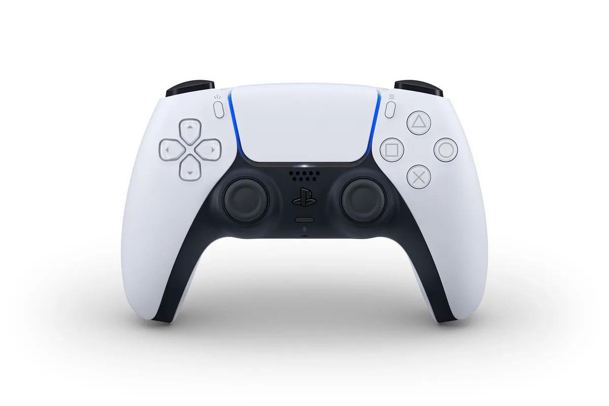

**Doei DualShock**

> [!NOTE]
> Dit artikel verscheen eerder op [Bright](https://www.bright.nl/nieuws/1126049/sony-onthult-controller-van-playstation-5-de-dualsense.html).

De DualSense lijkt op een iets dikkere variant van de huidige PlayStation 4-gamepad, waarvan de zijkanten en bovenkant wit zijn gemaakt. Het aanraakpaneel in het midden van de controller is iets groter, met aan weerszijden gekleurde lichten.

"In de afgelopen jaren hebben we meerdere ontwerpen gemaakt, voordat we besloten om voor deze te gaan", aldus PlayStation-topman Hideaki Nishino op de [PlayStation-blog](https://blog.us.playstation.com/2020/04/07/introducing-dualsense-the-new-wireless-game-controller-for-playstation-5/). "De DualSense is getest door een significante groep gamers met meerdere handgroottes, om er zeker van te zijn dat hij zo comfortabel mogelijk is."

Het is voor het eerst dat Sony zijn gamepad een echt andere naam geeft. De eerste PlayStation-controller heette de DualShock omdat er een trilmotor in zat. Die naam vindt Sony niet meer van deze tijd. De nieuwe controller geeft met haptische feedback meerdere sensaties, waardoor gekozen is voor de naam DualSense. Haptische feedback kan schokjes en tikjes beter nabootsen dan de ouderwetse trilmotor.

## Microfoon

De ronde PlayStation-knop in het midden is vervangen met een toets in de vorm van het logo, met vlak daaronder een microfoon. Hierdoor heb je niet langer een headset nodig om tijdens het gamen met vrienden te praten, al adviseert Sony er alsnog eentje voor langere gamesessies.

De toetsen van de DualSense zijn nagenoeg identiek aan die van de huidige DualShock, al is de Share-knop nu vervangen met een nieuwe Create-knop. De manier waarop je hiermee gameplay op sociale media deelt is volgens Sony iets anders, al heeft het bedrijf hier nog geen details over gegeven.

## Speciale trekkers

De trekkers bovenop de controller veranderen de gegeven druk op basis van je game. Hierdoor krijg je het gevoel een boog te spannen of een gaspedaal in te drukken.

## Dit weten we over de PS5 en nieuwe Xbox

[Bekijk ingesloten media](https://www.youtube.com/embed/YUgS64yLP7g?autoplay=1&modestbranding=1)

**[Volg Bright op YouTube](https://bit.ly/brighttv) voor meer tech-video's**
