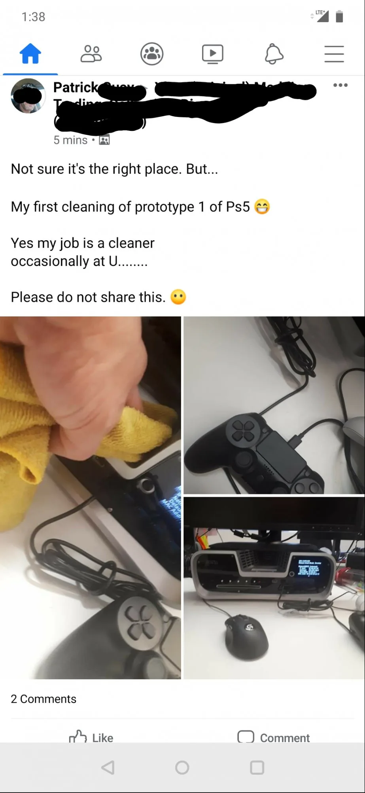

**PS5**

> [!NOTE]
> Dit artikel verscheen eerder op [Bright](https://www.bright.nl/nieuws/1124886/sony-onthult-logo-van-playstation-5.html).

Het PlayStation 5-logo ziet er min of meer uit zoals verwacht. Sony gebruikt exact hetzelfde lettertype als bij de [PlayStation 4](https://www.bright.nl/nieuws/artikel/4797726/playstation-4-ps4-verkoopcijfers-100-miljoen-kopen), waarbij simpelweg het cijfer is omgewisseld voor een vijf.

Het Japanse gamebedrijf deelde eerder al details over de [PlayStation 5](https://www.bright.nl/nieuws/artikel/4877351/playstation-5-dit-weten-we-al). De nieuwe gameconsole staat gepland voor eind 2020 en heeft kortere laadtijden dankzij een ingebouwde SSD-schijf. Het apparaat kan ook oude PlayStation 4-games afspelen.

Een schoonmaker bij een gameontwikkelaar [lekte](https://www.reddit.com/r/PS5/comments/eki59d/ps5_devkit_cleaning/) recent nog afbeeldingen van het prototype van de PlayStation 5. Daarbij was ook de nieuwe controller te zien, die er iets dikker uitziet dan het huidige model. Volgens geruchten krijgt de gamepad mogelijk extra trekkers onderop en is hij voorzien van een microfoon voor gamechatgesprekken.

## 104 miljoen PlayStation 4’s

De PlayStation 4 is inmiddels meer dan 104 miljoen keer verkocht, aldus Sony tijdens de CES-presentatie. Daarmee is het de op één na populairste gameconsole aller tijden. De PlayStation 2 staat met 158 miljoen verkochte exemplaren op de eerste plaats.

De [PlayStation VR](https://www.youtube.com/watch?v=tm1pJ_Qz_9s)\-headset is inmiddels meer dan 5 miljoen keer verkocht, vertelt de fabrikant. De virtualrealitybril wordt sinds oktober 2016 verkocht.

[Bekijk ingesloten media](https://w.soundcloud.com/player/?url=https%3A//api.soundcloud.com/tracks/694243849&color=%23ff5500&auto_play=true&hide_related=true&show_comments=false&show_user=true&show_reposts=false&show_teaser=false&visual=true)
