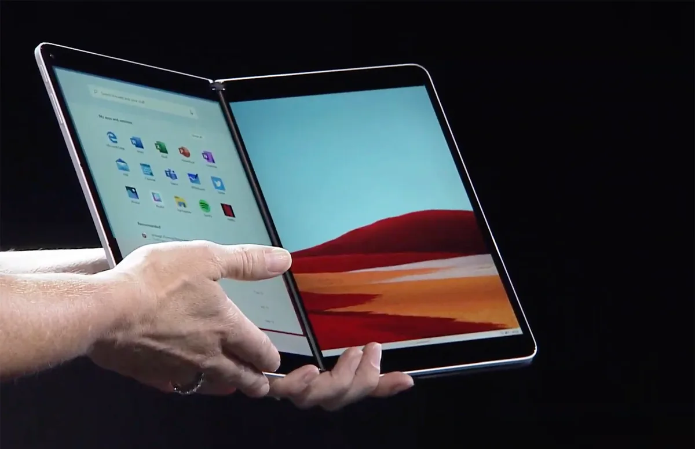

**Scharnieren**

> [!NOTE]
> Dit artikel verscheen eerder op [Bright](https://www.bright.nl/nieuws/1123945/surface-duo-microsoft-neo-windows-10-x-android-dubbel-scherm-dual-screen.html).

[Bekijk ingesloten media](https://www.youtube.com/embed/wLsionOOybQ?autoplay=1&modestbranding=1)

## Kijk onze eerste indruk:

De schermen van de Surface Neo en Duo zitten met een scharnier aan elkaar bevestigd. Beide displays kunnen naast elkaar worden gebruikt, of je kan de apparaten dichtvouwen. De twee schermen blijven dan met magneten aan elkaar vastzitten.

## Surface Duo met Android

Microsoft noemt de Surface Duo een hybride apparaat 'dat door de meesten als smartphone gezien zal worden'. Beide schermen zijn 5,6 inch groot.

De Surface Duo draait op een aangepaste versie van Android, waarin bijvoorbeeld twee apps tegelijkertijd getoond kunnen worden. Als je de telefoon kantelt, is het onderste scherm als toetsenbord te gebruiken terwijl de app op het bovenste scherm staat.

## Geen vouwbaar scherm

Met de Duo slaat Microsoft een andere richting in dan Samsung, dat onlangs een [opvouwbare telefoon](https://www.bright.nl/nieuws/artikel/4838301/samsung-galaxy-fold-nederland-kopen-verkrijgbaar-introductie-opvouwbare) onthulde. Deze [Galaxy Fold](https://www.bright.nl/nieuws/artikel/4838301/samsung-galaxy-fold-nederland-kopen-verkrijgbaar-introductie-opvouwbare) heeft geen scharnier, maar bleek ook gevoelig te zijn voor schermdefecten.

Het is voor het eerst in jaren dat Microsoft weer een gooi doet naar de smartphonemarkt. Eerder maakte het bedrijf een mobiel besturingssysteem en kocht het Nokia. Geruchten over een Surface-telefoon kwamen in het verleden geregeld voorbij.

## Surface Neo

De Surface Neo heeft twee grotere tabletschermen en een toetsenbordflap die over het onderste scherm gevouwen kan worden. Zo is hij als traditionele laptop te gebruiken. Een deel van het onderscherm laat dan extra informatie zien vlak boven de toetsen, zoals knoppen om emoji mee te plaatsen.

Op de Surface Neo staat een aangepaste versie van Windows 10 geïnstalleerd, genaamd Windows 10X. Dit besturingssysteem is speciaal voor dubbele schermen ontworpen.

Op het ene scherm wordt standaard een zoekbalk getoond, met daaronder je apps en andere informatie. Deze apps kunnen ook op het andere worden geopend. Sommige apps kunnen ook op beide schermen tegelijk worden getoond.

## Najaar 2020

Zowel de Surface Neo als de Surface Duo worden nog niet meteen verkocht: beide apparaten staan gepland voor het feestdagenseizoen van 2020.

Met de presentatie wilde de techgigant alvast een voorproefje geven van wat er op de planning staat.

## Draadloze oordoppen en laptops

Microsoft kondigde tijdens de presentatie ook de [Surface Earbuds](https://www.bright.nl/nieuws/artikel/4869806/microsoft-onthult-slimme-oordoppen-die-werken-met-office) aan, draadloze oordoppen met onder andere Office-integratie. Het is nog niet bekend wanneer de Surface Earbuds in Nederland op de markt komen.

Ook onthulde Microsoft drie [nieuwe Surface-laptops](https://www.bright.nl/nieuws/artikel/4869806/microsoft-onthult-slimme-oordoppen-die-werken-met-office), die wel binnenkort in Nederland verkrijgbaar zijn.

**Zet de bel aan op [het Bright YouTube-kanaal](https://bit.ly/brighttv) om onze videoreviews niet te missen.**
