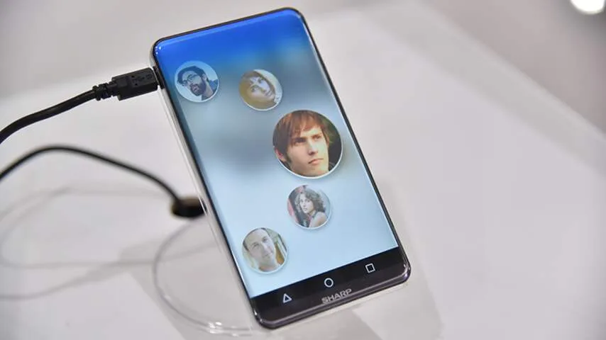

## Augmented reality

In 2016 verschenen de grote VR-brillen voor consumenten eindelijk op de markt. Inmiddels lijken meerdere techgiganten zich klaar te maken voor augmented reality (AR). Met AR worden digitale objecten bovenop de echte wereld getoond, via bijvoorbeeld een slimme bril (Google Glass) of een smartphonecamera.

> [!NOTE]
> Dit artikel verscheen eerder op [NU.nl](https://www.nu.nl/weekend/4371952/tech-in-2017-augmented-reality-randloze-smartphones-en-techwetgeving.html).

Zo introduceerde Google al in 2016 zijn AR-platform Tango, dat op dit moment alleen door de Lenovo Phab 2-smartphone wordt gebruikt. Apple-CEO Tim Cook heeft zich in de tussentijd meermaals positief uitgelaten over de technologie.

"Augmented reality zal vele malen groter worden dan virtual reality", denkt Cristian Vorstius Kruijff, oprichter van AR-productiebedrijf Artishock. Volgens hem zal het echter nog even duren totdat AR echt volwassen is.

"Er zijn toch ook al flink wat partijen bezig met het inscannen van steden, gebouwen en interieurs", aldus de AR-producent. "Die worden naar 3D omgezet en dat geeft AR goede referentiepunten qua positionering van content."

_Luister ook naar de voorspellingenpodcast van onze techredactie:_

Google heeft met zijn Tango-platform een eerste stap gezet, waardoor het nu afwachten is wat andere techgiganten gaan doen. De CEO van Apple is enthousiast en het bedrijf heeft veel patenten in huis gehaald met de overname van AR-bedrijf Metaio, maar tot nu toe heeft de gigant niks aangekondigd. De uitspraken van Cook doen echter vermoeden dat het bedrijf iets op de planning heeft staan.

De markt voor virtual reality zal na 2016 vermoedelijk minder significant veranderen. Laurens Bruins, één van de ontwikkelaars van VR-game Arizona Sunshine, denkt dat er mogelijk concurrenten voor HTC Vive, Oculus Rift en PlayStation VR op de markt komen. "Daarnaast zal hopelijk de kwaliteit van VR-games flink toenemen, zodat we ons in 2017 onder kunnen dompelen in VR-ervaringen die meer bieden dan ze nu doen", aldus Bruins.

## Randloze smartphoneschermen

In 2016 toonde Sharp een [prototype](http://www.nu.nl/mobiel/4332972/sharp-toont-randloos-smartphonescherm-met-ronde-hoeken.html) van een randloos smartphonescherm. Zo’n scherm zorgt ervoor dat de voorkant van een telefoon enkel uit een scherm kan bestaan. De zwarte randen aan de boven- en onderkant zijn met deze technologie niet langer nodig. Xiaomi [bracht](http://www.nu.nl/mobiel/4340910/xiaomi-toont-smartphone-met-randloos-scherm.html) in 2016 een telefoon uit waarvan de bovenkant is bedekt, maar onderop nog een zwarte balk zit.

Geruchten [wijzen](http://www.nu.nl/mobiel/4362189/samsung-galaxy-s8-krijgt-randloos-scherm-met-virtuele-thuisknop.html) er inmiddels op dat ook smartphonemaker Samsung een vergelijkbaar scherm in de volgende Galaxy-telefoon wil stoppen, waarbij de thuisknop in het scherm wordt geïntegreerd. Het wijst er op dat de eerste smartphones met randloze schermen in 2017 op de markt komen.

In de tussentijd nemen geruchten over buigbare schermen ook toe. Deze schermtechnologie zorgt ervoor dat het beeldscherm om de smartphone kan worden gevouwen, zodat deze aan bijvoorbeeld zowel de voor- als achterkant wordt getoond. Ook kan een telefoon hierdoor opvouwbaar worden gemaakt. Het is echter nog de vraag of ook deze technologie in 2017 zal worden toegepast.

_Randloos smartphonescherm — Beeld: SHarp_

## Aftapwet en terughackwet

Eind 2016 stemde de Tweede Kamer in met de '[terughackwet](http://www.nu.nl/internet/4368475/tweede-kamer-stemt-in-met-terughackwet.html)', die politie in staat stelt om verdachten in strafonderzoeken te hacken.

De wet Computercriminaliteit III ging hierdoor naar de Eerste Kamer, waar het kabinet geen meerderheid heeft. Het betekent dat VVD en PvdA de steun van CDA, ChristenUnie en SGP moeten krijgen om de wet aan te nemen. De PVV stemde in de Tweede Kamer tegen het voorstel. In 2017 zal de Eerste Kamer stemmen.

In de tussentijd bereidt de Tweede Kamer zich voor op de 'aftapwet', oftewel de Wet op de inlichtingen- en veiigheidsdiensten. Een huidige versie van het voorstel zou een 'sleepnet' mogelijk maken, waarbij data van burgers op grote schaal wordt ingezameld bij onderzoeken.

Experts waren eerder in december [kritisch](http://www.nu.nl/internet/4366210/experts-kritisch-nieuwe-aftapwet.html) over het huidige voorstel voor de wet. De Autoriteit Persoonsgegevens zei dat de wet [in strijd](http://www.nu.nl/internet/4366037/autoriteit-persoonsgegevens-vindt-nieuwe-aftapwet-ver-gaan.html) is met het Europees Verdrag voor de Rechten van de Mens, omdat er inbreuk wordt gemaakt op de persoonlijke levenssfeer van Nederlanders.

De aftapwet moet nog in de Tweede Kamer worden besproken voor erover wordt gestemd en hij naar de Eerste Kamer gaat. Voor de stemming kunnen Kamerleden nog amendementen indienen om over te stemmen, waarmee bepaalde delen van de wet kunnen worden gewijzigd.

Wanneer dit zal gebeuren is nog onbekend, maar de Kamer zal vermoedelijk haast maken. Op 15 maart vinden de Tweede Kamerverkiezingen plaats, waardoor de wet voor een ander kabinet kan komen te liggen.

## Slimme huisassistent

Techbedrijven richten zich steeds meer op huisautomatisering. Google en Amazon introduceerden in het buitenland slimme speakers, die met stemcommando’s bijvoorbeeld verlichting kunnen bedienen. Mogelijk komen de luidsprekers in 2017 ook naar Nederland, al hebben beide bedrijven nog niks officieel bekendgemaakt.

Paul Straathof, directeur van het Nederlandse smarthomebedrijf HomeWizard, is positief over de luidsprekers van Amazon en Google: "Ik denk dat dingetjes zoals een Echo en Home er zeker gaan komen. Het is leuk speelgoed dat ook wat toevoegt."

Er worden geen grootschalige nieuwe toepassingen voor andere slimme huisapparatuur verwacht, maar Straathof denkt wel dat huidige domoticasystemen gaan veranderen. "Dingen worden onderling simpeler om te koppelen", denkt de HomeWizard-oprichter. "Het gaat niet meer om één protocol, maar dat alle merken met elkaar gaan praten."

Daarbij zou Apple mogelijk buiten de boot vallen. Het techbedrijf heeft op het moment het meest gesloten platform voor slimme lampen, sloten en andere gadgets in huis. Wie ondersteund wil worden door de ingebakken iOS-app, moet zijn hardware daar specifiek op aanpassen. Apple werkt volgens recente geruchten aan een concurrent voor Google Home en Amazon Echo.

[Jaaroverzichten 2016](http://www.nu.nl/jaaroverzicht2016) | [Vooruitblikken 2017](http://www.nu.nl/weekend)
