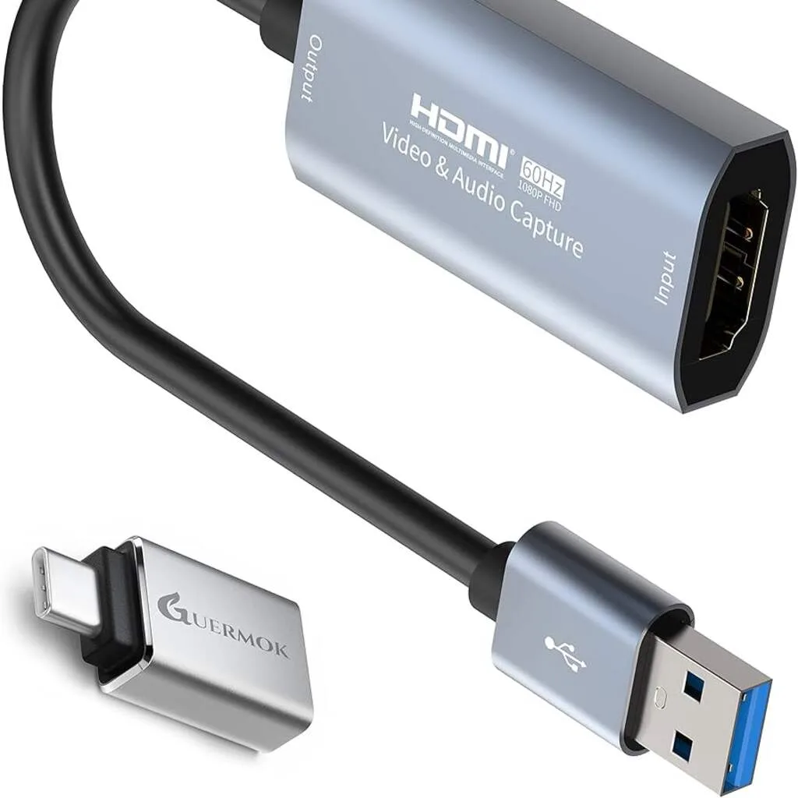

## Methode 1: Stream draadloos vanaf de console

De spelcomputers van zowel Sony als Microsoft hebben ingebouwde streamingmogelijkheden. Het beeld van je gameconsole wordt dan via het lokale netwerk naar een speciale app gestreamd.

> [!NOTE]
> Dit artikel verscheen eerder op [NU.nl](https://www.nu.nl/slimmer-leven/6327979/televisie-bezet-zo-sluit-je-de-spelcomputer-aan-op-de-tablet.html).

Dat gaat heel simpel: je downloadt Remote Play (iOS, Android) voor PlayStation of de Xbox-app ([iOS](https://apps.apple.com/us/app/xbox/id736179781), [Android](https://play.google.com/store/apps/details?id=com.microsoft.xboxone.smartglass&hl)) voor Xbox en volgt de daarin getoonde instructies om je tablet met de spelcomputer te verbinden.

Tegelijkertijd is streamen een wat gevoelige methode: heb je geen krachtige router, dan bestaat de kans dat je last hebt van vertraging of haperingen tijdens het gamen. Zorg er hoe dan ook voor dat je gameconsole bedraad met je internetrouter is verbonden, om het signaal zo optimaal mogelijk te maken.

## Methode 2: Verbind de console met een kabel

Je kunt ook je gameconsole met een kabel op je tablet aansluiten. Dat heeft iets meer voeten in de aarde, maar verzekert je wel van een stabiele videoverbinding.

Bij deze methode verbind je de HDMI-kabel die normaliter in je tv zit met de tablet. Daar heb je een zogeheten Capture Device voor nodig, een klein apparaatje met aan de ene kant een poort voor je HDMI-snoer en aan de andere kant een USB-C-aansluiting. De Capture Device zet het videosignaal om in een beeld dat speciale tabletapps kunnen tonen.

Een Capture Device is niet duur: voor [10 tot 20 euro](https://www.amazon.com/hdmi-capture-usb/s?k=hdmi+capture+usb) heb je er online een op de kop getikt. Let wel op dat de goedkoopste accessoires lagere resoluties tonen dan duurdere modellen.

Eenmaal aangesloten kun je op de iPad de app [Orion](https://orion.tube/) downloaden om je gamebeeld te bekijken. Deze app is gratis, maar je kunt betalen voor extra's zoals hogere resoluties met behulp van kunstmatige intelligentie.

Op Android kun je een app zoals [Noir](https://play.google.com/store/apps/details?id=me.dt2dev.uvcpreview.free) gebruiken om het bekabelde videobeeld op je iPad te tonen. Ook deze app is gratis, maar de ontwikkelaar biedt daarnaast een Pro-versie met extra functies aan.

_Televisie bezet? Zo sluit je de spelcomputer aan op de tablet_

## Een gigantisch virtueel gamescherm in VR

Heb je een virtualrealitybril van Meta in huis, dan kun je deze truc ook gebruiken om te gamen op een gigantisch groot virtueel scherm. Dat werkt net als op je tablet: sluit de HDMI-kabel met een Capture Device aan op de USB-C-poort van je headset en start vervolgens de juiste app.

Meta heeft hiervoor zelf een app voor de Quest [uitgebracht](https://www.meta.com/experiences/meta-quest-hdmi-link/7452106424824357/), die je in de digitale winkel vindt. Het bedrijf adviseert een Capture Device met USB 3.0-snelheden die video in een hogere resolutie toont. Lage resoluties zien er op een virtueel groot scherm namelijk niet heel mooi uit.
