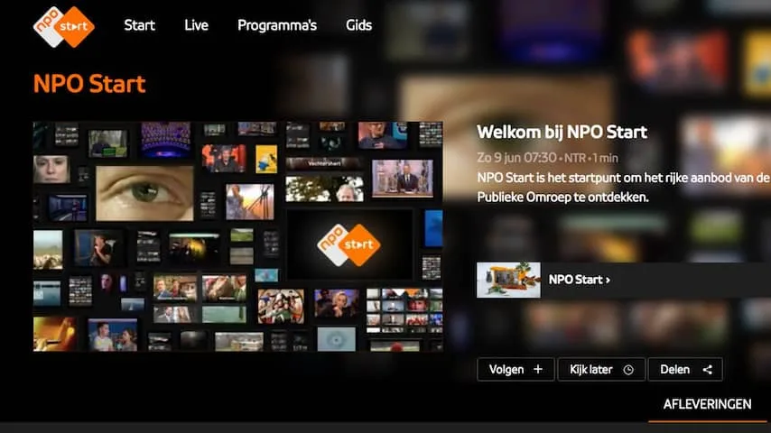
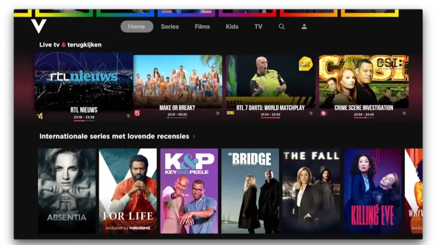
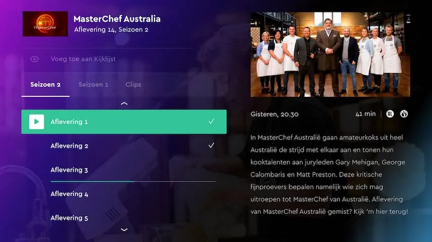
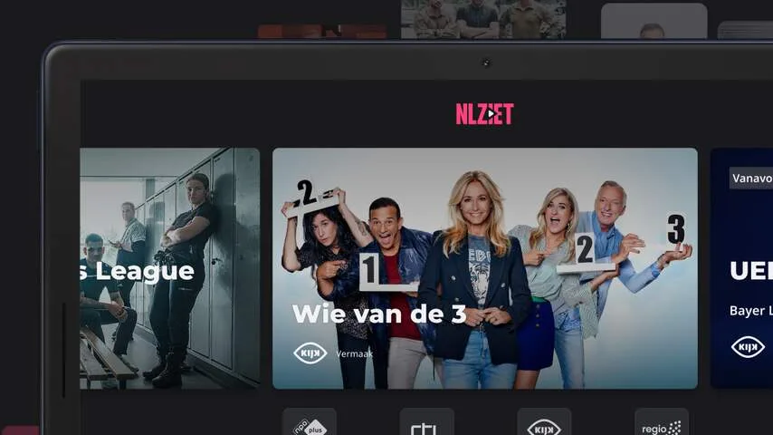

In dit artikel richten we ons op zelfstandige streamingdiensten die het Nederlandse zenderpakket aanbieden. Sommige providers bieden hun eigen online apps om tv te kijken, zoals de Ziggo GO-app, maar daarvoor heb je doorgaans een traditioneel tv-abonnement nodig. De apps in dit overzicht zijn zonder langlopend abonnement bij je internetprovider te gebruiken.

> [!NOTE]
> Dit artikel verscheen eerder op [NU.nl](https://www.nu.nl/slimmer-leven/6327982/televisiekijken-zonder-kabel-dit-zijn-je-opties.html).

Daarnaast hebben we het specifiek over apps die programma's van de traditionele Nederlandse tv-zenders laten zien. Diensten als Netflix, Disney+ en HBO Max nemen we daarom niet mee in dit overzicht.

_Televisiekijken zonder kabel? Dit zijn je opties — Beeld: NPO_

## NPO Start

De NPO Start-app biedt toegang tot de televisiezenders van de publieke omroep. Groot voordeel is dat de app gratis gebruikt kan worden. Je kan ook kiezen voor een abonnement, zodat je een hogere streamingkwaliteit hebt. Bij gratis gebruik is die kwaliteit vrij matig: livestreams hebben een resolutie van 576p, ver onder de Full HD-standaard van veel concurrenten.

De NPO-app is ook op vrij veel platformen te vinden: je kunt hem downloaden op je smartphone of tablet, maar de app is ook beschikbaar voor de meeste smart-tv's.

_Televisiekijken zonder kabel? Dit zijn je opties — Beeld: RTL_

## Videoland

Streamingdienst Videoland biedt naast zijn eigen films en series ook toegang tot de televisiezenders RTL 4, 5, 7, 8 en RTL Z. De zenders zijn in HD te bekijken, al waarschuwt de appmaker dat een programma "soms niet beschikbaar is vanwege rechten". Dat kan bijvoorbeeld gebeuren als RTL de internetrechten niet heeft gekocht voor een sportwedstrijd.

Voor Videoland betaal je 5 euro per maand, je kunt de dienst vooraf twee weken gratis proberen. Ook Videoland is beschikbaar op zowel Android als iOS en alle grote smart-tvplatformen.

_Televisiekijken zonder kabel? Dit zijn je opties — Beeld: SBS_

## KIJK

SBS6 en SBS9 hebben geen app waarin je de zenders live kunt kijken. Maar in de KIJK-app is het wel mogelijk programma's na de uitzending terug te kijken. In de app vind je ook kortere clips uit uitzendingen.

Groot voordeel van KIJK is dat je de app gratis kunt gebruiken. De meeste televisies vanaf 2015 ondersteunen de app. Daarnaast is de app te downloaden voor iPhone en Android.

_Televisiekijken zonder kabel? Dit zijn je opties — Beeld: NLZIET_

## NLZIET

Combineer je de eerdergenoemde apps, dan heb je voor 5 euro per maand toegang tot uitzendingen van de NPO, RTL en SBS. Wil je dit programma-aanbod op één plek, dan kun je ook een abonnement nemen op NLZIET. Dit bedrijf is een samenwerking van de grootste Nederlandse tv-zenders die hier hun programma's op aanbieden.

Naast de NPO, RTL en SBS vind je op NLZIET onder andere Belgische zenders zoals Eén en Canvas en kanalen van de regionale omroepen. Een abonnement kost 8 euro per maand, maar dan wordt er wel extra reclame getoond voor RTL en KIJK. Met een duurder abonnement van 10 euro per maand heb je daar geen last van. En voor 12 euro per maand kun je ook naar buitenlandse zenders als BBC One en History kijken.

NLZIET is op de meeste grote platformen beschikbaar, wat betekent dat je de app kunt installeren op zowel je telefoon, smartphone als je smart-tv.
