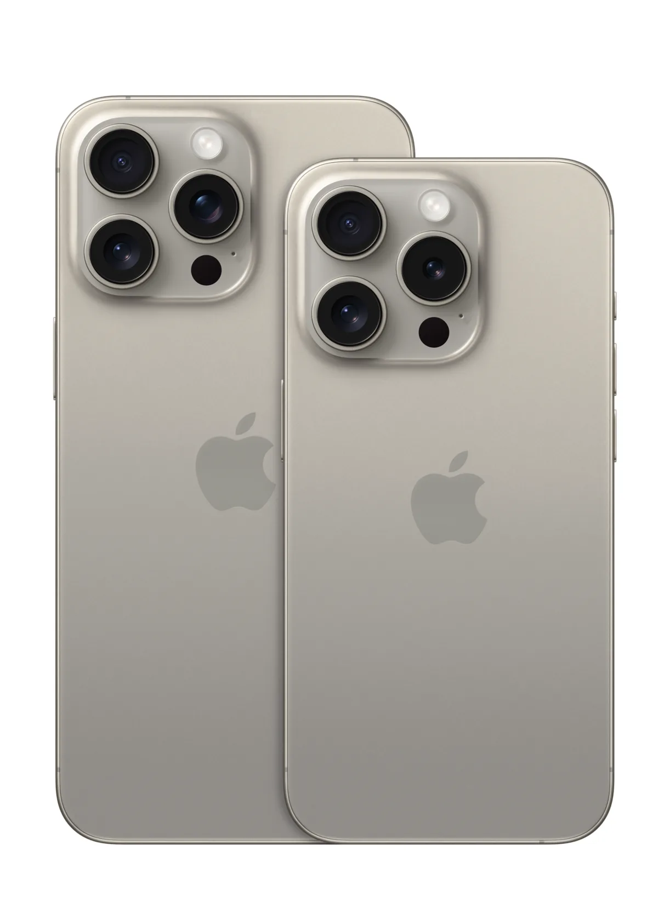
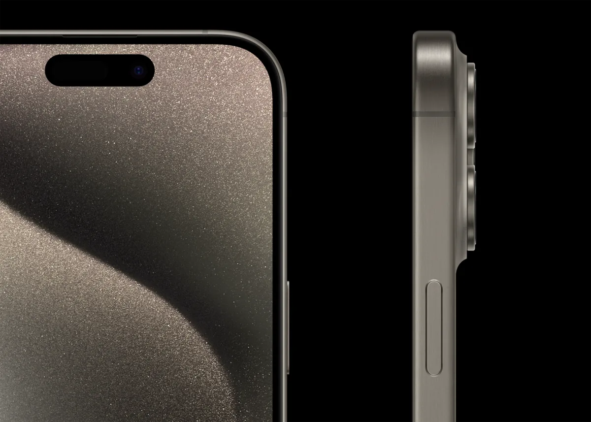
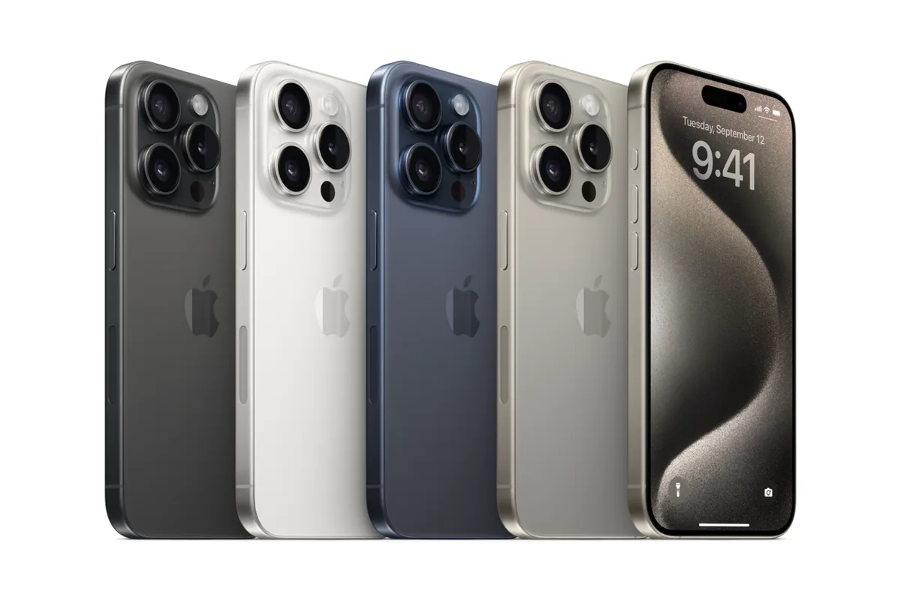

Het ging afgelopen week veel over de nieuwe aansluitpoort op de iPhone, waarmee de telefoon voldoet aan nieuwe, Europese wetgeving. Dat is niet het enige dat op de schop ging: de nieuwe iPhone 15 en 15 Pro zijn smartphones vol met veel, maar vooral kleine verbeteringen. De grootste innovatie zit in de prijs.

> [!NOTE]
> Dit artikel verscheen eerder op [AD](https://www.ad.nl/tech/toe-aan-een-nieuwe-iphone-het-laatste-model-is-969-euro-een-prijsverlaging-van-ruim-een-kwart~a0d53763/).

Elf jaar lang deed de iPhone het met Apples zelfbedachte lightning-aansluiting. Dat was voor de techreus een goudmijn: wie kabeltjes, docks en andere iPhone-accessoires wilde maken, moest hun producten bij Apple certificeren - en daarvoor onderdelen inkopen die door Apple waren goedgekeurd.

Het was tegelijkertijd een doorn in het oog van Europa, dat liever wilde dat alle apparatuur één en dezelfde oplaadkabel gebruikte. Het leidde tot nieuwe wetgeving die gadgetmakers verplicht een usb-c-aansluiting te gebruiken. Wetgeving waar Apple met de nieuwe iPhone 15 en 15 Pro aan voldoet.

## Bijna al je usb-c-spul werkt met de iPhone 15

Dat brengt in het eerste opzicht vooral reisgemak met zich mee: je hebt voortaan nog maar één snoertje in je tas nodig om je iPhone, tablet en laptop mee op te laden. Tijdens onze testperiode afgelopen dagen bleek bovendien dat veel usb-c-accessoires vlekkeloos werken met de nieuwe iPhone. Wil je het beeld van je telefoon op een groot scherm laten zien? Vroeger kocht je dan bij Apple een speciale lightning-naar-hdmi-kabel - nu werkt je bestaande hdmi-dongel voor een laptop met usb-c ook gewoon.

Apple belooft daarnaast dat bestanden sneller van je telefoon naar een computer verplaatst kunnen worden. Dat was bij ons ook het geval, al heb je voor optimale snelheden op een 15 Pro-telefoon wel een iets duurdere usb-c-3-kabel nodig.

## Twee gewone en twee Pro-modellen

De iPhone 15 komt dit jaar in vier smaken: twee gewone modellen met twee verschillende schermgroottes, met daarnaast twee Pro-varianten met diezelfde schermformaten. Het ontwerp van de vier telefoons wijkt licht af met iets dunnere randen, andere kleuren (voor het eerst in jaren verkoopt Apple weer een echt roze toestel) en het gebruik van lichter titanium in de Pro-reeks. Maar het ongetrainde oog zal weinig verschillen tussen de iPhone 14 en 15 opmerken.

_Tekst gaat verder onder de foto_

© Apple

## Vorig jaar Pro, nu gewoon

Functies die vorig jaar exclusief voor de duurdere Pro-telefoons waren, zijn ditmaal te vinden in de goedkoopste twee modellen van de iPhone 15. Zo hebben de smartphones bovenaan het scherm Apples nieuwe 'Dynamic Island', een klein, pilvormig schermpje rond de selfiecamera waarop apps extra informatie kunnen laten zien.

De camera heeft net als de 14 Pro nu een 48 megapixel-sensor waarmee foto's van veel hogere resolutie gemaakt kunnen worden. In de praktijk gebruikt Apple die hogere resolutie om met speciale software de beste pixels te selecteren en daarmee een mooiere foto met lagere resolutie te maken. Je kunt de maximale bestandsgrootte ook gebruiken, maar dan krijg je forse fotobestanden waarmee je telefoon snel volloopt.

Het zijn verbeteringen die grootbetalers vorig jaar al hadden op hun iPhone 14 Pro, maar die nu betaalbaarder zijn geworden. Ter illustratie: een iPhone 14 Pro met al het bovenstaande kostte je vorig jaar 1329, terwijl de iPhone 15 met ruwweg hetzelfde nu voor 969 euro over de toonbank gaat. Een prijsverlaging van ruim een kwart.

## Automatische portretfoto’s

De camera’s in zowel de 15 als de 15 Pro hebben overigens nog een leuke verbetering: je hoeft niet langer de portretstand te activeren als je portretfoto’s wilt maken met een onscherpe achtergrond. In plaats daarvan kijkt de camera tijdens het fotograferen of er personen in beeld staan. Zo ja, dan worden dieptedata automatisch vastgelegd en kun je een foto achteraf in een portret veranderen.

Handig, want bij eerdere iPhones baalden we achteraf vaak dat we een foto niet als portret hadden vastgelegd. Al werkt de nieuwe functie bij ons nog niet vlekkeloos op de iPhone 15: als er twee of meer mensen in beeld staan, raakt de optie soms in de war en worden de portretdata niet goed vastgelegd.

Op de 15 Pro heeft de camera nog een paar exclusieve verbeteringen, zoals de mogelijkheid om de focaallengte te veranderen. In de praktijk geeft het je iets meer tussenvormen om tussen de zoomen. Leuk voor serieuze fotografen die minutieus met kaders spelen, bij alledaagse fotografie gaf het ons niet heel veel meerwaarde. Wel leuk: op de 15 Pro Max kun je nu tot vijf keer inzoomen. Eerder kon dat tot slechts vier keer.

## Handige actieknop op de 15 Pro

De echt nieuwe dingen zitten dit jaar in de Pro-modellen, al gaat het ditmaal om detailwerk. Zo is de audioschakelaar aan de linkerzijde nu vervangen met een knop die je kunt indrukken om het geluid uit te schakelen - maar ook aan andere functies gekoppeld kan worden. Je kunt er bijvoorbeeld de Niet Storen-stand mee inschakelen of snel de camera-app openen.

Extra leuk voor productiviteitsgoeroes: je kunt er zogeheten shortcuts in Apples Opdrachten-app aan koppelen. Hiermee kun je allerlei complexe iPhone-handelingen automatiseren. Op die manier hang je bijvoorbeeld de Siri-concurrent van Google aan de actieknop voor snelle stemcommando’s, of kun je er de AI-diensten van ChatGPT mee activeren. Heb je een slim huis? Dan kun je met de knop bijvoorbeeld de deuren op slot doen. Leuk om mee te spelen, al hebben we nog niet een musthave-functie voor de actieknop weten te ontdekken.

iPhone 15. © Apple

## Lichter titanium

De 15 Pro en 15 Pro Max zijn gemaakt van titanium in plaats van aluminium, wat ze iets lichter maakt dan eerdere iPhones. Ter illustratie: de metalen iPhone 14 Pro van vorig jaar woog 187 gram, bij de titanium 15 Pro is dat nog maar 171 gram.

Een klein verschil, maar we merkten het afgelopen dagen wel. Dat was vooral het geval bij de wat grotere 15 Pro Max, die nu nog maar 221 gram in plaats van 240 gram woog. Een verschil van zo’n 10 procent, maar het is net genoeg om de telefoon wat minder onhandig in de hand te doen voelen.

## Conclusie

Wie hoopte op wereldschokkende verbeteringen in de nieuwe iPhones, komt bedrogen uit. In plaats daarvan is 2023 vooral een jaar waarin Apple zijn telefoons straktrekt en betaalbaarder maakt. Pro-functies van vorig jaar zijn nu een kwart goedkoper op de nieuwe iPhone 15, wat meteen de meest aantrekkelijke verbeteringen zijn. Het maakt het basismodel van de iPhone 15 de meest voor de hand liggende telefoon van de reeks om aan te raden.

Het is niet de moeite waard om vanaf een iPhone 14 of zelfs een iPhone 13 te upgraden - beide smartphones houden in 2023 nog steeds prima stand, deels omdat Apple de software goed blijft ondersteunen met updates. Maar wie al langer aan een nieuwe iPhone toe is, koopt dit jaar een prima smartphone voor een lager bedrag dan afgelopen jaren. De iPhone 15 is een uitstekende telefoon.

© Apple
