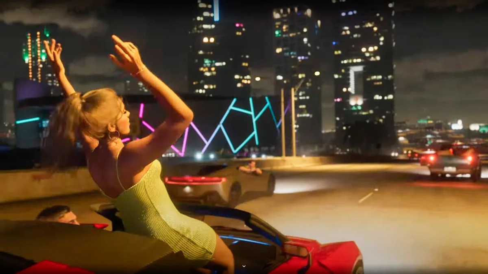

Na tien jaar zijn de eerste officiële beelden van de nieuwe Grand Theft Auto-game onthuld. Het zesde deel belooft één van de grootste games in jaren te worden, en de trailer die afgelopen nacht online kwam is inmiddels vele tientallen miljoenen keren bekeken op YouTube. Waarom nu al deze immense hype rondom een videospel dat pas in 2025 verschijnt?

> [!NOTE]
> Dit artikel verscheen eerder op [AD](https://www.ad.nl/games/trailer-nieuwe-grand-theft-auto-game-is-tientallen-miljoenen-keren-bekeken-op-youtube-dit-is-waarom~a6dc26a8/).

## De eerste trailer voor GTA VI ligt er. Waarom lijkt iedereen het daar toch over te hebben?

Het vorige deel, Grand Theft Auto V (de term voor diefstal van een voertuig in de VS), is de op één na meest verkochte game ter wereld met 190 miljoen verscheepte exemplaren. Bij verschijning van de actie-adventure brak de game zeven wereldrecords, waaronder die van ‘best verkopende game binnen 24 uur’ en ‘meest omzet genererende game binnen 24 uur’.

Bijna iedereen die frequent speelt, heeft zijn of haar tanden wel eens in een GTA gezet. De franchise - waarbij je als speler schietend en joyrijdend door een open wereld beweegt - is net zo groots als bijvoorbeeld Star Wars of Harry Potter. En het is maar liefst een decennium geleden sinds het vorige deel in de winkels verscheen, waardoor er wereldwijd reikhalzend door gamers wordt uitgekeken naar een nieuwe editie.

Een fragment van de immens populaire trailer van Grand Theft Auto VI. © AFP

## Waarom heeft het zo onwijs lang geduurd tot er een nieuwe GTA is aangekondigd?

Gamemaker Rockstar bracht vroeger eens per zoveel jaar nieuwe delen uit in de GTA-reeks, maar ontdekte bij GTA V een nieuwe manier om geld te verdienen: een speciale online modus waarbinnen spelers met echt geld steeds weer nieuwe dingen kunnen kopen. Het maakte de game onwijs succesvol, waarna het bedrijf besloot zo lang mogelijk op dit deel te teren.

Het leidde ertoe dat GTA V meerdere malen opnieuw is uitgebracht: steeds weer voor een nieuwe generatie spelcomputers. De eerste editie stamt uit 2013, in 2022 was de meest recente versie van de game.

## Hebben we al een idee hoe succesvol de nieuwste versie zal worden?

Marktanalisten voorspellen dat GTA VI uitermate goed zal verkopen zodra de titel in 2025 verschijnt. Hoewel dat nog moet blijken, laat de pas verschenen trailer zien dat er heel veel interesse in de game is: de korte video is in vijftien uur tijd maar liefst ruim 66 miljoen keer afgespeeld op het officiële YouTube-kanaal van de gamebouwer. Dat zijn bizarre cijfers voor een gamevideo. De meest succesvolle gametrailer op YouTube is die van smartphonegame _Subway Surfer_ met 361 miljoen views, maar die video had elf jaar de tijd om dat cijfer te bereiken.

Beeld uit de nieuwste Grand Theft Auto trailer. © IGN

## Doet het nieuwe deel nog iets nieuws of bijzonders?

Voor het eerst kun je in een GTA-game spelen als een vrouw. Dat is voor de reeks bijzonder, in vorige delen waren vrouwen vooral strippers en prostituees waarmee je in auto’s seks kon hebben. Je speelde altijd een crimineel in een vrouwonvriendelijke stad, net als in klassieke gangsterfilms.

Rockstar lijkt hier een poging te doen om GTA wat meer te emanciperen. Logisch ook: uit recente cijfers blijkt dat de helft van alle gamers wereldwijd een vrouw is. Die vrouwen zullen zichzelf ook graag willen herkennen in de game.

## ‌Vorige GTA-games zaten vol met seks en geweld. Moet ik mijn kinderen dat wel laten spelen?

Deze game is niet bedoeld voor kinderen, maar juist voor een volwassen publiek. De getoonde trailer waarschuwt in de eerste seconden dat er ‘mogelijk beelden ongepast voor kinderen’ in zitten, op het doosje van het vorige deel GTA V staat een 18+-markering.

Vroeger knepen ouders bij zulke volwassen games nog wel eens een oogje toe, omdat de grove pixels uit die tijd niet echt realistisch waren. Inmiddels is dat anders: geweld is zeer realistisch in beeld gebracht en GTA V had zelfs een martelscène. Dat is niet gemaakt voor kinderen.

## Hé maar, had ik anderhalf jaar geleden niet al iets van GTA VI gezien?

Eerder lekten onwijs veel beelden van het toen nog onaangekondigde GTA VI na een hackaanval. De video’s gaven toen een voorproefje van het spel, hoewel het toen ging om een nog ongepolijste versie. Het maken van dit soort games duurt vaak vele jaren. Dit lek dwong Rockstar het bestaan van de nieuwe GTA te erkennen. Later werd een 17-jarige jongen gearresteerd voor de hackaanval.

Een scène uit trailer "Grand Theft Auto VI" © AFP
