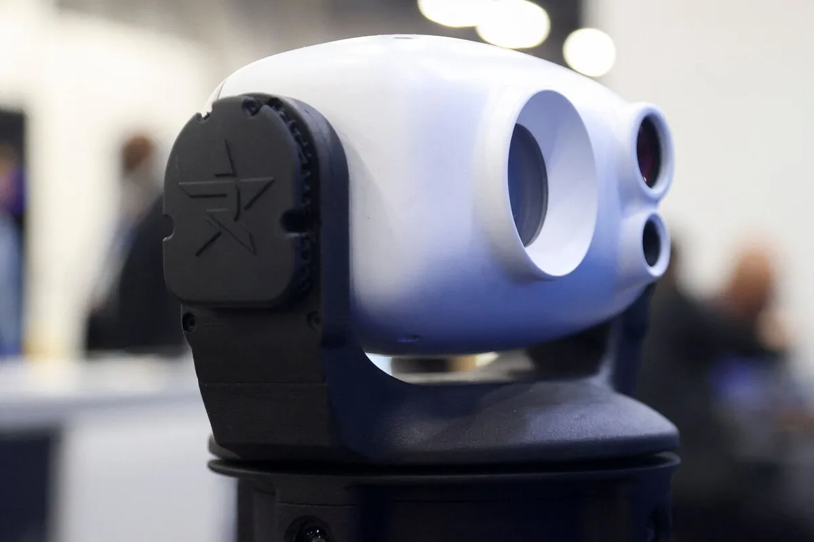
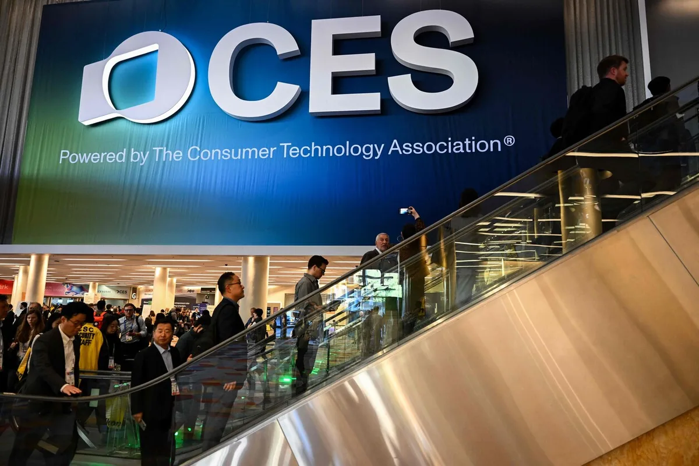

Donald Trump is op de belangrijkste techbeurs van de wereld, de CES in Las Vegas, het meest besproken onderwerp. Waar anders vooral over high-tech stofzuigers, of andere speeltjes wordt gesproken, gaat het op de beursvloer nu vooral over de nieuwe president van de Verenigde Staten die fikse importheffingen wil invoeren.

> [!NOTE]
> Dit artikel verscheen eerder op [AD](https://www.ad.nl/tech/trump-hangt-als-donkere-schaduw-over-gadgetbeurs-ces-maatregelen-te-omzeilen-met-speciale-fabrieken~a96c4379/).

,,Onze nieuwe president is dol op importheffingen, maar ik deel absoluut niet zijn mening.” Met die woorden reageert topman Gary Shapiro op vragen over hoe de komst van Trump de techwereld zal beïnvloeden. Shapiro staat aan het hoofd van de CTA, de organisatie die ieder jaar de Consumer Electronics Show (CES) organiseert. ,,Ik kan die mening nu gelukkig nog hebben zonder dat ik moet vertrekken.”

Trump’s importheffingen, de ‘tariffs’ die hij continu noemt, kunnen van grote invloed zijn op de techindustrie. Bedrijven als Apple, Google en Samsung opereren immers internationaal: smartphones en televisies worden in Azië gemaakt, waarna ze over heel de wereld worden verkocht. Worden deze producten naar de VS verzonden, dan moeten de bedrijven betalen voordat ze worden binnengelaten. Dat kan ervoor zorgen dat bedrijven zwaarder worden belast, maar het kan er ook toe leiden dat de prijzen van producten voor Amerikaanse consumenten simpelweg hoger worden, om de kostenstijging te compenseren.

Het is een onderwerp waar medewerkers van bedrijven op CES weinig over durven te zeggen. ,,Dat is een kwestie van onze bedrijfstop”, is het enige dat één medewerker van televisiemaker TCL er bijvoorbeeld over durfde te zeggen.

Een surveillance robot. © AFP

## Bedrijven springen door hoepels

,,Techbedrijven springen nu al door hoepels om dergelijke maatregelen te omzeilen”, weet Frank Everaardt van techplatform TechnologyInsider, die dit jaar ook de CES bezoekt. ,,Dan worden bijvoorbeeld alle onderdelen gemaakt in een Chinese fabriek en naar Mexico gestuurd om het daar in elkaar te zetten. Dan kunnen de bedrijven zeggen dat een product officieel is gemaakt in dat land.” Zulke samenstelfabrieken staan over de hele wereld, waaronder ook in Eindhoven.

Minister Beljaars (Economische Zaken) wil bij een werkbezoek aan de techbeurs nog niet vooruitlopen op de maatregelen. ,,De administratie van Trump moet nog geïnstalleerd worden en de beleidspapieren zijn nog niet bekendgemaakt.” Daarbij zegt de minister wel dat de importheffingen mogelijk voordelen met zich mee kunnen brengen: ,,Bijvoorbeeld als je kijkt naar de waardering van de dollar, waardoor de export naar de Verenigde Staten misschien wel eens beter uit zou kunnen pakken.”

© AFP

## Techmiljardairs paaien Trump

Techreuzen zijn desalniettemin druk bezig om voor te sorteren op het nieuwe Trump-beleid. Facebook-moederbedrijf Meta verving in aanloop naar de inauguratie beleidstopman Nick Clegg, die is vervangen voor de rechtsere Joel Kaplan. Het team dat nepnieuws werd in de VS opgedoekt en regels versoepeld waardoor gebruikers nu LHBT’ers geestelijk ziek mogen noemen. Apple-baas Tim Cook doneerde een miljoen aan het team van Trump, terwijl Amazon-CEO Jeff Bezos aanschoof bij een omstreden diner met de toekomstige president.

De meest invloedrijke techmiljardair in het kamp van Trump blijft waarschijnlijk Elon Musk, die ook aast op een plek in Trump’s regering. Inmiddels richt Musk zijn vizier ook op andere landen: in Duitsland sprak hij zijn steun uit voor het extreemrechtse AfD, in het Verenigd Koninkrijk roept hij op tot nieuwe verkiezingen.

De grootste techbedrijven hopen op die manier een uitzonderingspositie te bemachtigen, maar hetzelfde zal niet gelden voor de kleine, Chinese startups die op CES in Las Vegas hun nieuwe producten presenteerden. Als zij hun nieuwe gadgets willen verkopen aan Amerikanen, is dat waarschijnlijk voor de hoofdprijs.
