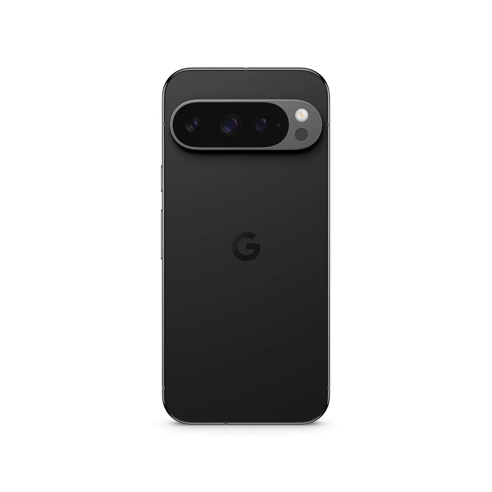
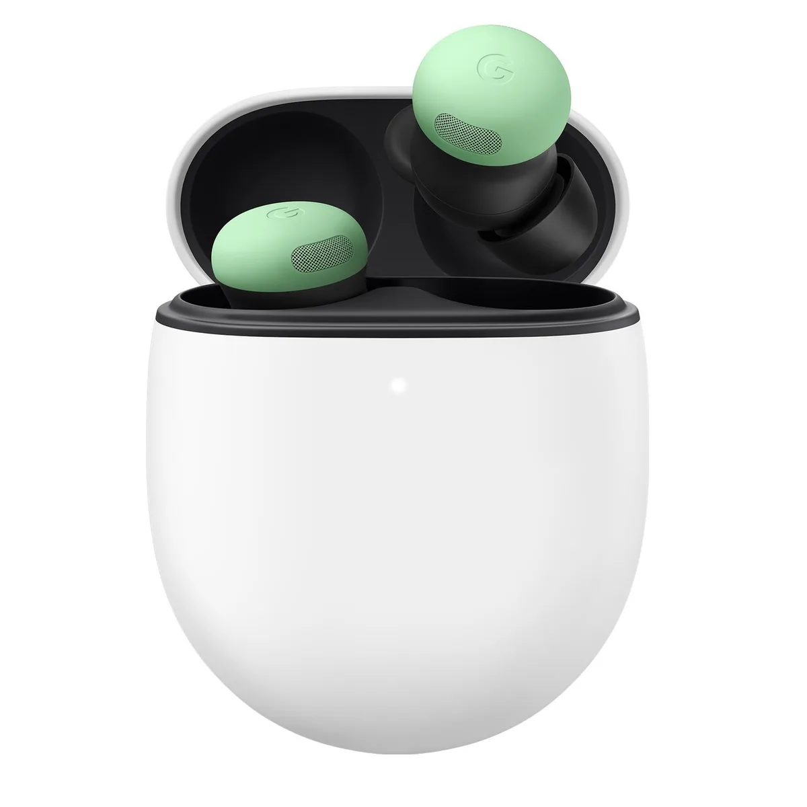

Techreus Google gaat de nieuwe versie van zijn opvouwbare telefoon ook in Nederland verkopen. Daarnaast introduceert het bedrijf slimme oordoppen waarmee je continu met een kunstmatige intelligentie kunt spreken die je op je wenken bedient - net als in de film _Her_.

> [!NOTE]
> Dit artikel verscheen eerder op [AD](https://www.ad.nl/binnenland/uit-sciencefiction-naar-realiteit-de-nieuwe-spraakgestuurde-oordoppen-van-google~a6d37d3c/).

Dat maakte de zoekgigant bekend tijdens een persbijeenkomst. Google verkocht eerder al een opvouwbare smartphone, maar die was slechts in een klein aantal landen te koop. De nieuwe Pixel 9 Pro Fold is het eerste model dat ook in de Benelux wordt verkocht. Opgevouwen lijkt de Pixel 9 Pro Fold op een gewone telefoon, maar je kunt hem openklappen om er een kleine tablet van te maken.

Google is niet de eerste die een opvouwbaar toestel verkoopt: onder meer Samsung heeft meerdere toestellen, waaronder één die als een ouderwetse klaptelefoon kan worden opgevouwen. Het nieuwe toestel van Google gaat 1899 euro kosten.

## Nieuwe Pixel 9 en 9 Pro

Naast de opvouw-Pixel heeft Google ook nieuwe edities van zijn andere smartphones geïntroduceerd. De Pixel 9 en 9 Pro hebben een nieuw ontwerp, met een strakker ogend camera-eiland op de achterzijde.

De smartphones hebben een snellere chip en onder andere een nieuwe camera voor selfies. Achterop de Pixel 9 Pro-telefoons zit nu een 48 megapixel-camera die mooiere foto’s maakt bij weinig licht. Het nieuwe scherm is 35 procent helderder dan bij het vorige model.

De Google Pixel 9. © Google

De telefoons hebben ook een paar AI-foefjes. Bij het maken van een foto wordt bijvoorbeeld automatisch de juiste uitsnede bepaald. De Pixel 9 wordt in Nederland vanaf 899 euro verkocht.

## Oordopjes met een AI-assistent

Ook nieuw zijn de Pixel Buds Pro 2, draadloze oordoppen vergelijkbaar met bijvoorbeeld de AirPods van Apple. De dopjes hebben volgens Google betere ruisonderdrukking die twee keer zo goed werkt. Door een draaisysteem blijven ze steviger in je oren zitten.

De nieuwe Pixel Buds werken ook nauwer samen met Googles kunstmatige intelligentie Gemini, die je heel de dag snel kunt aanspreken. Daarbij wordt een soort telefoongesprek met de AI gestart, waarbij je een natuurlijk klinkend gesprek kunt voeren met het computerprogramma, dat allerlei opdrachten voor je kan uitvoeren. Net als de AI in de film _Her_ dus. Daarin wordt een man, gespeeld door Joaquin Phoenix, verliefd op de AI die heel de dag in zijn oor fluistert.

Googles nieuwe oordoppen laten je met een AI-assistent praten. © Google

## Een ‘echte’ AI

Google heeft al jaren een virtuele assistent, maar die zat op simplistische wijze in elkaar: ze kon alleen zeer specifieke vragen herkennen en daar een antwoord op geven, net als bijvoorbeeld Siri op de iPhone.

Gemini is een nieuw soort kunstmatige intelligentie, vergelijkbaar met het momenteel immens populaire ChatGPT. Deze slimme software heeft geleerd talen volledig te begrijpen en kan daardoor het internet afspeuren voor antwoorden op je vragen.

Soms gaat dat overigens nog wel mis: AI-systemen in Googles zoekmachine adviseerden recent om lijm op je pizza te smeren zodat de kaas er niet vanaf glijdt. Dat had de kunstmatige intelligentie ergens gelezen, maar had niet door dat het een grapje was.
