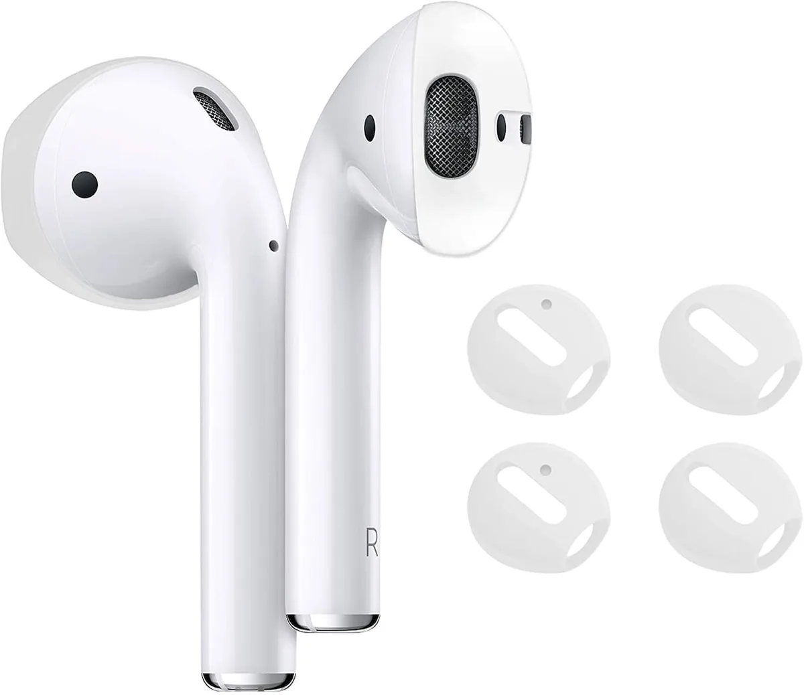
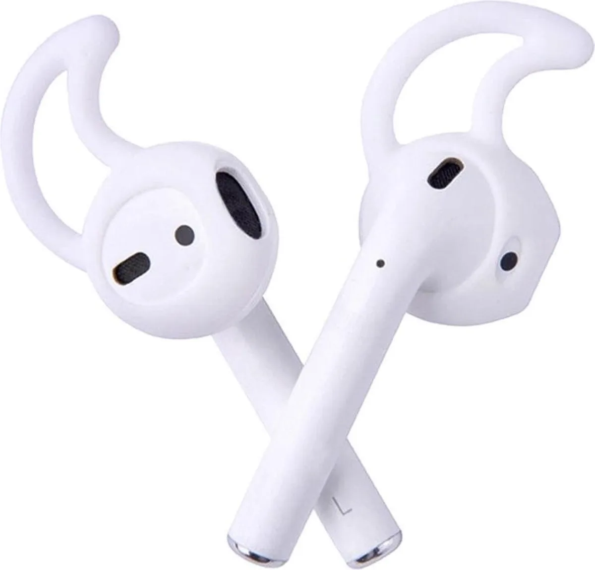

Leuk, die draadloze oordopjes, maar je staat toch te vloeken als ze steeds uit je oren vallen. We zetten daarom een paar tips op een rij om te zorgen dat ze goed blijven zitten.

> [!NOTE]
> Dit artikel verscheen eerder op [AD](https://www.ad.nl/tech/vallen-je-airpods-steeds-uit-je-oren-dit-kun-je-er-tegen-doen~a13c35af/).

Hoewel techbedrijven proberen de ideale pasvorm voor hun draadloze dopjes te vinden, is ieder menselijk oor weer net iets anders. Met een beetje pech is jouw oor net anders gevormd, waardoor het kleine plastic niet goed tussen de huid blijft klemmen. Dat was bij bedrade dopjes al vervelend, maar bij draadloze varianten riskeer je dat die dure gadget op de tegels valt of zelfs kwijtraakt langs het fietspad.

## Heb je in-ears? Probeer eens een groter dopje

Duurdere oordoppen zoals de AirPods Pro hebben een rubberen dopje dat aan de binnenzijde van je oor komt te zitten. Dit sluit het oorkanaal volledig af voor geluid van buitenaf, zodat ruisonderdrukking gebruikt kan worden voor een beter geluid.

Veel van deze oordoppensets komen met meerdere sets rubberen dopjes, zodat je de juiste voor jouw oren kunt selecteren. Vallen je oordoppen snel uit? Probeer dan eens een grotere maat, die vermoedelijk steviger in je oorkanaal blijven zitten.

## Doe ze eens andersom in

Het ziet er wat gek uit, maar soms helpt het: steek de AirPods eens andersom in je oren en steek het steeltje in je oorschelp. Hierdoor klemt hij, mits je oren een bepaalde vorm hebben, wellicht beter vast.

Al heeft deze oplossing wel de nodige nadelen. Het zit niet erg comfortabel en de audio komt niet op de manier je oren binnen zoals bedoeld. Hierdoor kan je muziek wat schel klinken.

## Plak er wat anti-slip op

Naast de vorm van je oren zorgt ook zweet ervoor dat oordopjes kunnen uitvallen. Je kunt dat voorkomen door een klein stukje anti-slip op je AirPods te plakken.

Met anti-slipcovers blijven de dopjes beter zitten als je oren beginnen te zweten. © Amazon

Dat kan door heel oneerbiedig een stukje ruwe plakband te bevestigen, maar er zijn ook elegantere oplossingen. Meerdere partijen verkopen anti-sliphoesjes, waarbij je een zacht materiaal over de dop aanbrengt dat minder glad wordt door zweet.

## Hang er haakjes aan

Er zijn ook accessoires die haakjes aan de bovenzijde van je oordopjes bevestigen. Die klemmen vast in je oorschelp, net zoals de AirPods doen als je ze verkeerdom in je oren zou steken. Maar omdat de positie van de dop goed blijft, is de geluidskwaliteit onveranderd.

Je oorschelp moet wel een goede vorm hiervoor hebben, zodat de haak zich vast weet te klemmen. Dat weet je vaak pas nadat je het geprobeerd hebt, maar voor 10 euro zijn deze haakjes zelden een diepte-investering.

Deze haakjes klemmen de AIrPods aan je oorschelp vast. © Bol

## Haken om je oren

De zogeheten ‘AirPods Grips’ zijn de meest ingrijpende oplossing. Dit zijn gigantische haken die je aan je doppen bevestigt, waarna je ze om je oren heen buigt. De doppen zitten hierdoor om je volledige oor heen, waardoor de kans minimaal is dat ze uitvallen.

Het ziet er op zijn beurt wel het meest opvallend uit. Maar voor wie al sinds de eerste AirPods zijn dopjes laat vallen, is dat het wellicht wel waard.
