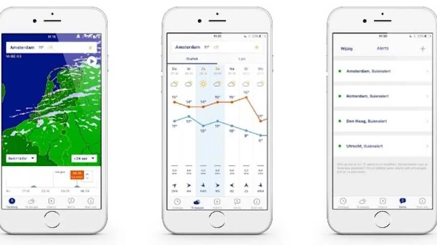
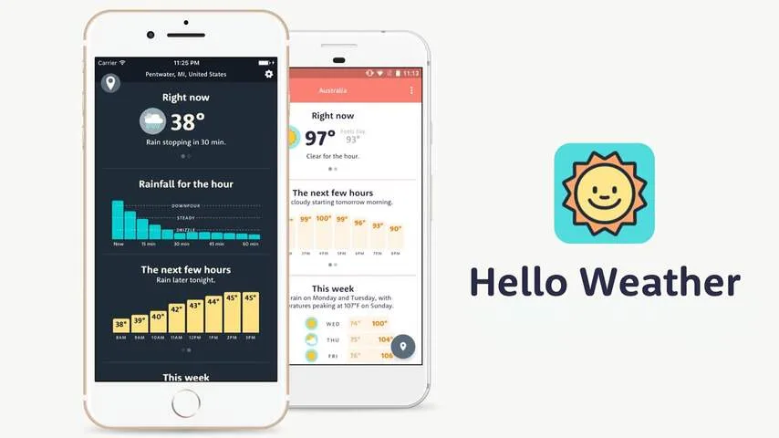
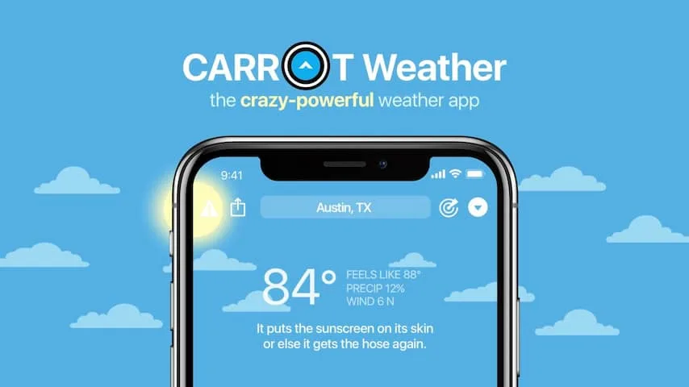

**Het wordt deze week uitzonderlijk warm. Op je smartphone staat al standaard een weerapp geïnstalleerd, maar voor wie tot in detail wil weten hoe lang het hoe heet wordt, zijn er nog veel uitgebreidere alternatieven beschikbaar. We zetten vijf handige alternatieven op een rij.**

> [!NOTE]
> Dit artikel verscheen eerder op [NU.nl](https://www.nu.nl/tech/5852247/vijf-apps-om-het-hete-weer-in-de-gaten-te-houden.html).

In dit overzicht kijken we naar weerapps die net iets anders doen dan de standaardapplicatie op je smartphone. Het zijn apps die alarm slaan bij regen, je uit meerdere weerbronnen tegelijkertijd informatie tonen of je precies vertellen wat je bij het huidige weer kunt doen. Veel van deze apps zijn gratis te downloaden en bevatten reclame, die voor een jaarlijks bedrag verborgen kan worden.

## Buienradar

Nederland is een regenland, wat een app zoals Buienradar haast onmisbaar maakt. In een overzicht zie je of het de komende uren gaat regenen bij jou in de buurt. Ook is het mogelijk om een alarm in te stellen, zodat de app een notificatie stuurt als het op jouw locatie dreigt te gaan regenen.

Buienradar is gratis te downloaden en bevat advertenties. Deze zijn te verbergen door een abonnement van ongeveer 3 euro per jaar af te sluiten. De alternatieve app [Buienalarm](https://www.buienalarm.nl/) biedt vergelijkbare functionaliteit voor een lager bedrag van 1 euro per jaar, maar heeft een wat verouderd ontwerp.

**Downloaden: [Android](https://play.google.com/store/apps/details?id=com.supportware.Buienradar&hl=nl) | [iOS](https://itunes.apple.com/nl/app/buienradar-weer/id621542526?mt=8)**

_Buienradar — Beeld: Buienradar_

## Weather Underground

Weather Underground haalt zijn weerinformatie net als andere apps van meteorologische instellingen, maar voegt daar nog een extra laag informatie aan toe. Gebruikers kunnen bij het starten van de app namelijk zeggen of het getoonde weerbericht wel of niet klopt.

Deze informatie wordt getoond aan andere bezitters van de app, zodat je elkaar kunt waarschuwen voor bijvoorbeeld plotselinge mist. Weather Underground lijkt in dat opzicht op de navigatie-app Waze, die gebruikers op vergelijkbare wijze files en werkzaamheden laat melden.

De app bevat advertenties, maar deze zijn voor rond de 2 euro per jaar weg te kopen.

**Downloaden: [Android](https://play.google.com/store/apps/details?id=com.wunderground.android.weather&hl=en_US) | [iOS](https://itunes.apple.com/us/app/weather-underground-forecast/id486154808?mt=8)**

## Hello Weather

Hello Weather is een van de meer uitgebreide weerapplicaties in de App Store. Hoewel hij alleen in het Engels beschikbaar is, klopt de weerinformatie ook voor Nederland. In de instellingen is het mogelijk om uitgebreide windinformatie in te schakelen en om de windsnelheid in knopen te laten zien.

Hoewel Hello Weather geen advertenties toont, moeten gebruikers een abonnement van 5 euro per jaar afsluiten om functies zoals weerkaarten en regenmeldingen te activeren. Voor dat bedrag krijg je ook de mogelijkheid om tussen meerdere meteorologische bronnen te wisselen, waardoor je de vrijheid hebt om de volgens jou meest kloppende bron te gebruiken.

**Downloaden: [Android](https://play.google.com/store/apps/details?id=com.helloweatherapp&hl=en_US) |** [**iOS**](https://itunes.apple.com/nl/app/hello-weather/id978393692?mt=8)

_Hello Weather — Beeld: Hello Weather_

## Weeronline

Hoewel het weeroverzicht van Weeronline met de temperatuur, windsterkte en regenindicatie wat simpel is, onderscheidt de app zich door die weerinformatie op zo'n praktisch mogelijke manier toe te passen. Zo vertelt de software bij lenteweer hoe groot de kans is op hooikoortsproblemen. Bij lagere temperaturen wordt in beeld gebracht waar reumapatiënten precies last van kunnen hebben, terwijl bij zonnige situaties migrainerisico's in kaart worden gebracht.

Ook biedt de app suggesties voor wat je kunt doen bij de huidige weersituatie. En daar schuilt ook meteen het verdienmodel van Weeronline in: hoewel de app geen advertenties biedt, worden gebruikers wel gewezen op een mogelijk uitje naar een betaald bloemenpark of een populaire bioscoopketen.

**Downloaden: [Android](https://play.google.com/store/apps/details?id=com.xs2theworld.weeronline&hl=nl) | [iOS](https://itunes.apple.com/nl/app/weeronline-weer-radar/id541059690?mt=8)**

## Carrot Weather

Carrot Weather brengt zijn weerinformatie net iets anders in beeld dan bovenstaande concurrenten. Hier worden de huidige verwachting en temperatuur namelijk vergezeld door een korte, grappige tekst. Zo noemt de app je een 'meatbag', suggereert hij bij slecht weer dat je een lijk probeert te verbergen en bedreigt hij je als je binnen blijft bij goed weer.

Achter die jolige ondertoon schuilt een goed aanpasbare app, waarin je onder meer de widgets voor op het beginscherm van je telefoon naar eigen smaak kunt aanpassen. Ook kun je een abonnement van 4 euro per jaar afsluiten om te mogen kiezen uit meerdere bronnen, net als in Hello Weather. Nadeel is wel dat Carrot Weather geen buienalarm in Nederland kan aanbieden.

Een abonnement op Carrot Weather kost 5 euro per jaar. Op iOS moet je ook betalen voor je de app downloadt.

**Downloaden: [Android](https://play.google.com/store/apps/details?id=com.grailr.carrotweather&hl=en_US) | [iOS](https://itunes.apple.com/nl/app/carrot-weather/id961390574?mt=8)**

_Carrot Weather — Beeld: Carrot Weather_
