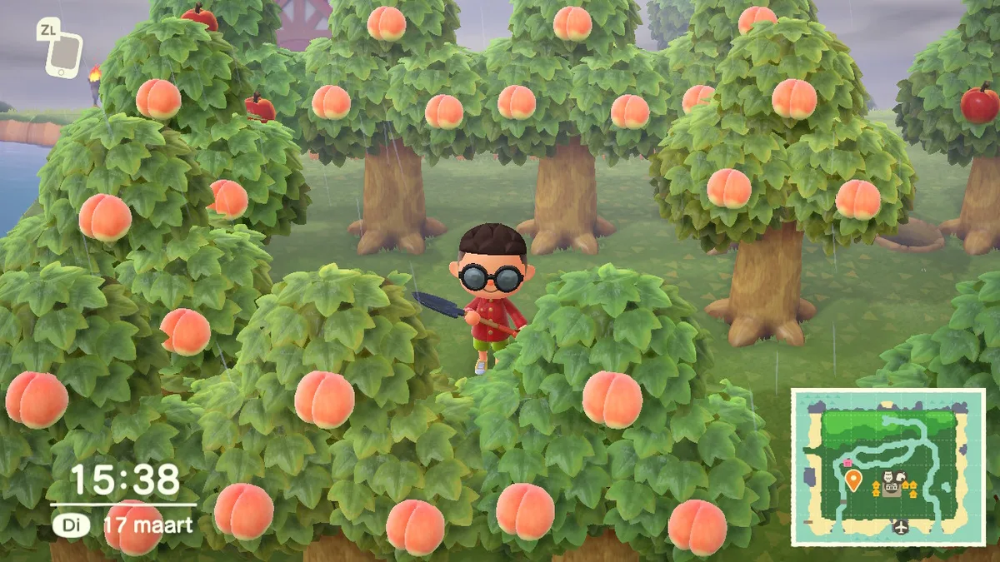

**Klingels cashen**

In Animal Crossing verhuis je naar een onbewoond eiland, waar de tijd net zo snel vervliegt als in de echte wereld. Is het buiten donker, dan is de gamewereld dat ook. En feestdagen worden allemaal netjes gevierd op de dagen die je gewend bent.

> [!NOTE]
> Dit artikel verscheen eerder op [Bright](https://www.bright.nl/nieuws/1125783/vijf-tips-als-je-animal-crossing-new-horizons-gaat-spelen.html).

Eigenlijk is deze game vooral gemaakt om lekker in te luieren: om even rustig te vissen langs de rivier of insecten te vangen, zonder dat je echt iets moet doen. Is dat alles waar je naar op zoek bent, dan hebben eigenlijk maar één tip voor je: lees dit artikel niet en verken de game op je eigen tempo.

Maar er zijn ook genoeg gamers die het uiterste uit hun virtuele vakantie willen halen, om zo snel mogelijk de hypotheek op hun huisje af te betalen en de leukste dingen zo snel mogelijk willen zien. Voor die groep mensen zetten we de volgende tips op een rij.

## 1\. Speel hem in het Nederlands

Gamers hebben vaak een afkeer voor de Nederlandse vertaling van games en spelen ze trouw in het Engels. Prima, maar Animal Crossing is een uitzondering waard. De Nederlandse lokalisatie zit tjokvol charme en leuke taalgrapjes, die door het gebruik van je moerstaal ook nog iets vertrouwder aanvoelen. Een gevoel dat goed aansluit op het koddige sfeertje van Animal Crossing.

> 

Er is maar één manier om de game in te stellen op de Nederlandse taaloptie: door de taal van je spelcomputer aan te passen. Druk op het tandwiel-icoon op het beginscherm en ga helemaal onderaan naar 'Systeem' om dit te doen.

## 2\. Bouw een boomgaard

Hoewel het niet uitmaakt hoe snel je in Animal Crossing je huis afbetaalt, kun je na iedere afgeloste hypotheek een nieuw stuk aanbouwen - en dat geeft meer plek voor meubels en andere voorwerpen. Een boomgaard is een goede manier om snel uit de schulden te komen.

Het lokale eilandwinkeltje koopt gevonden vruchten in voor 100 klingels per stuk, maar fruit dat alleen op andere eilanden groeit gaat voor het veelvuldige over de toonbank. Ga online op bezoek bij een ander eiland, of koop met Miles een speciale ticket om een willekeurig eilandje te bezoeken. Daar vind je al snel vruchten om je eigen boomgaard mee te kweken.

De vervolgstap is simpel: pak een schep en graaf een paar gaten, met minstens een vakje ertussen. Plant daar vervolgens de gevonden vruchten in. De komende dagen groeien hier bomen, met aan de takken het exotische fruit in kwestie. Schud het een paar keer los en plant het in de grond om je boomgaard nog groter te maken, totdat je er genoeg van hebt. Hierna kun je eens in de zoveel dagen de nieuwe vruchten voor flink wat klingers verkopen.

## 3\. Doe-het-zelven levert geld op

Voor het eerst in Animal Crossing kun je doe-het-zelven. Door ruwe materialen zoals steen en hout bij elkaar te zoeken, bouw je al snel je eigen gereedschap en meubels. Maar er schuilt nog iets handigs achter: het bouwen van spullen kan je ook veel klingels opleveren.

Bijna alles dat je zelf maakt is namelijk het dubbele waard van de materialen die je er in stopt. Heb je een stapel hout die de lokale winkel voor 1.500 klingels zou kopen? Dan zouden meubels hiermee gemaakt in totaal 3.000 moeten opleveren. Je bent iets langer kwijt aan de bouw van nieuwe spullen, maar op de langere termijn is het slimmer dan de verkoop van ruw materiaal.

## 4\. Zoek iedere dag de geldsteen op

Iedere dag kun je met een schep tegen de stenen op je eiland slaan om er grondstoffen uit te delven. Eén van die stenen doet iedere dag alleen iets anders: hij laat geldzakjes vallen nadat je er op slaat.

Je moet zo rap mogelijk tegen de steen rammen om de maximale hoeveelheid klingels er uit te halen, maar met iedere slag word je een stukje naar achter geslagen. Gelukkig is er een truc om toch zoveel mogelijk te verdienen: door drie gaten achter je personage te graven, word je niet naar achter gewerkt en kun je onbeperkt tegen de steen blijven rammen. En dat levert je al snel duizenden klingels per dag op.

[Bekijk ingesloten media](https://giphy.com/embed/W1SlFOOq8bkFaVnOzF)

[via GIPHY](https://giphy.com/gifs/W1SlFOOq8bkFaVnOzF)

## 5\. Bouw je dorpje dicht op elkaar

Je mag zelf bepalen waar de huizen, winkels en andere gebouwen in New Horizons komen te staan. Als je van plan bent de game zo efficiënt mogelijk te spelen, dan is het slim om ze dicht bij elkaar te zetten. Op die manier hoef je niet het hele eiland af te rennen om tijdens een kort potje spelen alles in te leveren en te verkopen.

Het is daarbij het verstandigst om huizen op een horizontale lijn te zetten. Alle deuren zitten aan de zuidzijde, en als je alles verticaal dicht op elkaar bouwt werkt de camera van de game vaak niet mee waardoor je de deuren niet goed kan zien - er zit immers een dak voor. Wil je toch iets op de verticale as neerzetten, dan kun je beter iets meer afstand bewaren.

_Animal Crossing: New Horizons verschijnt officieel op 20 maart voor de [Nintendo Switch](https://www.bright.nl/tags/onderwerpen/tech/games/spelconsoles/nintendo-switch)._
