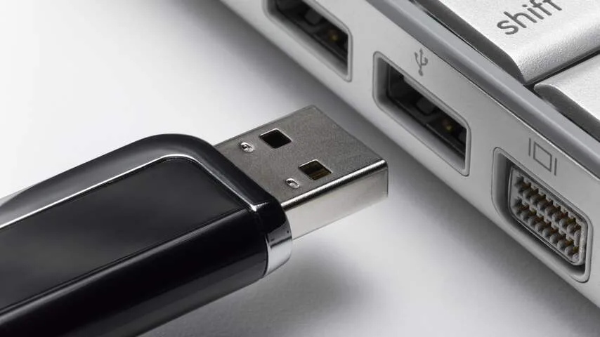

## 1. Laad niet draadloos op

De meeste smartphones hebben twee manieren om op te laden: je kunt een kabel onderaan inpluggen, of je kunt hem op een draadloze oplaadmat leggen. In de meeste gevallen is de bekabelde optie sneller.

> [!NOTE]
> Dit artikel verscheen eerder op [NU.nl](https://www.nu.nl/slimmer-leven/6313864/vijf-tips-om-je-smartphone-zo-snel-mogelijk-op-te-laden.html).

Een iPhone kan bijvoorbeeld met maximaal 15 watt opladen via de draadloze MagSafe-lader achter op het toestel, terwijl de USB-C-poort met zo'n 27 watt kan opladen.

Android-telefoons kunnen vaak ook met zo'n 25 watt van stroom worden voorzien. En hoe hoger de wattage, hoe sneller je toestel oplaadt.

## 2. Plug de kabel in je adapter, niet een laptop of pc

Je kunt de oplaadkabel bijvoorbeeld in een lege laptoppoort stoppen om een smartphone van stroom te voorzien. Maar in dat geval krijg je minder capaciteit dan wanneer je hem rechtstreeks op een oplader aansluit.

De meeste laptoppoorten geven maar zo'n 15 watt aan kracht. Opladen via je laptop zorgt er bovendien voor dat die ook sneller leegraakt, waardoor je laptop eerder moet worden opgeladen. Daardoor raakt de accu op de lange termijn ook sneller verweerd.

## 3. Zet de telefoon uit of in vliegtuigmodus tijdens het laden

Je telefoon gebruikt altijd stroom, zelfs terwijl hij wordt opgeladen. Door het toestel uit te schakelen weet je zeker dat alle energie rechtstreeks naar je accu gaat. Dan moet je uiteraard wel accepteren dat je tijdens het opladen even onbereikbaar bent.

Een alternatief is om de vliegtuigmodus van je telefoon in te schakelen, en zo nodig bijvoorbeeld de wifi uit te zetten. Dit zorgt ervoor dat draadloze antennes geen verbinding proberen te maken en je toestel iets minder energie slurpt.

## 4. Gebruik (of koop) een snellader

De oplader die standaard bij je telefoon wordt geleverd, werkt prima. Maar de kans bestaat dat hij niet de maximale capaciteit biedt waarmee je telefoon kan worden opgeladen. Vaak kun je een zogeheten snellader met hogere wattage kopen, die je telefoon sneller van stroom voorziet.

Het verschilt per toestel hoe snel hij kan worden opgeladen. Sla de handleiding erop na hoeveel watt de telefoon maximaal ondersteunt en kijk daarna hoeveel watt je oplader heeft. Kan hij meer aan? Dan kun je online een oplader bestellen die deze wattage biedt.

## 5. Gebruik de juiste kabel

Naast verschillende opladers zijn er ook meerdere varianten van de kabel die je gebruikt. Let daarbij vooral op de USB-poort die je in de stroomadapter stopt. Heeft deze een oude, dikkere USB-A-aansluiting zoals hieronder afgebeeld? Dan kan deze met maximaal 18 watt opladen. Modernere USB-C-kabels werken met hogere wattages.

Bij nog hogere oplaadcapaciteiten moet je er bovendien zeker van zijn dat je gebruikte kabel dit wel aankan. Sommige winkels adverteren met de ondersteunde wattage van een snoer. Maar je kunt dit ook zelf testen door een app zoals Ampere te installeren op je smartphone. Die laat zien met hoeveel watt een snoer stroom naar je telefoon stuurt.

_Vijf tips om je smartphone zo snel mogelijk op te laden — Beeld: Getty Images_
