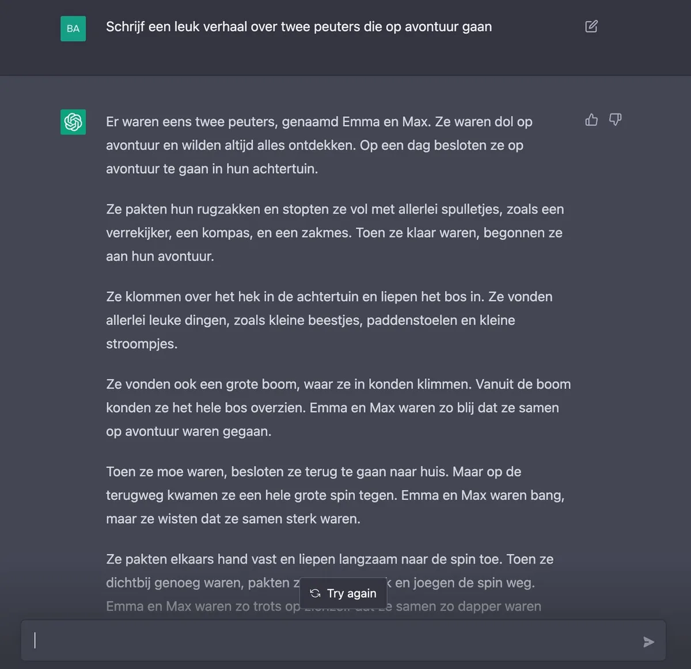
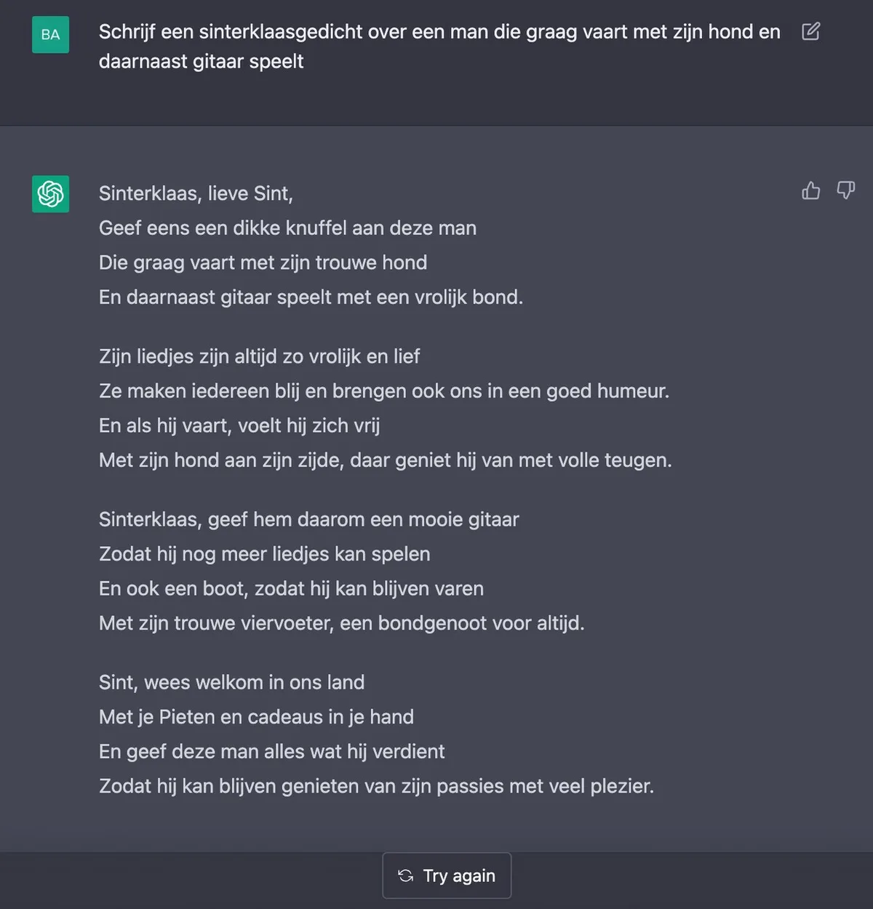

Het is nog enkele uren voor pakjesavond start, dus wie nog geen gedicht heeft geschreven zit nu geheid te zweten. Maar geen nood: er is een kunstmatige intelligentie (AI) die een handje helpt.

> [!NOTE]
> Dit artikel verscheen eerder op [AD](https://www.ad.nl/tech/waarom-zelf-een-sinterklaasgedicht-schrijven-als-deze-ai-het-ook-kan~a85d451b/).

ChatGPT is de nieuwste hit op sociale media. In een chatscherm kun je de AI vragen iets voor je te schrijven, waarna het programma er verbazingwekkend accurate teksten uitpompt. De schrijfopdracht kan van alles zijn: je kunt vragen om een leuk verhaal, een stukje code voor je website of zelfs een compleet gedicht.

De kunstmatige intelligentie maakt gebruik van zogeheten ‘_machine learning_’. De software heeft een gigantische hoeveelheid teksten van het internet gelezen, om op basis daarvan te leren hoe hij bepaalde verhalen kan schrijven.

Het maakt ChatGPT een geweldig hulpmiddel bij het maken van een sinterklaasgedicht. Want hoewel het gedicht dat deze AI voor je maakt niet meteen zonder aanpassen te gebruiken is, draait hij wel in een handomdraai een goede basis uit die je zelf kunt perfectioneren.

## Zo maak je een gedicht met ChatGPT

Om ChatGPT te gebruiken heb je een account nodig, dat je maakt op de [website van OpenAI](https://chat.openai.com/chat). Vervolgens kun je op diezelfde pagina inloggen om met de schrijfassistent te praten.

De webapp ziet eruit als een soort chatvenster. Jij kunt een opdracht typen naar ChatGPT, waarna de kunstmatige intelligentie onmiddellijk een resultaat zal produceren. Tik je bijvoorbeeld ‘schrijf een leuk verhaal over twee peuters die op avontuur gaan’ dan krijg je onderstaand resultaat:

Een voorbeeld van ChatGPT. © OpenAI

Het schrijven van een gedicht is net zo simpel, met bijvoorbeeld het commando ‘schrijf een sinterklaasgedicht’ of ‘schrijf een gedicht’. Bevalt het resultaat niet, dan kun je op ‘_Try again_’ klikken om het nog eens te proberen.

Voor een persoonlijker gedicht zouden we een specifieker commando gebruiken. Is het gedicht voor een man die bijvoorbeeld graag op zijn boot vaart en met zijn hond en gitaar speelt? Vraag dan iets als ‘schrijf een sinterklaasgedicht over een man die graag vaart met zijn hond en daarnaast gitaar speelt’. Hoe specifieker het commando, hoe beter de AI weet wat hij moet schrijven.

Een gedicht van ChatGPT. © OpenAI

## Wisselende resultaten met rijm

Het kan zijn dat je gedicht niet op rijm is. Soms is dat op te lossen door ChatGPT te vragen ‘een gedicht op rijm te schrijven’, maar bij ons zijn ervaringen daarbij wisselend. Nederlandse rijmwoorden lijkt de AI nog niet perfect te begrijpen.

Het kan daarom zijn dat je AI-gegenereerde sinterklaasgedicht nog wat nazorg vereist. Ga er doorheen met een [rijmwoordensite](https://www.ad.nl/tech/met-deze-sites-maak-je-supersnel-een-sinterklaasgedicht~a2566477/) ernaast om het een volwaardig gedicht te maken.

## AI maakt steeds meer creatieve dingen

Kunstmatige intelligentie wordt steeds vaker ingezet om creatieve dingen te maken. Naast gedichten zien we al langere tijd hoe computers bijvoorbeeld kunstwerken maken die verdacht veel lijken op mensenwerk. De [smartphone-app Lensa](https://www.ad.nl/tech/nieuwe-profielfoto-nodig-deze-slimme-app-maakt-er-in-een-handomdraai-tweehonderd-voor-je~a61ca376/) was onlangs nog een klein hitje, waarmee je voor een klein bedrag honderden profielfoto’s op basis van je oude selfies kan genereren.

Het werkt buitengewoon goed, maar leidt in sommige sectoren ook tot zorgen. Illustrators vrezen bijvoorbeeld dat zij minder vaak worden ingehuurd, omdat het goedkoper is om een computer het werk te laten doen. Datzelfde zou kunnen gebeuren met de technologie achter ChatGPT. Als een computer in enkele seconden een artikel kan schrijven en daar goed genoeg in wordt, kan dat het werk van menselijke schrijvers vervangen.

## Waarom is ChatGPT gratis?

ChatGPT is volledig gratis te gebruiken en toont ook geen advertenties. Daarmee lijken de makers geen geld te verdienen aan iedereen die er gebruik van maakt.

De software is volgens OpenAI vooral bedoeld als experiment. Iedereen die er nu gebruik van maakt, is in feite een tester die op nieuwe manieren probeert het uiterste te halen uit de kunstmatige intelligentie. En hoe meer dat gebeurt, hoe slimmer de software wordt en hoe beter de onderzoekers die begrijpen.
