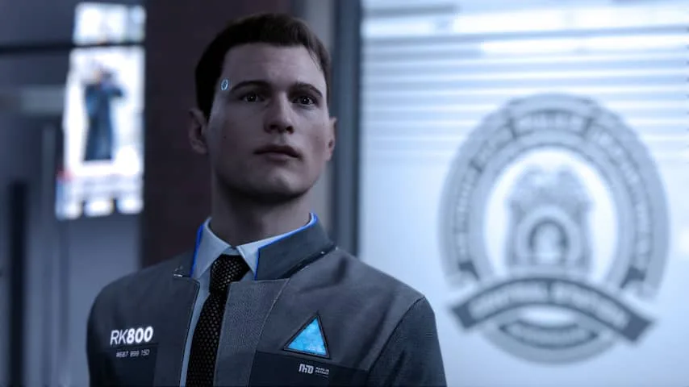

**Op 25 mei verschijnt de nieuwe PlayStation 4-game Detroit: Become Human, waarin de wereld is gevuld met slimme robotdienaren die in huis helpen. Hoe lang duurt het tot dit sciencefictionbeeld een realiteit wordt?**

> [!NOTE]
> Dit artikel verscheen eerder op [NU.nl](https://www.nu.nl/weekend/5241134/wanneer-nemen-robots-de-wereld-over.html).

In de fictieve versie van de stad Detroit zijn robots net zo populair als de hedendaagse smartphone. Bijna iedereen heeft er eentje in huis om te helpen bij alledaagse taken. De ene machine doet de boodschappen, terwijl de robot van een ander de kinderen van school haalt.

Die robots zijn haast niet van mensen te onderscheiden. Ze hebben gewone gezichten, dragen kleding en lopen net zoals hun menselijke eigenaren rond. Het verschil is alleen te zien aan de simpele lampjes op de kleding en het hoofd van de androïdes.

De robotrevolutie heeft niet enkel positieve ontwikkelingen met zich meegebracht. De straten zijn gevuld door protestmarsen, omdat de werkloosheid blijft stijgen. Veel personeel in bijvoorbeeld fabrieken is inmiddels door de robots vervangen.

Tegelijkertijd hebben steeds meer van de machines last van softwarebugs, waardoor ze onvoorspelbaar gedrag beginnen te vertonen. Het lijkt er op dat de kunstmatige intelligenties langzamerhand een eigen bewustzijn beginnen te ontwikkelen.

[Bekijk ingesloten media](https://content.jwplatform.com/players/7w5yRkfe-whqXCOFb.html)

## Komt de robotrevolutie er echt?

De game schetst een wereldbeeld waar techexperts al langere tijd over dromen - en voor waarschuwen. Primitievere robots beginnen in fabrieken langzamerhand steeds meer werk over te nemen. Apple gebruikt in Nederland bijvoorbeeld een robotarm om oude iPhones uit elkaar te halen en te recyclen. Tesla-baas Elon Musk probeert al langere tijd zijn fabrieken te automatiseren met dit soort machines.

Is een met robots gevulde wereld in 2018 reëel? "Dit hangt een beetje af van je definitie van robots", aldus hoogleraar robotica Vanessa Evers aan de Universiteit Twente. "Als je robots ziet als intelligente systemen die mobiel zijn, handelingen kunnen uitvoeren en die een fysiek effect hebben op de omgeving, dan bestaan die al in bijvoorbeeld ziekenhuizen en zelfrijdende auto's."

"Als een robot een assistent is die iets in huis regelt, in een auto rijdt of een bestelling aan Amazon doorgeeft, dan bestaan die al. Dus in die zin is het zeker reëel."

_Detroit — Beeld: Quantic Dream_

Adam Williams, de hoofdschrijver van de nieuwe game, denkt dat het niet lang meer zal duren tot zijn toekomstbeeld een realiteit wordt. "Ik denk dat die robottoekomst dichterbij is dan we nu denken."

"Er is een anekdote over president Nixon, die in de jaren '70 een rondleiding kreeg bij het technologielab van de CIA. Daar stond een gigantische computer. De baas van de CIA zei trots dat in de toekomst 'zeker tien van zulke machines in de Verenigde Staten staan'". Inmiddels staan alleen in de VS honderden miljoenen computers. "Grote technologische ontwikkelingen vinden vaak sneller plaats dan we vooraf vermoeden."

## Gaan robots onze banen overnemen?

In de game heeft de robotisering geleid tot werkloosheid in fabrieken en veel maatschappelijke problemen - punten die volgens Williams ook ooit in de echte wereld aan bod kunnen komen. "Ik weet niet zeker of we daar als mensheid iets tegen kunnen doen", vertelt hij.

"Het is net als bij de uitvinding van het internet, waarbij men ook niet kon voorkomen dat mensen daarop elkaar ooit zouden gaan beledigen en pornografie gingen kijken. Ik denk dat we niet moeten proberen om de nadelen te voorkomen, maar om de positieve gevolgen groter te maken."

"Als een engineer, iemand die dingen maakt, verwacht ik dat niet alleen onze relatie met technologie zal veranderen", aldus Evers. "Maar ook onze relatie met elkaar. Als wij intensief samenwerken met een autonome robot en dagelijks zien wat het nut daarvan is, dan zullen we die als onmisbaar gaan ervaren. En dan zullen mensen rollen onderling anders gaan verdelen."

## Worden robots ooit gevaarlijk voor de mensheid?

Meerdere experts vrezen vooralsnog voor de gevolgen van een wereld gevuld met robots. De recent overleden wetenschapper Stephen Hawking waarschuwde in de laatste jaren van zijn leven vaak voor de gevaren van kunstmatige intelligentie, de software waarmee een autonome robot leert om zijn werk te doen.

Volgens Hawking zou kunstmatige intelligentie ooit het einde van de mensheid kunnen inluiden. "De techniek verbetert zichzelf op een steeds hoger tempo", zei hij. "De mens kan die groei niet bijhouden, omdat biologische evolutie hen tegenhoudt. De mens wordt dan voorbijgestreefd."

"Dat lijkt me pas echt een gevaar als je een breed inzetbare kunstmatige intelligentie hebt", denkt Williams. "Zo'n kunstmatige intelligentie kan een beetje van alles. Die kan dan software maken om zichzelf te verbeteren en zo exponentieel intelligenter worden. Dat is niet een risico bij specifieke AI, die gemaakt is om één taak uit te voeren."

Evers vindt vragen over mogelijk gevaarlijke robots vaak suggestief verwoord. "De vraag gaat er van uit dat de dreiging van de robot komt. Net zoals bij ontwikkelingen bij bijvoorbeeld kernenergie en rakettechnologie, komt de dreiging juist van de mens."

## Wat als robots ooit echt intelligent worden?

In _Detroit: Become Human_ begint een klein aantal robots langzaam zelfbewust te worden. Een dilemma dat in de echte wereld voer zou zijn voor filosofen, denkt Evers. "We moeten bepalen wat bewustzijn is". Op het moment zou deze mogelijke ontwikkeling echter nog mijlenver weg zijn.

Williams durft ook niet te zeggen hoe we met zo'n maatschappij om moeten gaan. "In de game willen we ook niet een antwoord bieden op dit soort lastige, filosofische vragen. In plaats daarvan hopen we een beeld te schetsen van de wereld, waar spelers zelf over kunnen nadenken."

**[Lees meer achtergrondverhalen in NUweekend](http://www.nu.nl/weekend)**
