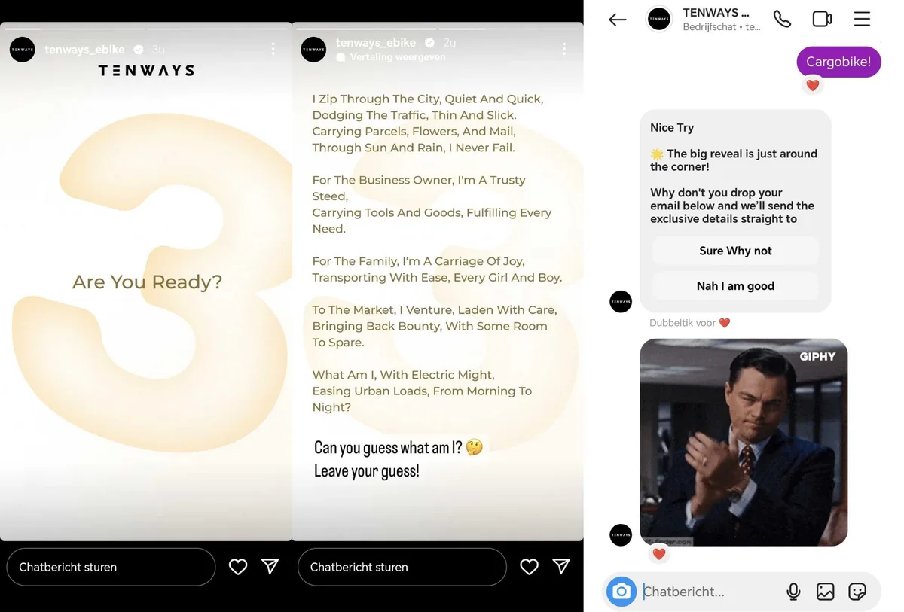

Daar hint de fietsenmaker sterk naar op zijn Instagram-account. Ze beloven over drie dagen een nieuw product aan te kondigen. Wat het wordt verklappen ze niet, maar een klein gedicht hinten ze sterk:

> [!NOTE]
> Dit artikel verscheen eerder op [Bright](https://www.bright.nl/nieuws/1177960/wordt-dit-de-goedkoopste-elektrische-bakfiets-van-het-moment.html).

_I zip through the city, quiet and quick, Dodging the traffic, thin and slick, Carrying parcels, flowers and mail, Through sun and rain, I never fail._

_For the business owner, I’m a trust steed, Carrying tools and goods, fulfilling every need._

_For the family, I’m a carriage of joy, Transporting with ease, every girl and boy._

Een nieuw voertuig van een elektrische fietsenmaker, gebouwd om vracht of kinderen te vervoeren: een elektrische bakfiets lijkt erg aannemelijk. We hebben het even aan de beheerder van het Instagram-account gevraagd, maar hij houdt het antwoord in het midden.

## Cargo bike

Het zou ook een ander soort cargo bike te zijn, met extra opslagplek aan de voor- en achterkant van de fiets. Hoe dan ook: gezien recente e-bikes van Tenways erg goedkoop waren, is de kans aanzienlijk dat deze mogelijke bakfiets één van de goedkoopste opties in zijn categorie zal worden. We horen het geheid komende maandag, 5 februari.

Eind december testte David nog de [Tenways Ago T](https://www.bright.nl/videos/1165259/deze-e-bike-van-tenways-is-scherp-geprijsd-en-fietst-heerlijk.html), een betaalbare e-bike die lekker wegfietst.

Lees meer over [e-bikes](https://www.bright.nl/onderwerpen/elektrische-fiets) en abonneer je op onze [gratis nieuwsbrief](https://www.bright.nl/nieuws/1175658/abonneer-je-gratis-op-de-bright-nieuwsbrief.html).
