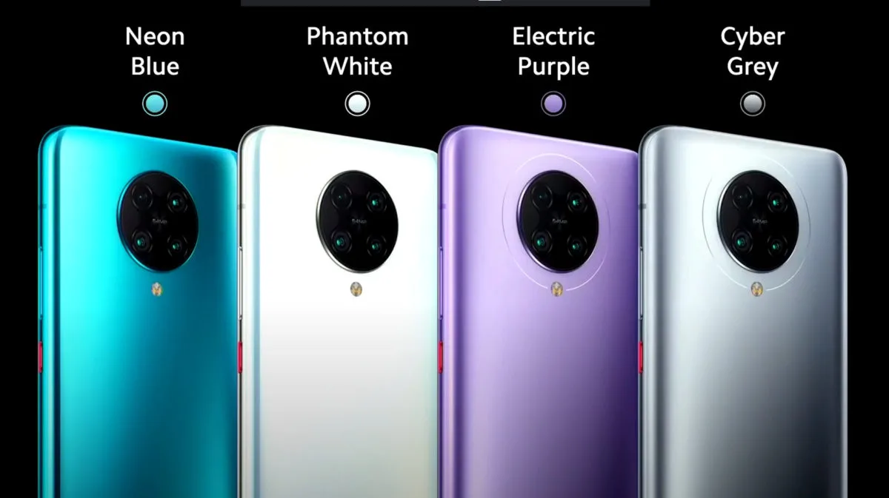

**Poco F2 Pro**

> [!NOTE]
> Dit artikel verscheen eerder op [Bright](https://www.bright.nl/nieuws/1126383/xiaomi-onthult-nieuwe-goedkope-pocophone.html).

Eigenlijk presenteerde de telefoonmaker in februari dit jaar [ook al een Pocophone-opvolger](https://www.bright.nl/nieuws/artikel/5000071/opvolger-pocophone-met-zeer-snel-scherm-onthuld-op-4-februari), maar dit toestel verscheen alleen in India. De nieuwe Poco F2 moet echter wereldwijd verschijnen, waardoor we hem ook in Nederland kunnen kopen.

De smartphone heeft een Snapdragon 865-processor en een scherm van 6,67 inch groot. Dit OLED-display heeft een resolutie van 2220 bij 1080 pixels. De vingerafdrukscanner zit in dit scherm verwerkt.

Achterop zitten vier camera's, waarvan de hoofdlens een sensor van 64 megapixel gebruikt. Deze moet video's van 8K kunnen filmen. Daarnaast zitten de 13 megapixel ultra-wide, de 5 megapixel telefotolens en een dieptesensor van 2 megapixel.

## 499 euro

Het toestel wordt in Europa verkocht vanaf 499 euro. Voor dat bedrag krijg je een model met 6GB werkgeheugen en 128GB opslag. Wie 599 euro betaalt heeft 8GB RAM en 256GB opslagruimte.

Daarmee is de Xiaomi-telefoon goedkoper dan de vlaggenschepen die telefoonmakers de afgelopen maanden aankondigden. [OnePlus](https://www.bright.nl/nieuws/artikel/5090166/oneplus-onthult-nieuwe-duurdere-oneplus-8-en-8-pro), dat doorgaans relatief goedkope toestellen maakte, besloot dit jaar ook in te zetten op een premiumtoestel.

## Getest: goedkope en snelle Pocophone

[Bekijk ingesloten media](https://www.youtube.com/embed/39LgkR8wiUs?autoplay=1&modestbranding=1)
