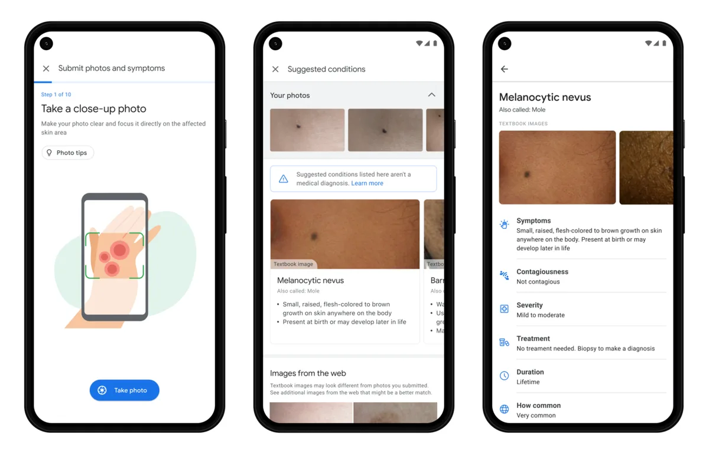

Google pakt het ambitieus aan: de techreus belooft dat een nieuwe app je kan helpen om verdachte bultjes te identificeren om zo te ontdekken of huidkanker op de loer ligt. En daarvoor zou je alleen maar een smartphone nodig hebben.

> [!NOTE]
> Dit artikel verscheen eerder op [AD](https://www.ad.nl/tech/zo-gaat-google-helpen-om-huidkanker-te-identificeren~a977814b/).

De app Derm Assist zou inmiddels op Europees niveau al zijn goedgekeurd om medisch in te zetten. Door gebruik te maken van dezelfde technologie die nu al wordt ingezet om bijvoorbeeld borstkanker goed te herkennen, zouden ook gekke jeukende bulten op je arm of nek worden onderzocht.

De techreus waarschuwt op zijn blog wel: ,,Dit is niet bedoeld ter vervanging van een medisch advies, want vaak heb je een arts nodig om de situatie te beoordelen.” Derm Assist zou bedoeld zijn ter aanvulling van bestaande middelen. Door een verdachte plek met de app te onderzoeken, zou je sneller weten wat er wellicht aan de hand is.

**Hoe werkt het?
**Derm Assist is een app die de camera van een smartphone gebruikt. Je maakt een foto van het bultje in kwestie, waarbij de software waarschuwt of je wel genoeg huid in beeld brengt en of alles goed scherp is.

Na het nemen van de foto vul je een korte vragenlijst in. Jeukt het? Begint het soms met bloeden? En hoe lang zit het er eigenlijk al? Op basis van die foto en je antwoorden kan Google proberen een diagnose te stellen.

Dat doet de app trouwens alleen als hij zeker is van zijn conclusie. Bestaat er twijfel bij een diagnose, dan zal Derm Assist waarschuwen dat het gegeven antwoord nog onzeker is.

Zo werkt Derm Assist van Google. © Google

**Waarom kan Google dit ineens?
**Google gebruikt bij Derm Assist kunstmatige intelligentie. Een computer heeft een gigantische hoeveelheid foto’s en informatie over huidproblemen bekeken, waardoor hij heeft geleerd om ieder specifiek probleem zo goed mogelijk te herkennen.

In feite wordt jouw informatie vervolgens voorgelegd aan dezelfde kunstmatige intelligentie, die op basis van eerdere onderzoeken een nieuwe conclusie trekt.

Steeds meer software van Google werkt op deze manier. Zo leert de stemassistent van het bedrijf bijvoorbeeld om woorden beter te herkennen door uitspraken van anderen te analyseren.

**Zit dat qua privacy wel goed, als Google ineens foto's van mijn moedervlekken heeft?
**Dat klinkt inderdaad wel spannend. In theorie weet de techreus ineens iets heel intiems van je: of je misschien last hebt van een medisch probleem. Het bedrijf belooft echter dat je gegevens niet zomaar worden verzameld en verwerkt. Je zult dus na het identificeren van eczeem ook niet ineens reclame zien voor een zalfje.

Je kunt er wel voor kiezen om je gegevens te doneren aan het bedrijf, maar dan worden ze alleen gebruikt om de kunstmatige intelligentie te verbeteren. In feite is jouw foto dan één extra om het herkenningsalgoritme nog iets slimmer mee te maken.

De app zal later dit jaar voor de eerste testers beschikbaar komen.

_**Hoe denk jij over deze technologische ontwikkeling?**
Reageren kan onderaan dit artikel. Alleen reacties voorzien van een volledige naam worden geplaatst. We doen dat omdat we een gesprek willen met mensen die staan voor wat ze zeggen, en daar dus ook hun naam bij zetten. Wie zijn naam nog moet invullen, kan dat doen door rechts bovenaan op onze site op ‘Login’ te klikken._
