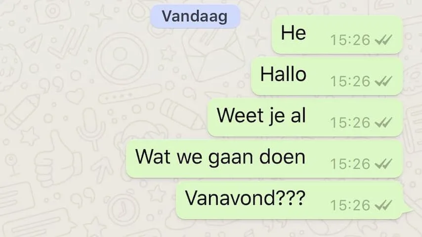
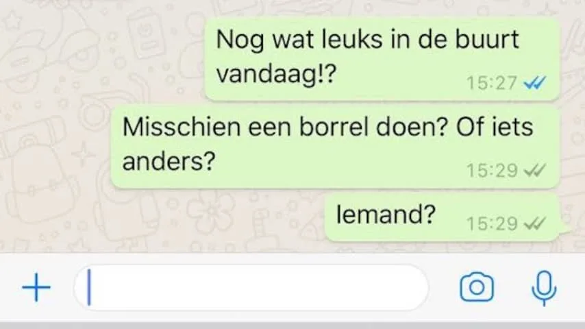

**Steeds meer Nederlanders gebruiken de chat-app WhatsApp om met elkaar te communiceren. Maar wat is nou netjes en onbeleefd in een appgesprek? NU.nl vroeg het aan drie etiquette-experts.**

> [!NOTE]
> Dit artikel verscheen eerder op [NU.nl](https://www.nu.nl/weekend/5386787/zo-gedraag-je-je-netjes-op-whatsapp.html).

**Is het beleefd om niet te reageren als je geen zin hebt om te chatten?**

Anne-Marie van Leggelo, Het Etiquette Bureau: ''Omdat je bij WhatsApp niet alleen kunt zien wanneer iemand online was maar ook of het bericht is gezien of aangekomen, worden er verwachtingen geschept bij de versturende partij en verplichtingen bij de ontvanger. Wat mij betreft is dat nergens voor nodig.''

Jan Jaap van Weering, Distinguished: ''Chatten is geen verplichting, maar het is niet altijd handig om niet of heel laat te reageren. Dat kan afwijzend overkomen op de verstuurder.''

Gonnie Klein Rouweler, Image Consultancy: ''Het is in principe onbeleefd niet te reageren als je geen zin hebt. In de etiquette gaat het om respect voor elkaar en het duidelijk zijn naar elkaar. Geef gewoon aan dat het chatten nu niet gelegen komt. Een reden hoef je daar niet bij te vermelden.''

**Veranderen blauwe vinkjes iets aan de zaak? Is het netjes niet te reageren als iemand weet dat je een bericht hebt gelezen**

Leggelo: ''Ook al kan je zien dat de ander het bericht heeft gezien dan wel ontvangen: om een antwoord zeuren is uit den boze. Geef de ander de tijd om te reageren en ga niet meteen van het ergste uit als je niet direct een bericht terugkrijgt. Dat geldt ook voor het reageren; snel reageren is mooi maar voel je daartoe niet verplicht. Ben je wel bewust van het feit dat mensen vaak binnen bepaalde tijd een antwoord verwachten.''

Van Weering: ''Indien men een bericht opent met de intentie om dit te lezen, dan is het wel zo correct om te reageren, anders moet men het bericht niet openen.''

Klein Rouweler: ''Het is zeker niet onbeleefd. Het kan zijn dat je in gesprek bent met anderen en dan heeft WhatsApp geen voorrang op het gesprek. Daarom is het ook onbeleefd tussendoor berichten te lezen in aanwezigheid van anderen. Soms kan je niet meteen reageren, omdat je tijd nodig hebt om niet te vluchtig op een bericht te reageren. Reageer wel altijd binnen 48 uur, zoals het een ongeschreven regel is bij andere correspondentiemiddelen.''

**Mag je eigenlijk je blauwe vinkjes uitschakelen?**

Leggelo: ''Berichten die niet op korte termijn worden beantwoord, kunnen voor veel verwarring zorgen. De frustratie kan nog groter worden als je merkt dat de persoon in kwestie wel andere berichten beantwoordt of iets op Facebook of Instagram zet. Dit soort leesbevestigingen kunnen voor misverstanden zorgen.

Verontschuldig je, of geef een reden aan als je (te) lang hebt gewacht met antwoorden. Ik raad aan om bij twijfel de vinkjes en leesbewijzen uit te zetten. Dat voorkomt veel gedoe.''

Van Weering: ''Het kan in bepaalde gevallen handig zijn. Is het praktisch voor de gebruiker, dan is hij of zij er vrij in om deze uit te schakelen. Dat is zeker het geval als men bij de geheime dienst werkzaam is, haha.''

Klein Rouweler: ''In principe is dat onbeleefd. Wees wellevend, duidelijk en respectvol naar anderen toe. De functie van de vinkjes is er bij normaal gebruik juist om de ander te laten weten dat je het bericht gelezen hebt. Waarom zou je daar niet transparant over zijn? De blauwe vinkjes roepen echter wel verwachtingen op van een reactie van de geadresseerde, terwijl dat niet terecht is.''

**Wat zegt de etiquette over het starten van een chat met alleen “hoi” of “hallo”, zonder te zeggen waar je het over wil hebben?**

Leggelo: ''Dat is niet beleefd. Dat zou je bij een eerste gesprek in de 'echte wereld' ook niet doen. Dan zeg je meer. Het roept vragen op. Grote kans dat de ontvanger niet zal antwoorden. Als het de eerste keer is dat je een gesprek begint met iemand, dan is het belangrijk om te weten wat je doel is en wat je verhouding is ten opzichte van je gesprekspartner.''

Van Weering: ''Sociale media zijn laagdrempelig, wat niet betekent dat men algemene beleefdheids- en fatsoensnormen achterwege kan laten. Het gaat er uiteindelijk om dat men respectvol en oprecht met elkaar omgaat. Goede omgangsvormen vallen vaak niet op, maar het ontbreken ervan wel.''

Klein Rouweler: ''Bij een formeel, zakelijk bericht vermeld je wel de reden van je bericht. Dan spreek je de ander ook niet aan met een informele "hoi" of "hallo". Al is communiceren via WhatsApp wel vaak kort en bondig.''

**Is het beleefd om je bericht te verspreiden over veel...**
**Losse...**
**Berichten...**
**Onder...**
**Elkaar?**

Leggelo: ''Omdat WhatsApp je niet per bericht een bedrag in rekening brengt zoals sms dat deed, lijken sommige mensen de enterknop of zelfs de spatie te zijn vergeten. In plaats daarvan drukken ze bij elke zin of bij elk woord op de verstuurknop. Het gevolg is een enorme berichtenreeks. Probeer je bericht niet in allemaal afzonderlijke kleine berichtjes op te delen, maar probeer zoveel mogelijk in één bericht te stoppen.''

Van Weering: ''Het is niet heel handig om dat te doen en het komt slordig over. Daarnaast lijkt de scribent op deze manier minder serieus of minder zakelijk.''

Klein Rouweler: ''Het is onbeleefd om meerdere berichten onder elkaar te verspreiden. Beter is het om één bericht te sturen. Als het een uitgebreid bericht is, kun je dat beter per e-mail versturen en op WhatsApp je e-mail aankondigen.''

_WhatsApp spam — Beeld: NU.nl/Bastiaan Vroegop_

**Hoe wordt gedacht over overmatig emoji-gebruik?**

Leggelo: ''Ik adviseer geen smiley-bombardementen. Gebruik ze met tact en met mate. Twee per bericht is in vrijwel alle gevallen ruim voldoende: overdaad schaadt. Wie emoji’s goed inzet, maakt gedeeltelijk goed wat verloren gaat door het gebrek aan intonatie, gezichtsuitdrukkingen en andere non-verbale communicatie. Maar wie er een emojionele rollercoaster van maakt, loopt risico op miscommunicatie.''

Van Weering: ''Emoji's zijn te speels, niet serieus en kinderlijk. Ze ontkrachten de boodschap.''

Klein Rouweler: ''Een enkele emoticon werkt prima om een bericht krachtiger te maken en om iets toe te lichten, maar overdrijf het vooral niet door alleen te communiceren met de oppervlakkige, vluchtige emoticons. In het zakelijke verkeer waar je de ander vaak niet goed kent, is het gebruik van emoji's nog steeds ongepast. Kies dan voor de veilige, formele weg van communiceren.''

**Gelden er andere regels over schelden op WhatsApp?**

Leggelo: ''Schelden in WhatsApp is net zo onbeleefd en respectloos als mondeling. Het is gemakkelijk en laf om in je eigen, veilige omgeving afschuwelijke woorden naar iemands smartphone te sturen. Let dus op je taalgebruik en denk na voordat je iets verstuurt. Boos? Tel tot tien voordat je het bericht verstuurt.''

Van Weering: ''Schelden is altijd onbeleefd en een uiting van onmacht. Mijn advies is om dat te vermijden. Tel tot tien in plaats van tot drie voordat het de digitale weg in gaat.''

Klein Rouweler: ''Schelden is in elk communicatiemiddel ongehoord en respectloos. Ook al is het niet anoniem via WhatsApp.''

**Hoe zit het met korte reacties? Dus als iemand bijvoorbeeld met alleen "ja" of "ok" reageert op een vraag?**

Leggelo: ''Dat is geheel afhankelijk van met wie je appt. tegenwoordig zijn er steeds meer mensen die zakelijk appen. Dan zijn volzinnen wenselijk. Privé kan ''ok'' of ''ja'' voldoende zijn als antwoord maar niet als elk antwoord. Blijf correct en beleefd.''

Van Weering: ''Dat is prima. Het is kort en krachtig, wat het duidelijk maakt. Dat is niet altijd kortaf bedoeld. Verplaats je in de lezer en vraag je af of die het ook zo opvat. Zeker in een zakelijke of amoureuze setting.''

Klein Rouweler: ''WhatsApp is een uitstekend communicatiemiddel voor korte informele berichten en boodschappen. Voor goede bekenden kan dat prima. Het voordeel van WhatsApp-gebruik is dat het een laagdrempelig, informeel en snel communicatiemiddel is.''

**Is het onbeleefd om geen interpunctie of hoofdletters te gebruiken op WhatsApp?**

Leggelo: ''Ja, je hoort zonder spel- en stijlfouten in tegenstelling met kortere zinnen en meer 'to the point' te schrijven, in tegenstelling tot een mail of brief. WhatsApp leent zich niet voor lange verhalen. Als je woorden of zinnen geheel in hoofdletters schrijft of veel uitroeptekens plaatst, dan lijkt het alsof je schreeuwt. Bij WhatsApp kijk je meer naar de smileys, leestekens en woorden die worden gebruikt.''

Van Weering: ''Een gebrek aan interpunctie of hoofdletters komt gehaast en ongeïnteresseerd over.''

Klein Rouweler: ''Het lijkt de trend om zo kort mogelijk te formuleren, zonder interpunctie en hoofdletters. Bij korte, snelle boodschappen aan goede bekenden is dit geaccepteerd, maar word niet te vluchtig in je taalgebruik. Bij onbekenden is het zeker onbeleefd en niet gepast. Wees je ervan bewust dat niet iedereen dit waardeert en zeker niet in de formele of zakelijke context.''

**Wat is de etiquette bij het gebruik van geanimeerde gif-afbeeldingen?**

Leggelo: ''Erg leuk die gif-afbeeldingen, maar hou het speciaal: dus niet te veel in één bericht, niet te vaak en wees selectief naar wie je zo'n gif stuurt.''

Van Weering: ''Daar zijn geen vaste regels voor. Gebruik ze zo min mogelijk.''

Klein Rouweler: ''Doe dat alleen naar degenen voor wie het passend en bestemd is en hou rekening met afbeeldingen van personen in het kader van de privacywetgeving. Wees bewust van de impact.''

**Is het netjes om veel te chatten in een buurtgroep?**

Leggelo: ''Nee, een buurtgroep is vaak bedoeld als veiligheidsapp van de buurt waarin men verdachte situaties aan elkaar meldt of aan de politie. En als 'gezelligheidsapp' om bijvoorbeeld bepaalde evenementen zoals lokale barbecues in aan te kondigen. Niet om voor de gezelligheid veel in te chatten.''

Van Weering: ''Beperk het tot praktische informatie waar de groepsleden echt iets aan hebben. Anders denkt de rest als je chat: heb je hem of haar weer, die zoekt zeker aandacht...''

Klein Rouweler: ''Het is zeker niet beleefd om veel te chatten in een buurtgroep. Gebruik die app voornamelijk voor relevante informatie. Niet iedereen heeft de tijd om alsmaar te reageren en zeker niet als het op tijdverdrijf overgaat.''

_WhatsApp buurtgroep — Beeld: NU.nl/Bastiaan Vroegop_

**Hoe moet je je gedragen in zo'n buurtgroep?**

Leggelo: ''Stel berichten op die positief, hulpvaardig en sociaal zijn. Geen beledigende, erotische, discriminerende of agressieve berichten. Stel bij voorkeur berichten op die gaan over burenhulp, buurtpreventie, en informatie over activiteiten die plaatsvinden in de buurt.''

Van Weering: ''Hou het kort en zakelijk!''

Klein Rouweler: ''Als er mensen zijn die op deze wijze nog contact met de buitenwereld willen hebben, is het beter om individueel te chatten. Geef duidelijk aan, maar altijd respectvol, als het chatten niet uitkomt. Bij de Buurtpreventie-app, dat als doel heeft de veiligheid in de buurt te verhogen, is het zeker niet gepast.''

**Mag je zomaar uit een groepsapp stappen?**

Leggelo: ''Uit een appgroep stappen is geen sinecure. De mededeling 'Jan heeft de groep verlaten' in een smal blauw balkje kan, zeker zonder aankondiging, hard aankomen. Het is de digitale variant van een ruimte uit rennen en hard met de deur slaan. Er zijn betere manieren om een overvloed van berichten voor te beperken, zoals een groep op 'stil' zetten.''

Van Weering: ''Uit een groepsapp stappen is prima, maar het is dan wel correct om de beheerder of medeleden uit te leggen waarom je dat gaat doen. Verplicht is dat niet.''

Klein Rouweler: ''Het staat je altijd vrij om uit een groepsapp te stappen. Nog beter is het om aan de groep kenbaar te maken waarom je dat van plan bent, zodat anderen niet naar je reden van afhaken hoeven te gissen.''

_Bovenstaand advies is in elk geval uitgebreider dan de regels van WhatsApp zelf. Het bedrijf heeft op het moment alleen algemene voorwaarden, die vooral het privacybeleid van het bedrijf vastleggen. Regels over hoe je je moet gedragen, heeft WhatsApp niet._
