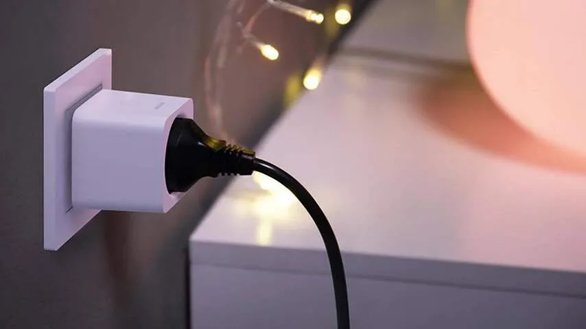
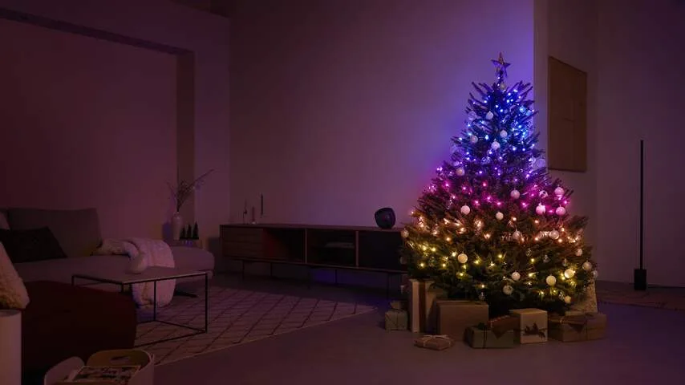

Je kerstboom slim maken klinkt overbodig, maar het brengt wat handigheidjes met zich mee. Je kunt bijvoorbeeld instellen dat de boom pas aangaat als een sensor in de kamer ziet dat het donker genoeg is of dat hij automatisch uitschakelt als je 's avonds alle andere lampen in huis uitdoet.

> [!NOTE]
> Dit artikel verscheen eerder op [NU.nl](https://www.nu.nl/slimmer-leven/6293999/zo-maak-je-de-lampen-in-je-kerstboom-slim-en-waarom-je-dat-zou-willen.html).

Wil je echt spaarzaam met je verlichting omgaan, dan kun je hem koppelen aan een bewegingssensor die ziet of er iemand in de kamer is. Dan kan de boom na vijf minuten automatisch uitschakelen als er niemand is.

Er zijn twee manieren waarop je jouw kerstverlichting slimmer kunt maken. De goedkoopste optie is met je bestaande lampen en een extra schakelaar. Maar voor wat meer geld kun je slimme lampen met nog wat extra functies kopen.

## Optie 1: hang je kerstverlichting achter een schakelaar

_Zo maak je de lampen in je kerstboom slim (en waarom je dat zou willen) — Beeld: Philips_

Meerdere smarthomefabrikanten verkopen schakelaars voor in het stopcontact waar je de stekker van een apparaat in kunt steken. Vervolgens kun je met een bijbehorende app de stroomvoorziening in- of uitschakelen, zodat de lampen aan- of uitgaan.

Gebruik je Hue-lampen in huis, dan kun je de Hue smart plug toevoegen aan je ecosysteem. Deze schakelaar kost standaard 35 euro en is in de [Pricewatch van _Tweakers_](https://tweakers.net/schakelaars/philips/hue-smart-plug_p1039440/vergelijken/) ook te vinden vanaf 27 euro. Hiermee verschijnt je kerstboom als Hue-lamp in de app. Je kunt hem ook toevoegen aan andere ondersteunde platformen, zoals Apples Woning-app.

Er zijn ook goedkopere slimme stekkers te vinden, zoals een van Xiaomi voor zo'n 15 euro. Kijk bij de aanschaf vooral goed of de betreffende schakelaar past binnen het ecosysteem waar je smarthomeapparaten op dit moment gebruik van maken. Dan is de kans ook groot dat je de kerstboom kunt laten samenwerken met andere lampen en sensoren die je nu al in huis hebt.

## Optie 2: slimme kerstverlichting

_Zo maak je de lampen in je kerstboom slim (en waarom je dat zou willen) — Beeld: Philips_

Wil je iets meer functionaliteit, dan kun je ook investeren in nieuwe kerstverlichting die rechtstreeks met je smarthome werkt. Fabrikanten als Bedee en Govee hebben slimme lampen voor in de boom. Die kun je met de bijbehorende app van kleur laten veranderen om de stijl van je boom aan te passen. Deze slingers vind je voor rond de 40 euro bij webwinkels.

De duurste optie in deze categorie is van Philips: de Festavia-slinger voor in de boom kost maar liefst 205 euro. Voor dat geld krijg je wel wat leuke extra's, zoals de mogelijkheid om de lampjes te laten flikkeren alsof het kaarsjes zijn.
