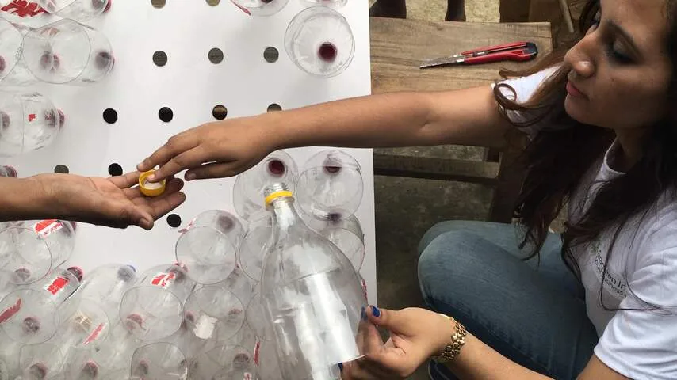

Hieronder beschrijven we twee manieren waarop je een airconditioner kunt bouwen. Voor de eerste manier heb je een simpele huis-tuin-en-keukenventilator nodig. De tweede optie verbruikt helemaal geen stroom en werkt ventilatorloos, maar vergt iets meer kluswerk.

> [!NOTE]
> Dit artikel verscheen eerder op [NU.nl](https://www.nu.nl/slimmer-leven/6318368/zo-maak-je-zelf-een-simpele-airco.html).

## Airco 1: de koudeflessentruc

Een ventilator is nooit genoeg om een kamer te verkoelen. Omdat hij enkel lucht blaast, verplaatst hij op een warme zomerdag alleen maar de warmte die al in je kamer hangt.

Dan de truc: met een paar oude flessen kun je vlak bij de ventilator koude lucht creëren die door de ruimte heen wordt geventileerd. Vul de flessen voor drie kwart met water en leg ze in je vriesvak. Als de flessen bevroren zijn, zet je ze voor de ventilator om de koelte de kamer in te blazen.

Grotere flessen zijn beter - dan heb je immers meer koude massa om te verwaaien. De flessentruc werkt zolang de flessen kouder zijn dan de ruimte waar ze in staan. Wil je de flessen snel bevriezen? Wikkel ze dan in nat keukenpapier voordat je ze in de vriezer legt.

_Zo maak je zelf een simpele airco — Beeld: Grey Group_

## Airco 2: een flessenbord voor je raam

In 2016 bedacht uitvinder Ashis Paul een airconditioner die geen stroom vereist. Je hebt alleen een stuk hout of stevig karton en een verzameling oude flessen nodig. Het systeem kan een kamer met wel 5 graden afkoelen en wordt in Bangladesh, het thuisland van Paul, veelvuldig gebruikt als goedkoop aircoalternatief.

Zaag eerst het hout of karton tot het precies groot genoeg is om in je raamopening te passen. Vervolgens maak je op de plaat gaten ter grootte van een flessenopening.

Halveer daarna de flessen in de breedte en maak een gaatje in de flessendop. Bevestig de bovenkant van de flessen aan de plaat door ze in de gaten te steken en aan de andere zijde de dop er weer op te schroeven.

Je hoeft hierna alleen nog maar de plaat in je raam te zetten, met de flessen naar buiten gericht. De vorm van de flessen zorgt ervoor dat de lucht wordt samengedrukt terwijl hij naar je kamer gaat, waardoor hij afkoelt zodra hij de ruimere kamer binnenkomt.
