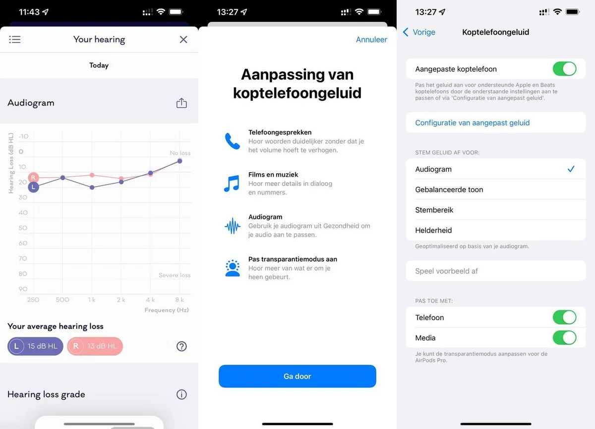

De AirPods-oordoppen van Apple kunnen worden aangepast op basis van een gehoortest, zodat muziek voor jou beter te horen is. Zo werkt dat.

> [!NOTE]
> Dit artikel verscheen eerder op [AD](https://www.ad.nl/tech/zo-pas-je-airpods-aan-op-jouw-specifieke-gehoor~a14a6214/).

Niemands oren zijn hetzelfde. De een kan beter sommige hoge tonen horen, terwijl de ander juist lagere tonen beter kan opvangen. Het zorgt ervoor dat de muziek uit oordopjes voor jou ook anders kan klinkt dan voor een ander.

Techreus Apple heeft daar bij zijn AirPods iets op gevonden: door een audiogram in te laden. Dat is in feite het rapport dat na een gehoortest wordt gemaakt, met daarin de feitelijke score van je gehoor. Vervolgens worden je AirPods hierop afgestemd. Zo kun je ineens klanken horen die niet opvallen bij ‘gewone’ oordoppen.

## Gehoortest zelf doen

Er zijn twee manieren om zo’n audiogram te bemachtigen. De meest voor de hand liggende is om naar een audicien te gaan en daar je gehoor te laten testen. Dat kost wat, maar je hebt dan wel meteen het meest gedegen resultaat. Als je vraagt om een audiogram, weten ze vaak wel wat ze je moeten geven.

Een tweede optie is om de gehoortest zelf te doen. Er staan meerdere apps in de App Store om dat mee te doen, waaronder de Mimi Hearing Test. Je moet dan met oordopjes in een stille ruimte zitten, waar je op een knop drukt zodra je geluidjes hoort. De app maakt achteraf zelf een audiogram dat je kunt gebruiken. Makkelijk, maar de foutmarge is iets groter dan bij een audicien.

De tekst gaat verder onder de afbeelding.

Je kan je AirPods koppelen aan de resultaten van een gehoortest. © Apple

## Koppel het audiogram aan je AirPods

Ga vervolgens op je iPhone naar de Instellingen-app en tik op Toegankelijkheid, gevolgd door Audio/Visueel > Aangepaste Koptelefoon. Zet daar de schakelaar bovenin beeld aan en kies ervoor een audiogram te koppelen.

Je krijgt nu de mogelijkheid om je audiogram in de Gezondheid-app te zetten, door er een foto van te maken of een digitaal bestand in te laden. Als dat niet werkt, kun je met de hand alle waarden in het document overtypen op je iPhone.

Hierna zal Apple je het verschil laten horen tussen het gewone geluid en de aangepaste variant. Als je alles goed hebt gedaan, zal de aangepaste versie voller en helderder klinken.

## Alleen AirPods en Beats

Op het moment werkt het audiogram alleen bij de AirPods-oordoppen en -koptelefoon van Apple, of met de koptelefoons van Beats. Die laatste worden namelijk ook door Apple gemaakt.

Of andere koptelefoons op termijn ook met de technologie zullen werken, is nog maar de vraag. Vermoedelijk wil Apple zelf het geluid kunnen kalibreren om de functie goed te laten werken.

_Bekijk hieronder onze video's op het gebied van technologie._
