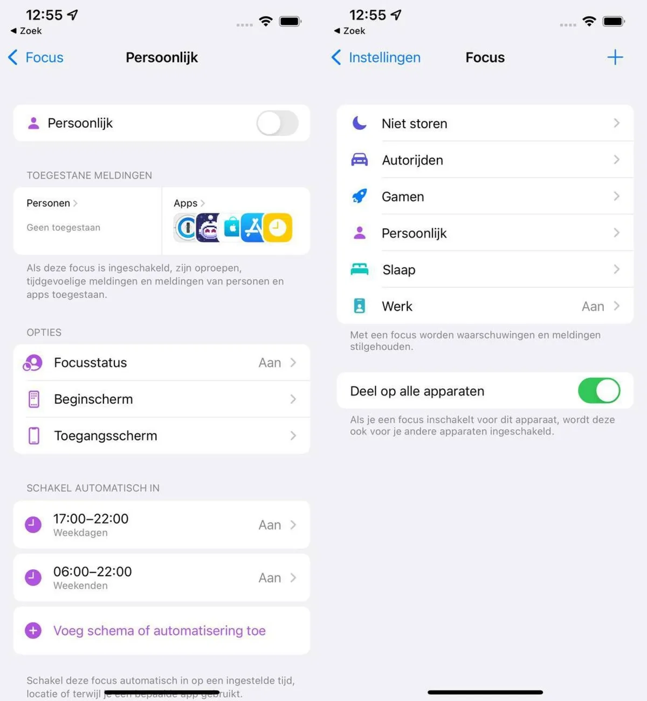

Met het eerder deze week uitgebrachte iOS 15 introduceert Apple een nieuwe functie, waarmee je jouw werk- en privélevens compleet kunt scheiden op je Apple-apparaten. We leggen uit hoe.

> [!NOTE]
> Dit artikel verscheen eerder op [AD](https://www.ad.nl/tech/zo-scheid-je-met-ios-15-werk-en-prive-op-je-iphone~a8b98ab3/).

Wie één telefoon voor werk en privé gebruikt, krijgt vaak genoeg ongewenste berichten op de verkeerde momenten. Je werkmail stuurt notificaties terwijl je op vakantie bent, de baas stuurt een chatberichtje op je vrije avond of de agenda-app herinnert je aan een vergadering waar je niet bij hoeft te zijn.

Met de nieuwe optie ‘Focus’ wil Apple hier een einde aan maken. Het idee is simpel: je maakt speciale profielen aan voor iedere situatie, waarmee je filtert wat je te zien krijgt. Staat je telefoon op privé, dan worden berichten van alle zakelijke apps stilgehouden. Ook kun je voor ieder profiel een eigen iconenscherm maken, zodat het icoon voor bijvoorbeeld je werkmail niet in het weekend in beeld staat.

## Maak een pagina voor iedere werksituatie

Het maken van Focus-profielen is vrij makkelijk, maar vergt wel enig voorwerk. Bedenk eerst goed voor wat voor situaties je graag een profiel wil maken: dat kan zijn voor werk en privé, maar je kunt er ook eentje instellen voor ‘s nachts tijdens het slapen.

Maak vervolgens voor iedere situatie een pagina met apps aan op het beginscherm. Voor je werkprofiel zet je hier bijvoorbeeld je app voor werkmail en een zakelijke chatapp op: alles dat je maar tijdens werkuren wil gebruiken. De iconen voor apps zoals Instagram zet je op de pagina die je op werk wil zien.

Past het niet allemaal, dan kun je zelfs meerdere pagina’s per Focus-profiel maken. Maar vraag je goed af welke apps je in zicht wil hebben op welk moment.

Met de Focus-modus maak je profielen voor werk, privé of bijvoorbeeld tijdens het slapen. © Apple

## Configureer de Focus-profielen

Vervolgens ga je naar de Instellingen-app van je iPhone, waar je tikt op ‘Focus’. Tik bijvoorbeeld op ‘Persoonlijk’ als je eerst je profiel voor buiten werktijd wil configureren. De iPhone zal je vragen om personen en apps te selecteren die je mogen lastigvallen.

Bij de personen kun je bijvoorbeeld goede vrienden en familie invullen. Dit zijn de mensen die je mogen bellen of chatten via Apples Berichten-app. Mag iedereen dat in je vrije tijd? Dan kun je onderaan op ‘Iedereen’ tikken.

Bij de apps selecteer je welke berichten mogen sturen als het profiel geactiveerd staat. Zorg bij je werkprofiel dat je zakelijke apps voor bijvoorbeeld mail hiertussen staan, en vermijd deze juist in je vrijetijdsoptie.

Berichten van niet-geselecteerde apps worden nog wel op je telefoon afgeleverd, maar zijn verborgen. Open het Berichtencentrum met een veeg van linksboven naar beneden, en veeg daarna nog eens naar boven op het beeld. Tik op ‘Tijdens de focus’ als je toch de genegeerde berichten wil zien.

## Selecteer je app-pagina’s

Na het instellen van een Focus word je naar de instellingenpagina gebracht. Hier kun je nog eens tikken op ‘Beginscherm’, gevolgd door ‘Aangepaste pagina’s’. Hier kun je instellen welke app-pagina’s je wil zien als de Focus is geactiveerd.

Bij het instellen van je privé-focus kies je de pagina’s met apps die je in je vrije tijd gebruikt, terwijl bij je werkfocus juist je werk-apps staan. Hierdoor verandert het beginscherm van je telefoon op basis van wat je aan het doen bent.

## Automatiseer of activeer met de hand

Je kunt hierna nog op ‘Voeg schema of automatisering toe’ tikken als je de focus-modi op vaste tijden wil activeren. Handig als je vaste uren op werk hebt: je telefoon springt dan automatisch naar je vrijetijdsfocus zodra je vrij bent.

Geen vaste uren, of doe je het liever met de hand? Je kunt snel tussen Focus-opties wisselen door in de rechterbovenhoek naar beneden te vegen (of van beneden naar boven op een iPhone 8 of eerder). Tik op ‘Focus’ en kies het profiel dat je dan wil activeren.
