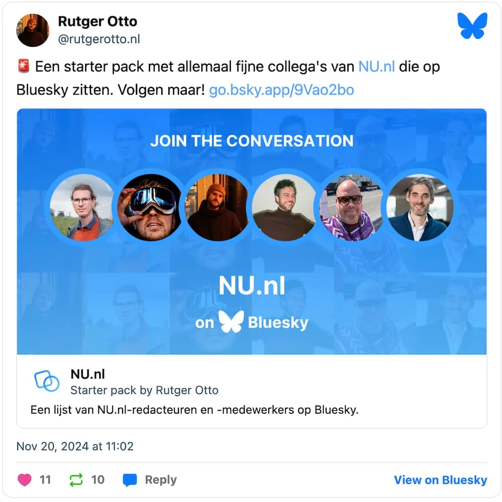

BlueSky en X lijken sprekend op elkaar: beide sociale platformen bestaan primair uit lange feeds met berichten van mensen die je volgt. Dat maakte het de afgelopen weken een ideaal toevluchtsoord voor X-gebruikers die topman Elon Musk niet meer willen steunen.

> [!NOTE]
> Dit artikel verscheen eerder op [NU.nl](https://www.nu.nl/slimmer-leven/6336379/zo-stap-je-goed-over-van-x-naar-bluesky.html).

## Importeer je X-volglijst op BlueSky

Officieel is er geen snelle knop om je X-volglijst over te zetten op BlueSky, maar een groep fanatieke ontwikkelaars heeft iets gebouwd om daarmee te helpen. Op [Sky-Follower-Bridge.dev](https://www.sky-follower-bridge.dev/get-started.html) kun je een extensie voor je webbrowser op een computer installeren. Na installatie ga je naar [x.com/following](https://x.com/following), druk je op alt en B tegelijk en log je in met je BlueSky-account.

De browserextensie gaat door de lijst mensen die je volgt heen op X en kijkt of er een vergelijkbaar account bestaat op BlueSky. Vervolgens kun je op een knop drukken om deze mensen daar meteen te volgen.

## Vind starter packs met interessante mensen

Je kunt mensen om te volgen individueel opsporen, maar het is ook mogelijk een zogeheten _starter pack_ te volgen. Dit zijn collecties van interessante accounts gemaakt door BlueSky-gebruikers. Je kunt bijvoorbeeld met één klik [politieke accounts](https://bsky.app/starter-pack/florisberlin.bsky.social/3lareoy5hdt2p) volgen, of een [lijst met natuurfotografen](https://bsky.app/starter-pack/gettoknownature.bsky.social/3l5fwa5xmvw2n). Zelf hebben we ook een lijst [met alle NU.nl-journalisten](https://bsky.app/starter-pack/rutgerotto.nl/3lbcbsc4ndz2o) op het platform samengesteld.

_Zo stap je goed over van X naar BlueSky — Beeld: BlueSky embed_

_Starter packs_ zijn te vinden op de profielen van de makers, maar de site [BlueSky Directory](https://blueskydirectory.com/starter-packs) heeft een doorzoekbaar overzicht voor als je iets specifieks wil vinden.

## Gebruik deck.blue op je pc of laptop

Twitter werd voor desktopgebruikers ooit groot dankzij tweetdeck, een app die je meerdere tijdlijnen en accounts naast elkaar liet zetten. De ontwikkelaar van webapplicatie [deck.blue](https://deck.blue/) heeft iets vergelijkbaars gebouwd, waarmee je BlueSky productiever kunt gebruiken op een groot scherm.

Omdat deck.blue in je webbrowser werkt, hoef je geen app te installeren. Je logt simpelweg in met je account en kunt daarna de webapp naar eigen smaak inrichten. Let wel op dat deck.blue een zogeheten appwachtwoord vereist. Deze kun je aanmaken door op de BlueSky-website naar je accountinstellingen te gaan.

## Geef jezelf een (soort) vinkje

Op BlueSky kun je niet een blauw vinkje aanvragen of aanschaffen om je identiteit te verifiëren, zoals wel mogelijk is op sites als X en Facebook. In plaats daarvan heeft BlueSky een ander verificatiesysteem: je kunt je account koppelen aan het domein van je persoonlijke website.

Het is een wat technisch proces waarbij je in de instellingen van je domeinbeheerder moet duiken. Het sociale netwerk beschrijft [op deze pagina](https://bsky.social/about/blog/4-28-2023-domain-handle-tutorial) hoe je dat precies doet. Heb je het proces voltooid, dan verandert je gebruikersaccount naar de url van jouw website, waardoor anderen weten dat jij het echt bent.
