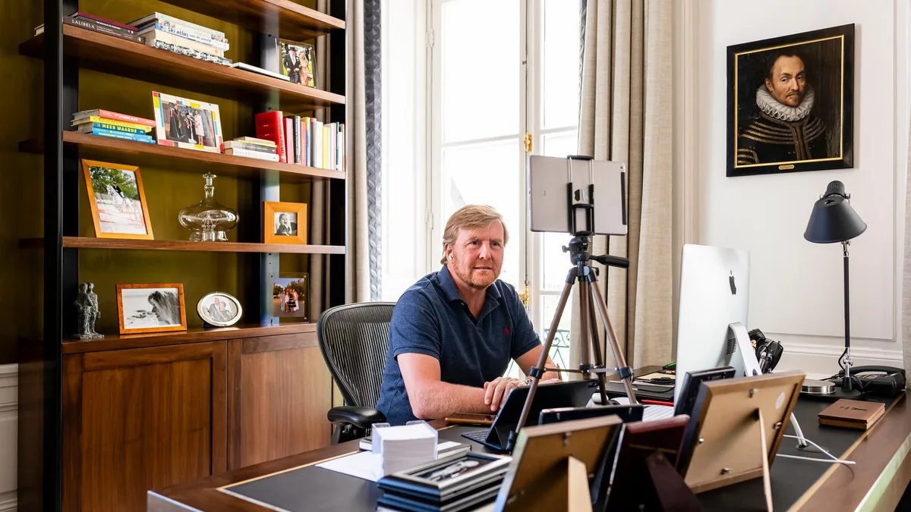

**Heel veel Apple**

> [!NOTE]
> Dit artikel verscheen eerder op [Bright](https://www.bright.nl/nieuws/1126165/zo-videobellen-onze-koning-en-koningin.html).

Dat blijkt uit een tweetal foto's die het Koninklijk Huis [op Twitter](https://twitter.com/koninklijkhuis/status/1252229975987519488/photo/1) heeft geplaatst. Op de beelden zijn de setups voor videobellen van de koning en koningin te zien.

De videogesprekken zouden vooral zijn met (zorg)instellingen, organisaties en bedrijven die betrokken zijn bij de bestrijding van het coronavirus in Nederland.

De uitrusting van Willem-Alexander lijkt het meest uitgebreid. Bovenop een standaard staat een oudere iPad, die verbonden is met de [AirPods Pro](https://youtu.be/9FrYRfVBhz0). Onder het statief rust een [iPad Pro](https://www.youtube.com/watch?v=_DuyjqDN-to) op een toetsenbordhoes, met daarnaast een iMac.

De uitrusting van Máxima lijkt zich te beperken tot een enkel statief met daarop een 11 inch-model van de iPad Pro.

Welke gadgets zien jullie ertussen? Wij herkennen in elk geval de volgende apparatuur. Zo te zien nagenoeg allemaal van Apple:

-   iMac 5K
-   Magic Keyboard
-   Magic Mouse
-   iPhone X of nieuwer
-   AirPods Pro
-   iPad (Air?) met 4G
-   iPad Pro met toetsenbordhoes
-   iPad Pro zonder hoes
-   En twee ouderwetse, bedrade telefoons

## Nieuwe iPhone SE: de perfecte crisis-iPhone?

[Bekijk ingesloten media](https://www.youtube.com/embed/xWReQnu6Ts8?autoplay=1&modestbranding=1)

**[Volg Bright op YouTube](https://bit.ly/brighttv) voor meer tech-video's**
