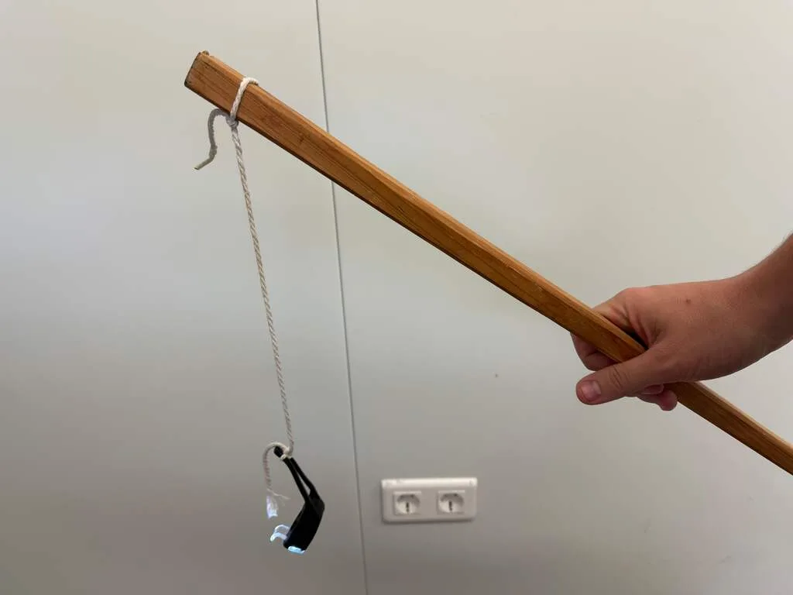

Een lampionstok kan op veel manieren kapotgaan. Vroeger ging meestal het lampje stuk, maar door de komst van ledverlichting gebeurt dat nu minder snel. Nu zit het probleem eerder in het snoertje of de batterijhouder in het handvat.

> [!NOTE]
> Dit artikel verscheen eerder op [NU.nl](https://www.nu.nl/slimmer-leven/6333580/zo-voorkom-je-dat-je-ieder-jaar-een-nieuw-lampionstokje-moet-kopen.html).

## Tip 1: Haal de batterij er na Sint-Maarten uit

Aan deze tip heb je dit jaar nog niets, maar vanaf het komende jaar pluk je er de vruchten van. Zijn de kinderen klaar met hun lampiontocht en kunnen de stokjes weer naar zolder? Denk er dan aan om de batterijen eruit te halen.

Wordt het stokje langere tijd niet gebruikt, dan kan de batterij na verloop van tijd gaan lekken. Het zuur dat hierbij vrijkomt, kan de interne onderdelen aantasten. Dat geldt ook voor de metalen onderdelen die de batterij met het licht verbinden. Een beschadigde aansluiting geleidt mogelijk geen stroom meer, waardoor het lampje dus niet meer zal schijnen.

Het is om die reden altijd een goed idee om de batterij uit een apparaat te halen dat je langere tijd niet gebruikt. Een lekkende batterij kan niet alleen je apparaat stukmaken, maar ook de huid verbranden bij aanraking.

## Tip 2: Maak een eigen lampionstok zonder draad

Vanaf de stok loopt een draadje met het lampje naar beneden. Dit snoer is het kwetsbaarste gedeelte van een lampionstok dat bij een paar ferme teugen kapot kan gaan. In het ergste geval breekt het snoer af. Maar ook als alleen de binnenkant van de kabel is beschadigd, werkt het lampje al niet meer.

Het is dus verstandig om zorgvuldig om te gaan met het snoer van de stok. Maar dat is niet voor ieder kind even makkelijk. Het alternatief is om een eigen lampionstok met een kleine fietslamp te maken: je hangt een touw aan een stokje, waar je de fietslamp vervolgens aan bevestigt. Doordat in dit lampje alle interne apparatuur zit, is de kans op beschadiging door een ruk aan het touw nihil.

_Zo voorkom je dat je ieder jaar een nieuw lampionstokje moet kopen — Beeld: Bastiaan Vroegop_
