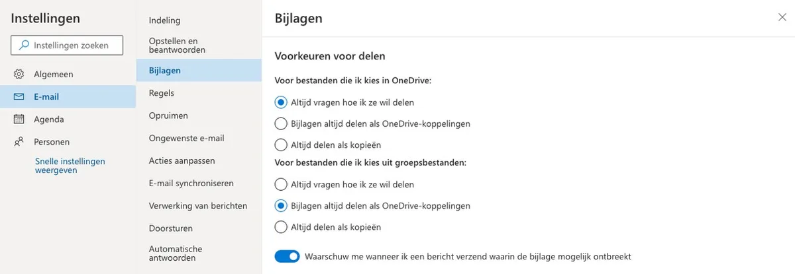

Het gebeurt iedereen wel eens: je stuurt een e-mail, maar ontdekt kort daarna dat je de bijlage niet hebt toegevoegd. Gelukkig is er een handige truc die dit helpt voorkomen.

> [!NOTE]
> Dit artikel verscheen eerder op [AD](https://www.ad.nl/tech/zo-voorkom-je-dat-je-ooit-nog-een-mailbijlage-vergeet~a37a10e1/).

De meeste grote maildiensten hebben inmiddels een functie die je herinnert om een bijlage toe te voegen. Schrijf je het woordje ‘bijlage’ of ‘attachment’ in een bericht en wil je hem zonder bestand verzenden? Dan springt een notificatie in beeld. Hieronder leggen we uit hoe dat werkt bij de populairste diensten.

## Gmail

Bij Gmail staat de bijlageherinnering standaard ingeschakeld, al werkt hij wat specifiek. Je wordt automatisch herinnerd een bijlage toe te voegen als je de woorden ‘zie de bijlage’ in een mail gebruikt, maar hij werkt niet bij simpelere varianten zoals ‘zie bijlage’ of alleen het woord ‘bijlage’.

Bovendien moet Gmail op de juiste taal ingesteld staan, wat je doet door bovenin op het tandwiel te drukken en te kiezen voor ‘Alle instellingen bekijken’. Staat Gmail in het Engels, dan werkt de reminder alleen bij termen zoals ‘see attachment’.

Je kunt voor Gmail ook de Chrome-plugin [Mailbutler](https://chrome.google.com/webstore/detail/mailbutler-for-gmail/ohjcpfgehefbhieohfmllokpklckplie) toevoegen aan je browser. Binnen de instellingen hiervan kun je enkele woorden zoals ‘bijlage’ en ‘document’ toevoegen, zodat er vaker een reminder in beeld springt.

## Outlook

Outlook heeft zowel in zijn app als op de website een herinnering voor bijlagen, die je kunst in- of uitschakelen in de mailinstellingen. Je klikt dan op het tandwiel, drukt onderin op de optie voor alle instellingen en gaat naar de optie ‘Bijlagen’. Daar kun je een vinkje zetten achter ‘Waarschuw me wanneer ik een bericht verzend waarin de bijlage mogelijk ontbreekt’.

Ook bij Outlook geldt: zorg dat je mailprogramma is ingesteld op de juiste taal. Wie de dienst in het Engels gebruikt, zal alleen worden herinnerd bij woorden zoals ‘attachment’ om een bestand toe te voegen.

We merken daarnaast dat de handtekening bij Outlook voor problemen kan zorgen. Heeft deze een plaatje, dan ziet Outlook deze als een bijlage - en krijg je dus geen reminder om iets toe te voegen.

Het instellingenscherm bij Outlook. © Microsoft

## Apple Mail

De mail-app van Apple heeft geen officiële herinneringsfunctie voor bijlagen, maar er is een alternatief. In de App Store staat de plugin [Mailbutler](https://apps.apple.com/nl/app/mailbutler/id1313355438?mt=12), die de optie toevoegt om alsnog te waarschuwen bij missende bijlagen.

Binnen de instellingen van Mailbutler kun je zelf kiezen op welke woorden wordt gelet, zoals ‘bestand’, ‘bijlage’ en ‘document’. Wordt één van de ingestelde woorden genoemd en ontbreekt de bijlage, dan slaat Mailbutler alarm.
