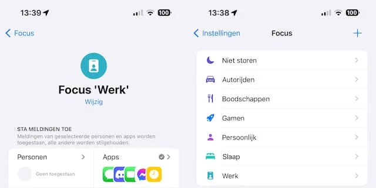

Vooral jongeren lijken veel berichten per dag te ontvangen. Uit recent Amerikaans onderzoek blijkt dat de gemiddelde tiener [237 notificaties per dag](https://www.commonsensemedia.org/research/constant-companion-a-week-in-the-life-of-a-young-persons-smartphone-use) op het scherm te zien krijgt. Een deel van die berichten kan belangrijk zijn, maar de rest is al snel ruis - afleiding terwijl je bijvoorbeeld probeert iets productiefs te doen.

> [!NOTE]
> Dit artikel verscheen eerder op [NU.nl](https://www.nu.nl/slimmer-leven/6289811/zo-voorkom-je-dat-je-te-veel-meldingen-op-je-smartphone-ontvangt.html).

Daar is wat tegen te doen, vertelt smartphone-expert Friso Weijers van _Tweakers_. "Google en Apple hebben de afgelopen jaren functies toegevoegd om smartphoneverslaving tegen te gaan. Daar zitten ook mogelijkheden om een stortvloed aan notificaties in te dammen bij."

Met onderstaande tips kun je snoeien in die grote hoeveelheid notificaties.

## Tip 1: Filter de lijst met apps die berichten sturen

Apps op iOS en Android vragen bij de eerste keer opstarten of je notificaties wil ontvangen. Deze toestemming kun je later ook weer intrekken via de instellingen van je telefoon. Het loont om af en toe door de lijst met apps te gaan en frequente spammers te elimineren.

Op Android doe je dat vanuit de Instellingen-app onder het menu 'Meldingen', gevolgd door 'App-meldingen'. Met de schakelaars rechts kies je welke apps wel en welke apps geen berichten mogen sturen.

Bij iPhones werkt het vergelijkbaar. Open de Instellingen-app en tik op 'Meldingen'. Onderaan vind je een lijst van alle apps die berichten mogen sturen. Je haalt een app weg door hem aan te tikken en de schuif bij 'Sta meldingen toe' om te zetten.

## Tip 2: Wees streng met je smartwatch

Een smartwatch ontvangt alle notificaties van je telefoon, maar dat hoeft niet. In de app van je horloge kun je vaak selecteren welke telefoonnotificaties ook naar je horloge verzonden moeten worden. Zo kun je minder belangrijke berichten op je telefoon houden en je smartwatch alleen een melding laten sturen als bijvoorbeeld je vrienden of familieleden iets van je vragen.

## Tip 3: Gebruik de focusmodus

"Inmiddels kun je heel precies kiezen van welke apps je notificaties wil krijgen en welke je wil stilhouden", zegt Weijers. "Je kunt ervoor kiezen om alleen berichten van bepaalde mensen door te laten. Of je laat alleen mensen die een paar keer achter elkaar bellen je toch storen." Daarvoor gebruik je de zogeheten Focus-modus.

Bij Android kun je die optie inschakelen vanuit het instellingenmenu 'Digitaal welzijn'. Je kiest op welke tijden je je even notificatieloos wil concentreren, of tijdens welke agenda-afspraken je telefoon je niet mag lastigvallen.

"Heb je een iPhone, dan vind je de opties voor het stilhouden of doorlaten van notificaties onder het kopje 'Focus' in het instellingenmenu." Tik op een Focus-profiel en ga naar 'Apps' om te selecteren welke apps een bericht mogen sturen.

Bij 'Personen' kun je ook aanzetten welke contacten je mogen bereiken als je de Focus-optie gebruikt. Zo kun je ervoor kiezen WhatsApp-berichten van een collega te blokkeren, maar die van familieleden niet.

_Zo voorkom je dat je te veel meldingen op je smartphone ontvangt_

## Tip 4: Stel apps slimmer in

"Sommige apps hebben ook hun eigen functies om een overvloed aan notificaties in te dammen. Denk aan WhatsApp: daarbij kun je individuele gesprekken dempen als die op je zenuwen werken." Op dezelfde manier kun je ook de notificatiewoede van chatapps als Slack en Discord inperken.

Sommige mailapps laten je een notificatiefilter inschakelen. De app probeert te bepalen welke e-mails belangrijk voor je zijn en brengen je alleen daarvan op de hoogte. Daarvoor wordt bijvoorbeeld gekeken met welke contacten je actief hebt gemaild en welke berichten ongevraagd van een vreemde komen. Onder andere de mailapp Spark heeft zo'n optie.
