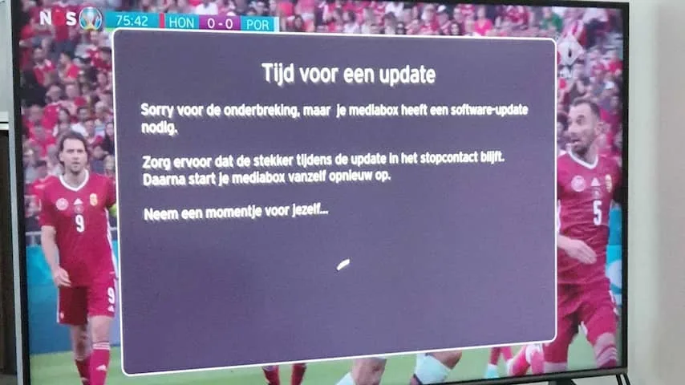

## Zorg dat de software up-to-date is

Steeds vaker zijn tv's verbonden met het internet. Fabrikanten versturen van tijd tot tijd ook updates om de software te verbeteren. Die updates kun je vaak een tijdje uitstellen, maar met verloop van tijd wordt het installatieproces soms automatisch gestart.

> [!NOTE]
> Dit artikel verscheen eerder op [NU.nl](https://www.nu.nl/tech/6139857/zo-voorkom-je-dat-je-tv-gekke-dingen-doet-tijdens-ek-wedstrijden.html).

Het is daarom slim om al voor een wedstrijd te kijken of een televisie up-to-date is. Dat kan in de meeste gevallen door op de instellingenknop van de afstandsbediening te drukken en bijvoorbeeld naar de systeeminstellingen te navigeren.

_Zo voorkom je dat je tv gekke dingen doet tijdens EK-wedstrijden_

## Zet automatische updates of desnoods wifi uit

Zelfs als er geen update paraat staat, is er een kans dat er later toch eentje verschijnt en ineens je tv in beslag neemt. Door de functie voor automatische updates op de tv uit te schakelen, voorkom je dat ze later worden geïnstalleerd.

Heb je niet zo'n schakelaar? Door de wifi-instellingen te wissen of de ethernetkabel los te trekken, voorkom je dat de tv verbinding met het internet maakt. Dan weet je zeker dat er niks wordt gedownload.

Denk er wel aan om later alsnog te zoeken naar updates. Want hoewel ze vervelend zijn, zorgen ze er ook voor dat je tv bijvoorbeeld beter beveiligd is tegen cybercriminelen die willen inbreken.

## Controleer ook je tv-kastje

Naast je televisie is het kastje van je provider ook gevoelig voor updates. Controleer daarom ook hierop of er vooraf iets klaarstaat. Ook dat kan dan vanuit de instellingen van het apparaat.

Iets om rekening mee te houden: niet iedere settopbox laat je met de hand updates installeren, waardoor je afhankelijk bent van wanneer je tv-provider ze naar je kastje toestuurt. En omdat niet ieder apparaat zonder internet werkt, kun je er ook niet altijd voor kiezen de wifi uit te schakelen om het proces te vermijden.

## Schakel Motion Smoothing in (en zet het daarna uit)

Verstopt in de video-instellingen van je televisie staat een optie genaamd Motion Smoothing. Staat deze geactiveerd, dan 'verzint' de televisie de pixels tussen verschillende frames van een snel, bewegend shot.

Motion Smoothing is ideaal voor voetbalwedstrijden: het zorgt ervoor dat de bal vloeiender over je scherm beweegt, waardoor het soms schokkerige effect verdwijnt.

Het is echter aan te raden om na de wedstrijd Motion Smoothing weer uit te schakelen. Bij films en series zorgt het voor een onnatuurlijk effect, wat door filmfans al jarenlang wordt bekritiseerd. Dit wordt ook wel het Soap Opera-effect genoemd, omdat programma's er ineens uitzien als goedkope soaps.

## Houd rekening met mogelijke vertraging

Bij eerdere EK-wedstrijden klaagden kijkers over een vertraagd beeld. Ze hoorden de buren dan juichen bij een doelpunt, waarna ze zelf pas na tientallen seconden de bal in het doel zagen verdwijnen.

Dat komt door de verschillende manieren waarop live-tv wordt uitgezonden. Kijken via de kabel van je provider op een settopbox is de snelste manier, terwijl het bij streamingapps zoals NLZIET en Ziggo Go trager verloopt.

Veel kun je er niet aan doen, behalve ervoor kiezen via de kabel te kijken.

## 4K-tv? Kijk (met eigen risico) in 4K

De NPO biedt tijdens het EK een experimentele 4K-zender, waarop wedstrijden in een hogere resolutie bekeken kunnen worden. Dat kanaal is er alleen bij KPN en Ziggo, onder bepaalde voorwaarden. Zo heb je bij Ziggo bijvoorbeeld een specifiek abonnement met luxere settopbox nodig.

In theorie zijn de wedstrijden op het 4K-kanaal mooier, maar afgelopen dagen stroomden klachten binnen. Zo zou het beeld donker en flets zijn, terwijl bij één wedstrijd een minuut lang de video vastliep. De NPO probeert de problemen op te lossen.
