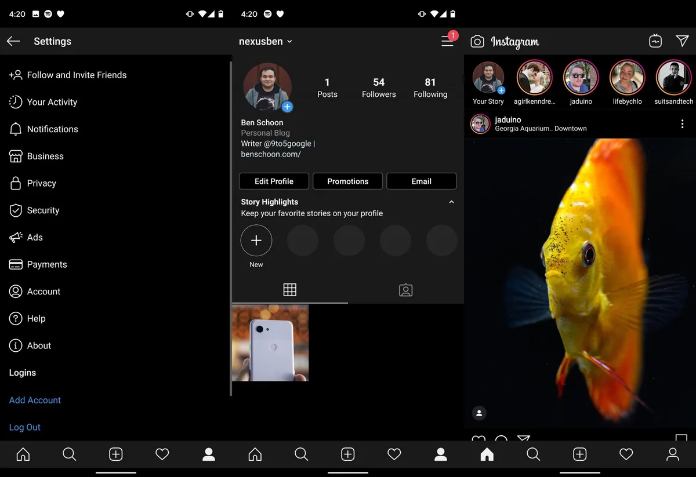

**Eerste beelden**

> [!NOTE]
> Dit artikel verscheen eerder op [Bright](https://www.bright.nl/nieuws/1123859/zo-ziet-de-donkere-modus-van-instagram-er-straks-uit.html).

Binnen de donkere modus worden de witte interfacevlakken verruild voor zwarte varianten, met daarop witte teksten. Alleen de foto's geplaatst op het netwerk blijven onveranderd.

Op de beelden is de Android-variant van de donkere modus te zien. Deze werkt in combinatie met de speciale dark mode-schakelaar in Android 10, maar ook met de nachtoptie die Samsung op Android Pie heeft toegevoegd.

## iOS 13

Het is nog afwachten of ook de iOS-app van Instagram een donkere modus krijgt. Daar lijkt de tijd wel rijp voor: in [iOS 13](https://www.bright.nl/tips/artikel/4853566/ios-13-tips-nieuwe-functies-ios13-iphone-update) introduceerde Apple een donker thema voor iPhones en iPads. Speciaal aangepaste apps kunnen meekleuren als je dit thema aanzet, net als bij de opties in Android 10 en op Samsung-telefoons.

Instagram heeft nog niks bekendgemaakt over de donkere versie van de app. De optie dook op bij sommige testers van de app, waaronder bij [9to5Google](https://9to5google.com/2019/09/24/instagram-android-dark-mode-beta/).

## Dit moet Instagram verbeteren

[Bekijk ingesloten media](https://www.youtube.com/embed/99s?autoplay=1&modestbranding=1)

**Abonneer op het [Bright YouTube-kanaal](https://bit.ly/brighttv) voor meer tech-video's.**

**[Volg Bright ook via Instagram](https://www.instagram.com/bright_nl).**
