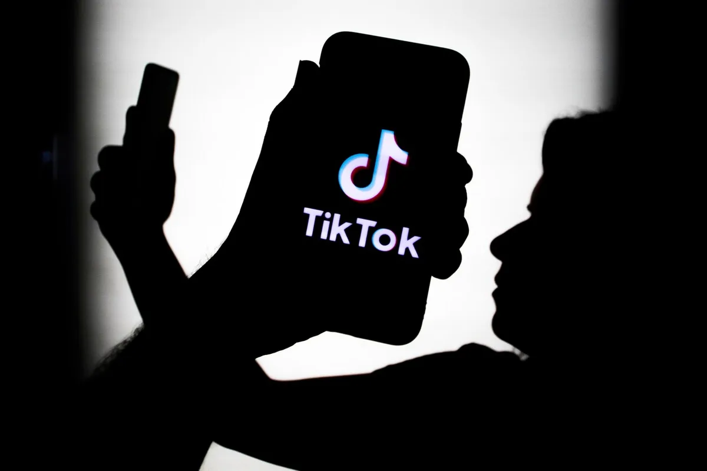

Het bedrijf achter de socialemediahit TikTok is aangeklaagd voor het onrechtmatig verzamelen van privégegevens van kinderen. Hoe zorg je dat het bedrijf stopt met het verzamelen van jouw privédata? We leggen het uit.

> [!NOTE]
> Dit artikel verscheen eerder op [AD](https://www.ad.nl/tech/zo-zorg-je-dat-tiktok-geen-gegevens-meer-van-je-heeft~a91970d6/).

Deze week stapten stichting Take Back Your Privacy en de Consumentenbond naar de rechter. Beide organen beweren dat TikTok-maker ByteDance de gegevens van minderjarigen heeft verzameld, terwijl dat wettelijk helemaal niet is toegestaan.

© NurPhoto via Getty Images

Met de zaak hopen ze het bedrijf te dwingen deze gegevens niet langer te verzamelen, waarna aan getroffen kinderen een schadevergoeding zou worden betaald. Voor ieder kind jonger dan 13 jaar zou 1500 euro betaald moeten worden, kinderen tussen de 13 en 15 zouden 1250 euro krijgen en voor 16- of 17-jarigen zou een bedrag van 1000 euro gerekend worden. Althans, als de rechter meegaat in de aanklacht.

,,TikTok heeft op schandalige wijze misbruik gemaakt van soms nog hele jonge kinderen. Het heeft ze misleid, hun privacy geschonden en over hun rug grove winst gemaakt”, aldus Consumentenbond-directeur Sandra Molenaar. ,,Pure uitbuiting, die gecompenseerd moet worden. En wel op een manier die ook afschrikkend werkt voor andere bedrijven die hetzelfde doen.”

## Wat doet TikTok nu al?

TikTok deed lange tijd relatief weinig om de privacy van minderjarige gebruikers te beschermen. De app maakte geen onderscheid tussen volwassen gebruikers en kinderen, waardoor hun privégegevens zoals kijkgedrag, interesses en hun namen op dezelfde manier werden verwerkt.

In januari dit jaar kwam de app met een nieuw privacybeleid voor minderjarigen, gevolgd door privacyinstellingen die er sinds afgelopen zomer voor zorgen dat accounts van kinderen standaard op ‘privé’ staan ingesteld. Volgens ByteDance worden kindergegevens niet meer zomaar verzameld.

De app-beheerder schorst ook iedere gebruiker die jonger dan 13 jaar blijkt te zijn. Maar omdat alle privacymaatregelen relatief nieuw zijn, richten veel rechtszaken zich op de onrechtmatige dataverzameling bij kinderen tussen 2018 en 2021. Volgens de Nederlandse aanklacht zou de privacy van kinderen nu alsnog worden geschonden.

## Zo verwijder je je TikTok-account

Wie vreest voor de privacy bij TikTok, kan ervoor kiezen een account bij de video-app te verwijderen. Dat gaat relatief simpel: open de app en ga rechtsonder naar ‘Profiel’. Daar druk je op de drie streepjes (het zogeheten hamburgericoon) rechtsboven en tik je op ‘Account Beheren’.

Onderaan de daar geopende pagina staat de optie ‘Account verwijderen’. De app zal je waarschuwen dat je na het wissen niet meer kunt inloggen en dat je toegang kwijtraakt tot je geüploade video’s.

Je account zal pas na 30 dagen definitief worden verwijderd. In die eerste maand bestaat je profiel nog wel, maar is het niet openbaar zichtbaar. Dit dient als een soort bedenktijd voor gebruikers die in de tussentijd toch het verwijderproces willen stopzetten.

## Zo zorg je dat alles écht weg is

Het verwijderen van een account hoeft niet per se te betekenen dat al je gegevens bij TikTok zijn weggehaald. Sommige techbedrijven staan erom bekend ook informatie van niet-ingelogde gebruikers te verzamelen, om daarmee bijvoorbeeld beter te adverteren.

Hoewel het onduidelijk is in hoeverre dat bij TikTok gebeurt, kan het geen kwaad om efficiënt te zijn. Omdat je in Europa woont, moet ontwikkelaar ByteDance al jouw gegevens verwijderen als je daar een formeel verzoek voor indient.

Zo’n verwijderverzoek dien je op [deze pagina](https://www.tiktok.com/legal/report/privacy?lang=en) in. Vul je land, gebruikersnaam en e-mailadres goed in en tik op ‘Other’. Vervolgens verschijnt een veld waarin je kunt vermelden dat je graag al je gegevens bij het bedrijf laat weghalen.

Op dezelfde pagina kun je ook het account van een minderjarige gebruiker rapporteren. Zo zorg je dat het profiel van bijvoorbeeld je kind als zodanig wordt gemarkeerd, mits de leeftijd daarbij niet goed was ingevuld.
