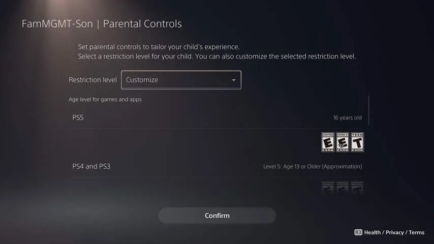
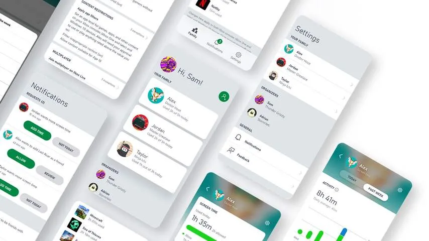

Iedere moderne spelcomputer heeft speciale opties voor ouders. Die kunnen zo instellen hoe kun kinderen het apparaat kunnen gebruiken.

> [!NOTE]
> Dit artikel verscheen eerder op [NU.nl](https://www.nu.nl/slimmer-leven/6299202/zo-zorg-je-ervoor-dat-je-kinderen-niet-eindeloos-gamen.html).

Je kiest bijvoorbeeld hoelang ze mogen gamen en welke spellen zijn toegestaan. Ook kun je bepalen of ze met andere mensen via de bijgeleverde microfoon mogen praten.

Hieronder zetten we op een rij hoe je dat bij ieder apparaat kunt doen. Het is niet altijd een kwestie van simpelweg de systeeminstellingen induiken.

## Ouderlijk toezicht op de Nintendo Switch

Nintendo heeft een losse app uitgebracht voor ouders, die hierin het gamegedrag van hun kinderen kunnen beperken en controleren. Deze app installeer je op je [iPhone](https://itunes.apple.com/US/app/id1190074407) of [Android-telefoon](https://play.google.com/store/apps/details?id=com.nintendo.znma&gl=us&hl=en).

Daarna kun je bijvoorbeeld instellen hoeveel uur er per dag gegamed kan worden. De app laat je ook instellen tot hoe laat er gegamed kan worden, zodat kinderen niet na hun bedtijd hun geplande uurtjes gaan inhalen.

De Nintendo-app kan de game automatisch uitzetten als de tijd voorbij is, maar kan ook een notificatie naar jouw telefoon sturen. Zo kun je zelf je kind toespreken om de console uit te schakelen. Ook heeft de app een maandelijks overzicht van hoeveel iedereen gespeeld heeft. Op die manier krijg je een beter beeld van het gamegedrag van je kinderen.

## Gametijd op een PlayStation beperken

Op een PlayStation zitten de opties voor ouderlijk toezicht verstopt in de instellingen. Druk op het tandwiel en ga naar de optie om familiebeheer te configureren. Stel dan in welke accounts op de gameconsole van een kind zijn.

Sony laat je de speeltijd van een kind beperken, waarbij je ook een maandelijkse limiet kunt instellen. Zo kun je een kind beloven dat hij bijvoorbeeld twintig uur per maand mag gamen, waarna hij of zij zelf mag kiezen wanneer.

Bij jonge kinderen kun je de leeftijdsindicatie instellen, zodat spellen voor bijvoorbeeld twaalf jaar en ouder worden geblokkeerd.

_Zo zorg je ervoor dat je kinderen niet eindeloos gamen — Beeld: Sony_

## Familie-instellingen op de Xbox en pc

Microsoft heeft net als Nintendo een app uitgebracht, waarmee je de gametijd op een Xbox voor kinderen kunt beheren. Deze is beschikbaar voor [iPhones](https://aka.ms/XboxFamilySettingsiOS) en [Android-toestellen](https://aka.ms/XboxFamilySettingsAndroid). Naast knoppen om speeltijd te beperken heeft deze app een wekelijks overzicht van de speeltijd.

Naast Xbox-spelcomputers werkt deze app ook met Windows-computers, wat handig kan zijn bij pc-games. Maar let op: je kind moet dan ook op de pc een eigen gameprofiel hebben.

_Zo zorg je ervoor dat je kinderen niet eindeloos gamen — Beeld: Microsoft_
