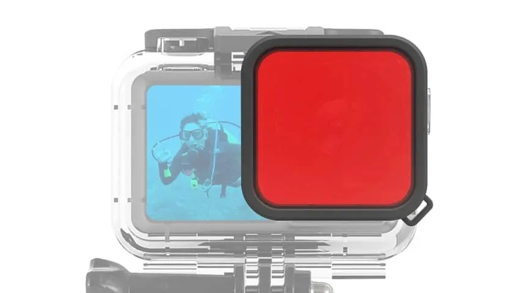
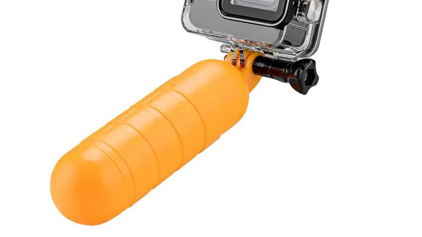

## Tip 1: kijk eerst of het wel mag

In Europa is geen wet die verbiedt op openbare plekken te fotograferen of filmen. Ben je op het strand of een meertje, dan ben je vrij om met je actiecamera aan de slag te gaan. Wel moet je ervoor zorgen dat je de privacy van andere bezoekers niet schendt.

> [!NOTE]
> Dit artikel verscheen eerder op [NU.nl](https://www.nu.nl/slimmer-leven/6321176/zwemavonturen-filmen-met-een-gopro-let-hier-goed-op.html).

Bij zwembaden kunnen andere regels gelden. Vaak is er een bord waarop staat of filmen en fotograferen in het water is toegestaan. Kun je hier niks over vinden, dan kun je personeel altijd vragen naar de algemene regels. Zo voorkom je dat een boze badmeester je uit het water vist.

## Tip 2: kijk hoe waterdicht je camera is (en haal zo nodig een hoesje)

De meeste recente actiecamera's zijn van zichzelf waterdicht tot 10 meter diepte. Heb je een exemplaar dat al zo'n tien jaar oud is, dan heb je mogelijk een speciale hoes nodig om hem waterdicht te maken.

Hoe waterdicht je camera is, kun je vaak achterhalen door simpelweg op de verpakking te kijken. Heb je die niet meer? Zoek online dan naar de modelnaam met daarachter het woordje "specs". De meeste fabrikanten vermelden expliciet hoe diep de camera het water in kan.

Staat er geen diepte vermeld, dan kun je bij de specificaties ook zoeken naar de zogeheten IP-code. Deze bestaat uit de letters IP gevolgd door twee cijfers. Het eerste cijfer laat zien hoe stofdicht je apparaat is, de tweede vertelt je de waterdichtheid.

Wil je met een actiecamera het water in, dan moet dat tweede cijfer idealiter een 8 zijn. Dat betekent dat hij meer dan een meter het water in kan.

Wil je dieper dan 10 meter het water in, dan heb je alsnog een speciale hoes nodig. Die zorgt ervoor dat je camera tot 60 meter de diepte in kan.

_Zwemavonturen filmen met een GoPro? Let hier goed op — Beeld: DJI_

## Tip 3: gebruik een roodfilter op je lens

Omdat je camera door het water heen filmt, wordt het beeld erg blauw en wat flets. Het beeld ziet er hierdoor minder mooi uit dan de beelden van bijvoorbeeld vloggers die hun zwemavonturen filmen.

Je kunt het beeld vrij snel mooier maken door een zogeheten roodfilter te kopen. Dat is een soort zonnebril voor je camera, die een rood glas voor de lens bevestigt. Dat compenseert onder water voor de grote hoeveelheid blauw licht, waardoor je een evenwichtiger videobeeld krijgt.

## Tip 4: bevestig een handvat dat drijft

Het grote gevaar bij onderwaterfilmpjes is dat je de camera kwijtraakt. Hij zakt dan vrij snel naar de bodem, waar je hem alleen met veel moeite weer weg kan vissen. Zwem je in diep natuurwater, dan kun je hem daar zelfs kwijtraken.

Film je met de hand, dan kun je een speciaal handvat bevestigen dat blijft drijven. Het is een kleine boei, die vaak wordt verkocht in felle, opvallende kleuren. Zo'n zogeheten 'bobber' heb je voor een tientje.

Een alternatief is om de camera op je lichaam te bevestigen. Bij voorkeur met een hesje om je romp, omdat dat bij een wilde duik niet per ongeluk kan losschieten. Dat is wel het risico bij een hoofdband.

_Zwemavonturen filmen met een GoPro? Let hier goed op — Beeld: Telesin_
